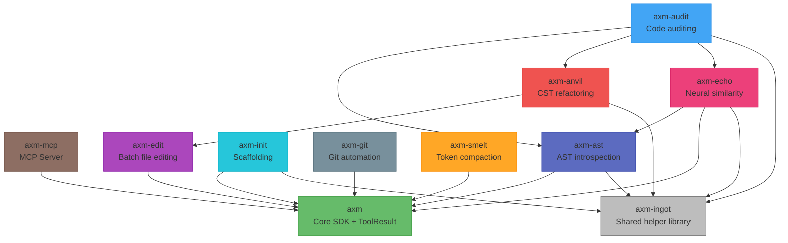

<p align="center">
  
</p>

<h1 align="center">axm-forge</h1>
<p align="center"><strong>Developer tools for the AXM ecosystem.</strong></p>

<p align="center">
  <a href="https://github.com/axm-protocols/axm-forge/actions/workflows/ci.yml"></a>
  <a href="https://forge.axm-protocols.io/audit/"></a>
  <a href="https://forge.axm-protocols.io/init/"></a>
  <a href="https://github.com/axm-protocols/axm-forge/actions/workflows/axm-quality.yml"></a>
  
  <a href="https://forge.axm-protocols.io"></a>
</p>

---

## What do you need?

AXM Forge is the **developer toolchain for the AXM ecosystem** — every tool returns structured, deterministic output built for AI agents, not text to parse. Arrive with a problem, leave with the exact tool to call.

| You want to… | Use |
|---|---|
| Quality-gate a package — lint, types, complexity, security, all in one call | [`verify`](packages/axm-audit/docs/index.md) |
| Re-check one dimension (lint, types, security…) during a fix loop | [`audit`](packages/axm-audit/docs/index.md) |
| Run tests with structured pass/fail output | [`audit_test`](packages/axm-audit/docs/index.md) |
| Edit many files atomically — all of it lands or none of it does | [`batch_edit`](packages/axm-edit/docs/index.md) |
| Commit with auto-staging + conventional-commit enforcement | [`git_commit`](packages/axm-git/docs/index.md) |
| Get an overview of an unfamiliar project | [`ast_context`](packages/axm-ast/docs/index.md) |
| Find a symbol across the codebase (no grep noise) | [`ast_search`](packages/axm-ast/docs/index.md) |
| Inspect a symbol — signature, body, docstring | [`ast_inspect`](packages/axm-ast/docs/index.md) |
| Know who calls a function before you change it | [`ast_callers`](packages/axm-ast/docs/index.md) |
| Measure the blast radius of a change | [`ast_impact`](packages/axm-ast/docs/index.md) |
| Scaffold a package that passes every quality gate from day one | [`init_scaffold`](packages/axm-init/docs/index.md) |
| Find duplicate code / check a helper already exists before writing it | [`echo_code`](packages/axm-echo/docs/index.md) |

> **…and 35+ more** — CST refactoring (`ast_move`), token compaction (`smelt`), the full git workflow (`git_pr`, `git_tag`, `git_worktree`…), dead-code and flow analysis, and more. Browse them per package below or in the [docs](https://forge.axm-protocols.io).

## Packages

| Package | Description | Version | Quality |
|---|---|---|---|
| [axm](packages/axm/) | AXM CLI — thin autodiscovery wrapper for the ecosystem | [](https://pypi.org/project/axm/) | [](https://forge.axm-protocols.io/audit/) [](https://github.com/axm-protocols/axm-forge/actions/workflows/axm-quality.yml) |
| [axm-mcp](packages/axm-mcp/) | MCP Server — runtime tool discovery and execution | [](https://pypi.org/project/axm-mcp/) | [](https://forge.axm-protocols.io/audit/) [](https://github.com/axm-protocols/axm-forge/actions/workflows/axm-quality.yml) |
| [axm-init](packages/axm-init/) | Python project scaffolding CLI with Copier templates | [](https://pypi.org/project/axm-init/) | [](https://forge.axm-protocols.io/audit/) [](https://github.com/axm-protocols/axm-forge/actions/workflows/axm-quality.yml) |
| [axm-audit](packages/axm-audit/) | Code auditing and quality rules for Python projects | [](https://pypi.org/project/axm-audit/) | [](https://forge.axm-protocols.io/audit/) [](https://github.com/axm-protocols/axm-forge/actions/workflows/axm-quality.yml) |
| [axm-ast](packages/axm-ast/) | AST introspection CLI for AI agents, powered by tree-sitter | [](https://pypi.org/project/axm-ast/) | [](https://forge.axm-protocols.io/audit/) [](https://github.com/axm-protocols/axm-forge/actions/workflows/axm-quality.yml) |
| [axm-git](packages/axm-git/) | Git workflow automation for AXM agents | [](https://pypi.org/project/axm-git/) | [](https://forge.axm-protocols.io/audit/) [](https://github.com/axm-protocols/axm-forge/actions/workflows/axm-quality.yml) |
| [axm-edit](packages/axm-edit/) | Atomic batch file editing for AI agents | [](https://pypi.org/project/axm-edit/) | [](https://forge.axm-protocols.io/audit/) [](https://github.com/axm-protocols/axm-forge/actions/workflows/axm-quality.yml) |
| [axm-anvil](packages/axm-anvil/) | Deterministic CST-based refactoring toolkit — move, rename, split, merge symbols atomically | [](https://pypi.org/project/axm-anvil/) | [](https://forge.axm-protocols.io/audit/) [](https://github.com/axm-protocols/axm-forge/actions/workflows/axm-quality.yml) |
| [axm-smelt](packages/axm-smelt/) | Deterministic token compaction for LLM inputs | [](https://pypi.org/project/axm-smelt/) | [](https://forge.axm-protocols.io/audit/) [](https://github.com/axm-protocols/axm-forge/actions/workflows/axm-quality.yml) |
| [axm-echo](packages/axm-echo/) | Neural similarity detection — cross-package dedup and upstream-reuse retrieval | [](https://pypi.org/project/axm-echo/) | [](https://forge.axm-protocols.io/audit/) [](https://github.com/axm-protocols/axm-forge/actions/workflows/axm-quality.yml) |
| [axm-ingot](packages/axm-ingot/) | Shared helper library — common code factored out and tested once, reused across packages | [](https://pypi.org/project/axm-ingot/) | [](https://forge.axm-protocols.io/audit/) [](https://github.com/axm-protocols/axm-forge/actions/workflows/axm-quality.yml) |

## Quick Start

### Using the tools (via MCP)

Connect the whole AXM toolchain to your MCP client (Claude Code, IDE…) in one
command — `uvx` fetches it on demand, no manual install:

```bash
claude mcp add --scope user axm-mcp -- uvx --python 3.12 --from "axm-mcp[all]@latest" axm-mcp
```

`--scope user` installs it globally (available in every session). Drop it to enable AXM per-project instead — the server then loads only in the directory where you run the command.

This exposes `verify`, `audit`, the `ast_*` family, `git_commit`, `batch_edit`,
and the rest as MCP tools. See the **[axm-mcp Quick Start](packages/axm-mcp/docs/tutorials/quickstart.md)**
for the `.mcp.json` form and the advanced persistent-HTTP setup.

Want a single tool on the CLI instead? Each package ships standalone, e.g.
`uv add axm-audit` then `axm-audit`.

### Developing the workspace

```bash
# Clone and install
git clone https://github.com/axm-protocols/axm-forge.git
cd axm-forge
uv sync --all-groups

# Run all tests
make test-all

# Lint + type check
make lint

# Full quality gate
make check
```

## Architecture



## Development

Each package is independently versioned with prefixed tags (`anvil/v*`, `ast/v*`, `audit/v*`, `echo/v*`, `edit/v*`, `init/v*`, `git/v*`, `smelt/v*`).

| Command | Description |
|---|---|
| `make test-all` | Run tests for all packages |
| `make lint` | Ruff + mypy for all packages |
| `make check` | Lint + tests |
| `make axm-audit` | Run axm-audit on each package |
| `make axm-init` | Run axm-init check on each package |
| `make quality` | Full AXM quality gate (pre-push) |
| `make docs-serve` | Preview documentation |

## License

Apache 2.0 — see [LICENSE](LICENSE) for details.
