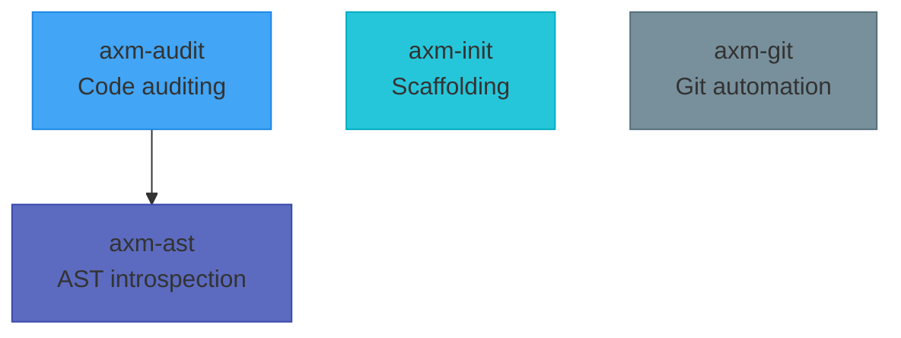

<p align="center">
  
</p>

<h1 align="center">axm-forge</h1>
<p align="center"><strong>Developer tools for the AXM ecosystem.</strong></p>

<p align="center">
  <a href="https://github.com/axm-protocols/axm-forge/actions/workflows/ci.yml"></a>
  <a href="https://github.com/axm-protocols/axm-forge/actions/workflows/axm-quality.yml"></a>
  <a href="https://github.com/axm-protocols/axm-forge/actions/workflows/axm-quality.yml"></a>
  <a href="https://github.com/axm-protocols/axm-forge/actions/workflows/axm-quality.yml"></a>
  
  <a href="https://forge.axm-protocols.io"></a>
</p>

---

## Philosophy

AXM Forge provides the **developer toolchain** for the AXM ecosystem. Every tool returns structured, deterministic results — designed for AI agents that need precise answers, not text to parse.

- 🌳 **AST-Powered Introspection** — Tree-sitter based analysis that understands Python at the structural level. Find callers, measure blast radius, and trace import graphs — all without grep noise.
- 🛡️ **Codified Quality Gates** — 40+ rules covering lint, types, coverage, complexity, security, and project governance — all in a single `verify()` call.
- 📦 **Automated Scaffolding** — Generate projects, workspaces, and workspace members that pass all 39 governance checks from day one.
- 🔀 **Git Workflow Automation** — Structured commits with auto-staging, pre-commit retry, and conventional commit enforcement. Semver tagging and push — all through agent-friendly MCP tools.

## Packages

| Package | Description | Version | Quality |
|---|---|---|---|
| [axm-ast](packages/axm-ast/) | AST introspection CLI for AI agents, powered by tree-sitter | [](https://pypi.org/project/axm-ast/) | [](https://github.com/axm-protocols/axm-forge/actions/workflows/axm-quality.yml) [](https://github.com/axm-protocols/axm-forge/actions/workflows/axm-quality.yml) |
| [axm-audit](packages/axm-audit/) | Code auditing and quality rules for Python projects | [](https://pypi.org/project/axm-audit/) | [](https://github.com/axm-protocols/axm-forge/actions/workflows/axm-quality.yml) [](https://github.com/axm-protocols/axm-forge/actions/workflows/axm-quality.yml) |
| [axm-init](packages/axm-init/) | Python project scaffolding CLI with Copier templates | [](https://pypi.org/project/axm-init/) | [](https://github.com/axm-protocols/axm-forge/actions/workflows/axm-quality.yml) [](https://github.com/axm-protocols/axm-forge/actions/workflows/axm-quality.yml) |
| [axm-git](packages/axm-git/) | Git workflow automation for AXM agents | [](https://pypi.org/project/axm-git/) | [](https://github.com/axm-protocols/axm-forge/actions/workflows/axm-quality.yml) [](https://github.com/axm-protocols/axm-forge/actions/workflows/axm-quality.yml) |

## Quick Start

```bash
# Clone and install
git clone https://github.com/axm-protocols/axm-forge.git
cd axm-forge
uv sync --all-groups

# Run all tests
make test-all

# Lint + type check
make lint

# Full quality gate
make check
```

## Architecture



## Development

Each package is independently versioned with prefixed tags (`ast/v*`, `audit/v*`, `init/v*`, `git/v*`).

| Command | Description |
|---|---|
| `make test-all` | Run tests for all packages |
| `make lint` | Ruff + mypy for all packages |
| `make check` | Lint + tests |
| `make axm-audit` | Run axm-audit on each package |
| `make axm-init` | Run axm-init check on each package |
| `make quality` | Full AXM quality gate (pre-push) |
| `make docs-serve` | Preview documentation |

## License

Apache 2.0 — see [LICENSE](LICENSE) for details.
