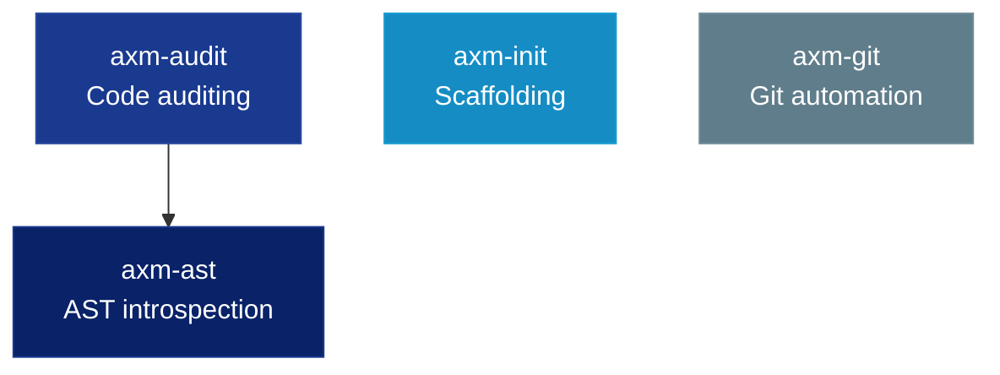

<p align="center">
  
</p>

<h1 align="center">axm-forge</h1>
<p align="center"><strong>Developer tools for the AXM ecosystem.</strong></p>

<p align="center">
  <a href="https://github.com/axm-protocols/axm-forge/actions/workflows/ci.yml"></a>
  <a href="https://forge.axm-protocols.io"></a>
  
  
</p>

---

## Packages

| Package | Description | Version |
|---|---|---|
| **axm-ast** | AST introspection CLI for AI agents, powered by tree-sitter | [](https://pypi.org/project/axm-ast/) |
| **axm-audit** | Code auditing and quality rules for Python projects | [](https://pypi.org/project/axm-audit/) |
| **axm-init** | Python project scaffolding CLI with Copier templates | [](https://pypi.org/project/axm-init/) |
| **axm-git** | Git workflow automation for AXM agents | [](https://pypi.org/project/axm-git/) |

## Quick Start

```bash
# Clone and install
git clone https://github.com/axm-protocols/axm-forge.git
cd axm-forge
uv sync --all-groups

# Run all tests
make test-all

# Lint + type check
make lint

# Full quality gate
make check
```

## Architecture



## Development

Each package is independently versioned with prefixed tags (`ast/v*`, `audit/v*`, `init/v*`, `git/v*`).

| Command | Description |
|---|---|
| `make test-all` | Run tests for all packages |
| `make test PKG=axm-ast` | Run tests for a specific package |
| `make lint` | Ruff + mypy for all packages |
| `make check` | Full quality gate |
| `make docs` | Build documentation |

## License

Apache 2.0 — see [LICENSE](LICENSE) for details.
