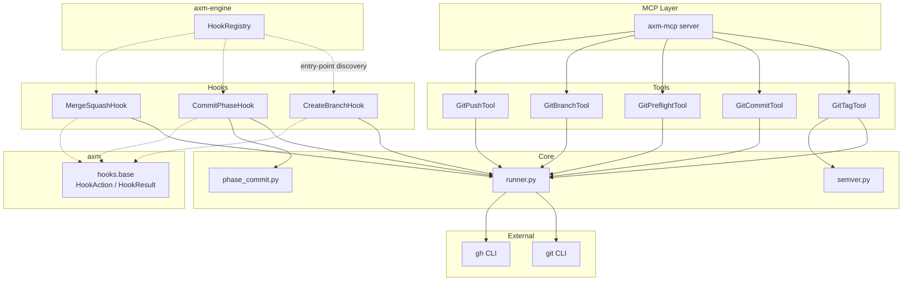

# Architecture

## Overview

`axm-git` provides deterministic MCP tools that wrap Git and GitHub CLI operations. Each tool satisfies the `AXMTool` protocol (from `axm`) and is auto-discovered via Python entry points.

## Layers

### 1. Tools (`tools/`)

Each tool exposes an `execute(*, path, ..., **kwargs) → ToolResult` method with explicit typed parameters:

- **`GitTagTool`** — Full tag workflow: check clean tree, check CI, compute semver bump, create tag, verify hatch-vcs, push.
- **`GitCommitTool`** — Stage files, commit with pre-commit hooks, auto-retry on linter fixes. Supports batched commits.
- **`GitPreflightTool`** — Parse `git status --porcelain` and `git diff --stat` into structured data.
- **`GitBranchTool`** — Create or checkout a branch. Supports `from_ref` (branch from tag/commit) and `checkout_only` (switch without creating).
- **`GitPushTool`** — Push with dirty-check guard, auto-upstream detection, custom remote, and force-push support.

### 2. Core (`core/`)

Shared logic used by multiple tools:

- **`runner.py`** — `run_git()` and `run_gh()` subprocess wrappers, `gh_available()` auth check, `detect_package_name()` from `pyproject.toml`. Also provides `suggest_git_repos()` (scans for child directories that are git repos) and `not_a_repo_error()` (enriches "not a git repository" errors with suggestions for nearby repos).
- **`semver.py`** — `parse_tag()` for version parsing, `compute_bump()` for Conventional Commits analysis (returns `VersionBump` with next version + reason).
- **`phase_commit.py`** — `get_phase_commit()` looks up the commit hash for a given protocol phase name by searching git log.

### 3. Hooks (`hooks/`)

Lifecycle hook actions conforming to the `HookAction` protocol from `axm.hooks.base`. Auto-discovered via `axm.hooks` entry-points.

All hooks accept an `enabled` param (default `True`). Pass `enabled=False` to skip git operations entirely (returns `HookResult.ok(skipped=True, reason="git disabled")`).

- **`CreateBranchHook`** — Creates a session branch `{prefix}/{session_id}`. Skips if not a git repo.
- **`CommitPhaseHook`** — Stages all changes, commits with `[axm] {phase_name}`. Skips if nothing to commit.
- **`MergeSquashHook`** — Squash-merges the session branch back to the target branch.

## Design Decisions

| Decision | Rationale |
|---|---|
| `AXMTool` protocol | Consistent interface, auto-discovery via entry points |
| `subprocess` over `gitpython` | Zero dependency, deterministic, same behavior as manual CLI |
| Auto-retry on pre-commit fix | Agents waste a tool call without it |
| `git add -A --` | Handles additions, modifications, AND deletions in one command |
| Soft CI check | `gh` is optional — tagging still works without GitHub CLI |
