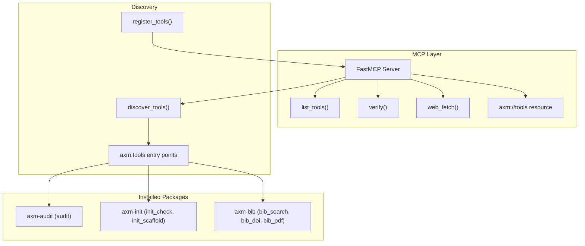

# Architecture

## Overview

`axm-mcp` is a thin MCP shell with zero imports from AXM core. It discovers tools at runtime via Python entry points and exposes them over the Model Context Protocol.

## Modules

| Module | Key Symbols | Purpose |
|---|---|---|
| `mcp_app.py` | `mcp`, `_verify_tool()`, `_web_fetch_tool()`, `_tool_catalog()`, `main()` | FastMCP server instance + built-in tools + tool catalog resource |
| `server.py` | `serve()`, `health_check()`, `DEFAULT_PORT` | Streamable HTTP transport — runs the FastMCP instance over HTTP on port 9427 (or `AXM_MCP_PORT`) |
| `concurrency.py` | `KeyedLock` | Per-key asyncio lock manager — prevents concurrent execution of the same session or git operation |
| `discovery.py` | `discover_tools()`, `register_tools()`, `ToolLike`, `_session_lock`, `_git_lock` | Entry point scanning + MCP registration; `protocol_*` and `git_*` tools wrapped with async keyed locks |
| `verify.py` | `verify_project()` | Orchestrate audit + init check + AST enrichment |
| `web_fetch.py` | `fetch_page()` | Anti-bot web page fetching via Scrapling (basic / dynamic / stealth) |
| `lifecycle.py` | `find_binary()`, `generate_plist()`, `install()`, `uninstall()` | launchd service management — install/uninstall axm-mcp as a macOS background service |
| `plist_template.py` | `PLIST_TEMPLATE` | launchd plist XML template used by `lifecycle.generate_plist()` |

## Design Decisions

| Decision | Rationale |
|---|---|
| Zero imports from `axm` core | Fully decoupled — `axm-mcp` works with any combination of installed packages |
| `ToolLike` Protocol | Duck typing via `Protocol` — no class inheritance needed |
| Entry points for discovery | Standard Python mechanism, no config files needed |
| `verify` as meta-tool | Single call replaces 3 separate tool invocations |
| AST enrichment of failures | Adds blast-radius context to help agents prioritize fixes |

## Tool Lifecycle

1. **Startup**: `discover_tools()` scans `axm.tools` entry points
2. **Registration**: `register_tools()` wraps each tool as an MCP callable
3. **Resource**: `_tool_catalog()` exposes the tool catalog via `axm://tools` MCP resource
4. **Execution**: MCP client calls tool → wrapper delegates to `tool.execute(**kwargs)` → returns `ToolResult`
5. **Verify**: `verify_project()` chains audit → init_check → AST enrichment
