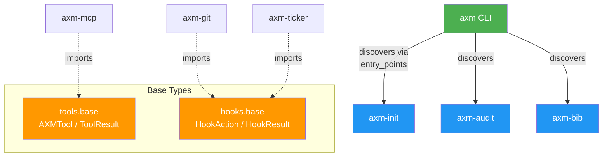

# Architecture

## Overview

`axm` is a **thin autodiscovery CLI wrapper** that delegates all functionality to installed AXM ecosystem packages. It contains zero business logic.



## Autodiscovery Pattern

At startup, `axm` scans the `axm.commands` entry-point group:

```python
for ep in importlib.metadata.entry_points(group="axm.commands"):
    command_fn = ep.load()
    app.command(command_fn, name=ep.name)
```

Each AXM package declares its commands in `pyproject.toml`:

```toml
[project.entry-points."axm.commands"]
init_scaffold = "axm_init.cli:scaffold"
init_check    = "axm_init.cli:check"
```

This is the same pattern used by `axm-mcp` for tool discovery (`axm.tools` group).

## Design Decisions

| Decision | Rationale |
|---|---|
| Entry-point autodiscovery | No hard dependencies on ecosystem packages |
| Optional deps (`axm[init]`) | Users install only what they need |
| `cyclopts` for CLI | Same framework as other AXM CLIs |
| `src/` layout | PEP 621 best practice, no import conflicts |
| Zero business logic | All functionality lives in dedicated packages |
| `{domain}_{action}` naming | One name for CLI and MCP — no mental translation |
| `AXMTool`/`ToolResult` in `axm` | Shared interface, no private dependency needed |
| `HookAction`/`HookResult` in `axm` | Hooks contract without pulling `axm-engine` deps |
| `agent_hint` on `AXMTool` | LLM-optimized one-liner propagates to MCP tool descriptions — richer than docstrings, cheaper than system prompts |
