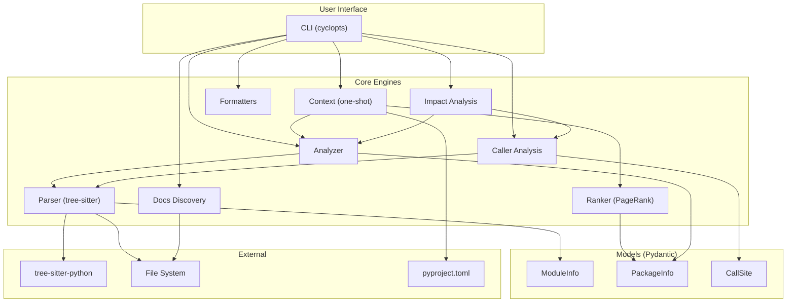

# Architecture

## Overview

`axm-ast` follows a layered architecture: CLI → core engines → models. The core layer is entirely I/O-free — it operates on Pydantic models produced by tree-sitter parsing.

## Layers

### 1. CLI (`cli.py`)

Cyclopts-based commands with input validation and formatted output (text + JSON). Each command follows the pattern: parse arguments → call core → format output.

### 2. Core Engines (`core/`)

Independent, composable analysis engines:

| Engine | Purpose | Key Function |
|---|---|---|
| `parser.py` | Tree-sitter AST parsing → `ModuleInfo` | `extract_module_info()` |
| `analyzer.py` | Package discovery, graph, search, stubs | `analyze_package()` |
| `ranker.py` | PageRank symbol importance | `rank_symbols()` |
| `callers.py` | Call-site detection | `find_callers()` |
| `context.py` | One-shot project dump | `build_context()` |
| `impact.py` | Change blast radius | `analyze_impact()` |
| `docs.py` | Documentation tree discovery | `discover_docs()` |

### 3. Formatters (`formatters.py`)

Output formatting with multiple detail levels:

| Function | Purpose |
|---|---|
| `format_text()` | Human-readable text (summary / detailed / full) |
| `format_compressed()` | AI-friendly compressed view |
| `format_json()` | Machine-readable JSON |
| `format_mermaid()` | Mermaid dependency graph |

### 4. Models (`models/`)

Pydantic models for structured data exchange between layers:

| Model | Purpose |
|---|---|
| `ModuleInfo` | Full introspection result for a single module |
| `PackageInfo` | Full introspection result for a package |
| `FunctionInfo` | Function metadata (params, return type, decorators) |
| `ClassInfo` | Class metadata (bases, methods, docstring) |
| `ParameterInfo` | Function parameter (name, type, default) |
| `VariableInfo` | Module-level variable / constant |
| `ImportInfo` | Import statement (absolute/relative, names) |
| `CallSite` | Call-site location (module, line, context) |

## Design Decisions

| Decision | Rationale |
|---|---|
| tree-sitter for parsing | Fast, incremental, handles broken files gracefully |
| Pydantic models | Validation, serialization, JSON output for free |
| PageRank for ranking | Graph-based importance adapts to any project structure |
| Composable engines | `impact` = `callers` + `analyzer` + `ranker` + test mapping |
| `src/` layout | PEP 621 best practice, no import conflicts |
