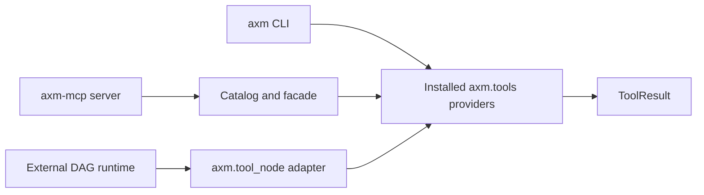

# Workspace architecture

Forge contains the developer-tool layer and its Python SDK. Its packages
share repository infrastructure but are installed and versioned independently.

## From client to provider

```mermaid
flowchart LR
    CLI["axm CLI"] --> EP["Installed axm.tools providers"]
    MCP["axm-mcp server"] --> CAT["Catalog and facade"]
    CAT --> EP
    DAG["External DAG runtime"] --> NODE["axm.tool_node adapter"]
    NODE --> EP
    EP --> RESULT["ToolResult"]
```

This is an invocation diagram, not a complete dependency graph.
`axm` defines `AXMTool`, `ToolResult`, generic CLI discovery and
`tool_node`. Providers register entry points under `axm.tools`.
`axm-mcp` loads providers and presents its own catalog/meta-tools over
stdio or HTTP. Its default facade does not expose every provider directly:
discovery and dispatch reach the broader installed catalog.

The server's `verify` combines installed audit and governance tools with
AST enrichment. It is a server meta-tool, not an axm-audit entry point.
The [MCP contracts](../axm-mcp/reference/facade.md) distinguish structured data,
text rendering and failures.

## Analysis and mutation

- **axm-ast** reads source structure; callers, dependencies and inferred
  impact are analysis results, not a proof of runtime behavior.
- **axm-anvil** uses AST analysis, LibCST and axm-edit to move, rename or
  extract Python symbols.
- **axm-edit** validates batches, writes files and manages snapshots.
  Multi-file rollback is recovery logic rather than a filesystem transaction;
  post-processing and rollback failure have their own limits.
- **axm-audit** combines external tools and structural rules. Some checks
  execute tests or external processes; an audit is not universally free of
  side effects.
- **axm-echo** finds similar code and reuse candidates. Scores require
  review; similarity does not establish semantic equivalence.
- **axm-smelt** transforms text and measures token counts. Choose strategies
  according to the information you can afford to lose.

For details, read [editing guarantees](../edit/reference/batch.md),
[refactoring limits](../anvil/explanation/limits.md) and
[audit framework dispatch](../audit/reference/frameworks.md).

## Shared services and helpers

| Package | Responsibility |
|---|---|
| axm-config | Non-sensitive values, namespace resolution and runtime paths |
| axm-vault | Credential catalog, keyring integration and secret resolution |
| axm-doctor | Environment/authentication diagnostics and bootstrap workflows |
| axm-ingot | Dependency-free reusable helpers for other Python packages |
| axm-init | Project templates and governance checks |
| axm-git | Git and release workflow operations |

Configuration roots and secret storage have distinct contracts; do not assume
one environment variable relocates every service.
See [configuration](../axm-config/index.md), [vault](../axm-vault/index.md) and
[doctor](../axm-doctor/index.md).

## Repository infrastructure

The root `pyproject.toml` defines a uv workspace with `packages/*`
members. Each package owns its source, tests, API and version metadata.
The root lockfile coordinates dependency resolution.

MkDocs includes the package navigation trees and generates API pages from
their source. The site includes both public guides and generated module
references; a generated module page does not make every symbol a supported
public API.

Graph runtimes, authoring and application services live in other AXM
workspaces. Forge supplies tools and the `tool_node` adapter, not their
scheduler. See the [complete package catalog](../packages/index.md).
