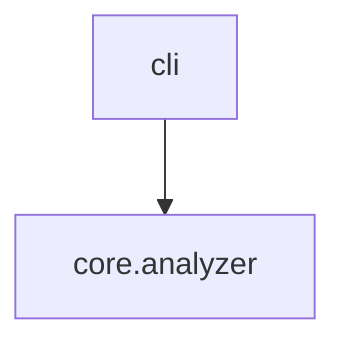

# Output Formats

`axm-ast` offers multiple output formats optimized for different consumers.

## Detail Levels (`describe`)

### Summary (default)

Best for quick orientation. Shows module names, public function signatures, and class names.

```bash
axm-ast describe src/mylib
```

### Detailed

Adds docstrings, parameter types, return types, and visibility indicators (`🔓` public, `🔒` private).

```bash
axm-ast describe src/mylib --detail detailed
```

### Full

Everything: imports, variables, private symbols, decorators. Useful for complete documentation generation.

```bash
axm-ast describe src/mylib --detail full
```

### Compressed

AI-optimized format designed to fit large codebases into LLM context windows.

```bash
axm-ast describe src/mylib --compress
```

**Includes:**

- Module docstrings (first line only)
- `__all__` exports
- Public function signatures with first docstring line
- Class stubs with methods
- Relative imports (dependencies)
- Module-level constants

**Excludes:**

- Function bodies
- Absolute imports (e.g., `from pathlib import Path`)
- Private symbols not in `__all__`
- Multi-line docstrings

### TOC (table of contents)

Ultra-lightweight overview returning only module names and symbol counts — no individual function or class details.

```bash
axm-ast describe src/mylib --detail toc
```

**Includes:**

- Module dotted name
- Module docstring (first sentence)
- Function count, class count, total symbol count

**Excludes:**

- Individual function/class details
- Signatures, parameters, imports, variables

Combine with `--modules` to filter:

```bash
axm-ast describe src/mylib --detail toc --modules core
```

## Graph Formats

### Text (default)

```bash
axm-ast graph src/mylib
```

### Mermaid

Paste directly into GitHub markdown or MkDocs:

```bash
axm-ast graph src/mylib --format mermaid
```

````

````

### JSON

```bash
axm-ast graph src/mylib --json
```

## JSON Output

Every command supports `--json` for machine-readable output. JSON output follows consistent conventions:

- **Describe**: Full module/function/class trees
- **Graph**: Adjacency list `{module: [dependencies]}`
- **Context**: Structured project metadata
- **Impact**: Callers, affected modules, tests, score
- **Search/Callers**: Symbol lists with location info

!!! tip "Piping to jq"
    ```bash
    axm-ast describe src/mylib --json | jq '.modules[].name'
    axm-ast impact src/mylib --symbol foo --json | jq '.score'
    ```
