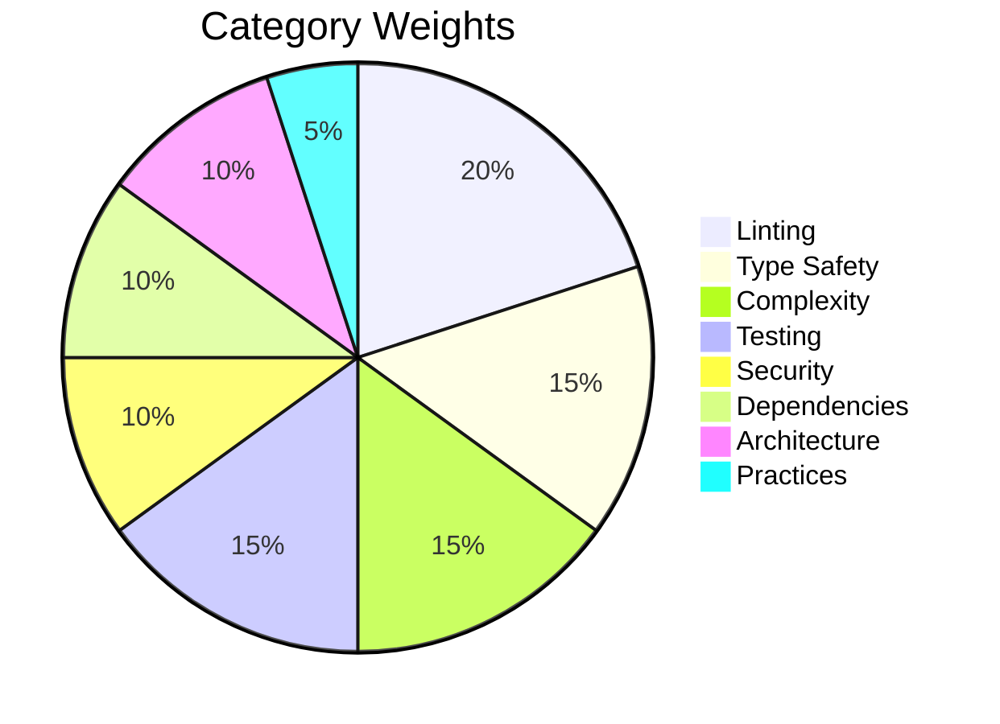

# Scoring & Grades

## Composite Quality Score

The quality score is a **weighted average** across 8 categories, on a 100-point scale:

| Category | Tool | Weight |
|---|---|---|
| Linting | Ruff | **20%** |
| Type Safety | mypy | **15%** |
| Complexity | radon | **15%** |
| Security | Bandit | **10%** |
| Dependencies | pip-audit + deptry | **10%** |
| Testing | pytest-cov | **15%** |
| Architecture | AST analysis | **10%** |
| Practices | AST analysis | **5%** |



Each category produces a score from 0 to 100. The composite score is:

```
score = lint × 0.20 + type × 0.15 + complexity × 0.15
      + security × 0.10 + deps × 0.10 + testing × 0.15
      + architecture × 0.10 + practices × 0.05
```

!!! info "Why no Structure category?"
    Structure validation (project layout, `pyproject.toml` completeness) is handled
    by `axm-init` with 16 dedicated checks. `axm-audit` focuses on **code quality**.

## Category Scoring

### Lint Score

```
score = max(0, 100 − issue_count × 2)
```

Pass threshold: ≥ 80 (≤ 10 issues).

### Format Score

```
score = max(0, 100 − unformatted_count × 5)
```

Pass threshold: ≥ 80 (≤ 4 unformatted files).

### Type Score

```
score = max(0, 100 − error_count × 5)
```

Pass threshold: ≥ 80 (≤ 4 errors).

### Complexity Score

```
score = max(0, 100 − high_complexity_count × 10)
```

High complexity = cyclomatic complexity ≥ 10. Pass threshold: ≥ 80 (≤ 2 complex functions).

### Security Score

```
score = max(0, 100 − high_count × 15 − medium_count × 5)
```

Uses Bandit to detect vulnerabilities. Pass threshold: ≥ 80.

### Dependencies Score

Average of two sub-scores:

- **pip-audit**: `max(0, 100 − vuln_count × 15)` — known CVEs
- **deptry**: `max(0, 100 − issue_count × 10)` — unused/missing deps

### Testing Score

```
score = coverage_percentage
```

Uses `pytest-cov` to measure line coverage. Pass threshold: ≥ 80%.

### Architecture Score

Average of four sub-scores:

- **Circular imports**: `max(0, 100 − cycle_count × 20)`
- **God classes**: `max(0, 100 − god_class_count × 15)`
- **Coupling**: `max(0, 100 − N(modules > threshold) × 5)` — fan-out exceeding 10 imports
- **Duplication**: `max(0, 100 − duplicate_pair_count × 10)`

### Practices Score

Average of six sub-scores:

- **Docstring coverage**: `int(coverage_pct × 100)`
- **Bare excepts**: `max(0, 100 − count × 20)`
- **Hardcoded secrets**: `max(0, 100 − count × 25)`
- **Blocking I/O**: `max(0, 100 − count × 15)` — detects `time.sleep` in async contexts and HTTP calls without `timeout` parameter
- **Logging presence**: `int(coverage_pct × 100)`
- **Test mirroring**: `max(0, 100 − missing_count × 15)`

## Grading Scale

| Grade | Score | Meaning |
|---|---|---|
| **A** | ≥ 90 | Excellent — production-ready |
| **B** | ≥ 80 | Good — minor issues |
| **C** | ≥ 70 | Acceptable — needs attention |
| **D** | ≥ 60 | Poor — significant issues |
| **F** | < 60 | Failing — critical problems |

## Severity Levels

Each individual check carries a severity:

| Severity | Effect | Example |
|---|---|---|
| `error` | Blocks audit pass | Missing `pyproject.toml` |
| `warning` | Non-blocking | High complexity function |
| `info` | Informational only | Docstring coverage stats |

## Type Safety

All results use Pydantic models (`AuditResult`, `CheckResult`, `Severity`) with `extra = "forbid"` for strict validation — safe for both human and agent consumption.
