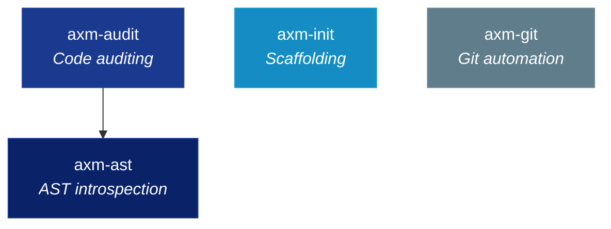

<div class="hero" markdown>

<p align="center">
  
</p>

<h1 align="center">axm-forge</h1>
<p align="center"><strong>Developer tools for the AXM ecosystem — AST introspection, code auditing, project scaffolding, and git automation.</strong></p>

<p align="center">
  <a href="https://github.com/axm-protocols/axm-forge/actions/workflows/ci.yml"></a>
  
  
</p>

</div>

---

## Workspace Packages

| Package | Description | Version |
|---|---|---|
| **[axm-ast](ast/)** | AST introspection CLI for AI agents, powered by tree-sitter | [](https://pypi.org/project/axm-ast/) |
| **[axm-audit](audit/)** | Code auditing and quality rules for Python projects | [](https://pypi.org/project/axm-audit/) |
| **[axm-init](init/)** | Python project scaffolding CLI with Copier templates | [](https://pypi.org/project/axm-init/) |
| **[axm-git](git/)** | Git workflow automation for AXM agents | [](https://pypi.org/project/axm-git/) |

## Quick Start

```bash
# Install the workspace
uv sync --all-groups

# Run all tests
make test-all

# Full quality gate
make check
```

## Architecture



## Learn More

- **New here?** Start with a package's Getting Started tutorial
- **Building tools?** See the How-To Guides in each package
- **Understanding the design?** Read the Architecture explanations
