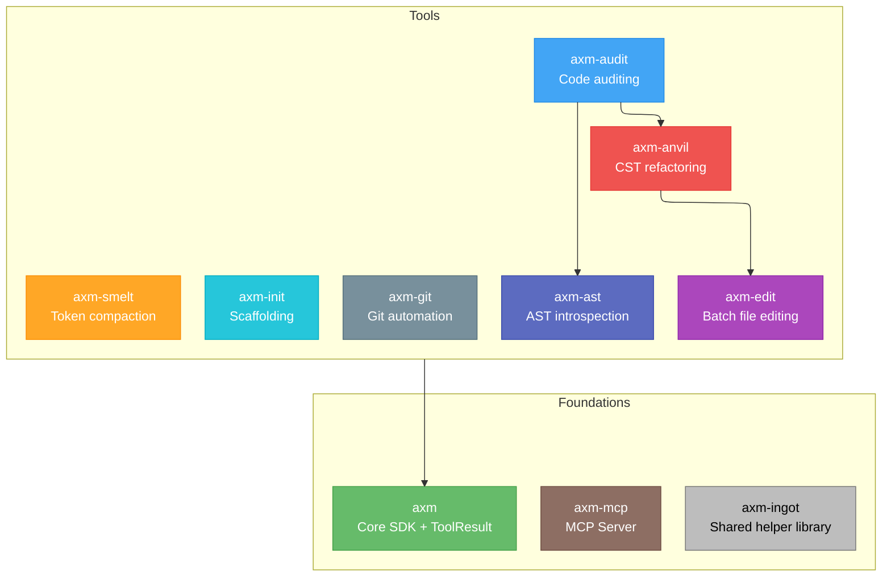

<div class="hero" markdown>

<p align="center">
  
</p>

<h1 align="center">axm-forge</h1>
<p align="center"><strong>Developer tools for the AXM ecosystem — AST introspection, code auditing, project scaffolding, and git automation.</strong></p>

<p align="center">
  <a href="https://github.com/axm-protocols/axm-forge/actions/workflows/ci.yml"></a>
  <a href="https://forge.axm-protocols.io/audit/"></a>
  <a href="https://forge.axm-protocols.io/init/"></a>
  <a href="https://github.com/axm-protocols/axm-forge/actions/workflows/axm-quality.yml"></a>
  
  
</p>

</div>

---

## Philosophy

AXM Forge provides the **developer toolchain** for the AXM ecosystem. Every tool returns structured, deterministic results — designed for AI agents that need precise answers, not text to parse.

<div class="grid cards" markdown>

-   :material-cube-outline:{ .lg .middle } **Automated Scaffolding**

    ---

    Generate projects, workspaces, and workspace members that pass all 39 governance checks from day one. Copier templates encode AXM conventions so every new package starts production-ready.

-   :material-shield-check:{ .lg .middle } **Codified Quality Gates**

    ---

    40+ rules covering lint, types, coverage, complexity, security, and project governance — all in a single `verify()` call. Scores and grades make quality measurable and comparable.

-   :material-file-tree:{ .lg .middle } **AST-Powered Introspection**

    ---

    Tree-sitter based analysis that understands Python at the structural level. Find callers, measure blast radius, and trace import graphs — all without grep noise. Every query returns precise, semantic results.

-   :material-source-branch:{ .lg .middle } **Git Workflow Automation**

    ---

    Structured commits with auto-staging, commit-hook retry, and conventional commit enforcement. Semver tagging and push — all through agent-friendly MCP tools.

-   :material-file-replace-outline:{ .lg .middle } **Atomic Batch Editing**

    ---

    Replace, create, and delete across dozens of files in a single transactional call. No partial writes, no half-applied refactors — it all lands or none of it does.

-   :material-hammer-wrench:{ .lg .middle } **CST-Based Refactoring**

    ---

    Move, rename, split, and merge symbols across a codebase without breaking a single import. Concrete syntax trees keep every reference in sync.

-   :material-arrow-collapse-vertical:{ .lg .middle } **Token Compaction**

    ---

    Deterministic strategies to shrink LLM inputs — whitespace collapse, null stripping, table compaction, deduplication — with presets from safe to aggressive. Fit more context, spend fewer tokens.

</div>

## Workspace Packages

| Package | Description | Version | Quality |
|---|---|---|---|
| **[axm](axm/index.md)** | AXM CLI — thin autodiscovery wrapper for the ecosystem | [](https://pypi.org/project/axm/) | [](https://github.com/axm-protocols/axm-forge/actions/workflows/axm-quality.yml) [](https://github.com/axm-protocols/axm-forge/actions/workflows/axm-quality.yml) |
| **[axm-mcp](mcp/index.md)** | MCP Server — runtime tool discovery and execution | [](https://pypi.org/project/axm-mcp/) | [](https://github.com/axm-protocols/axm-forge/actions/workflows/axm-quality.yml) [](https://github.com/axm-protocols/axm-forge/actions/workflows/axm-quality.yml) |
| **[axm-init](init/index.md)** | Python project scaffolding CLI with Copier templates | [](https://pypi.org/project/axm-init/) | [](https://github.com/axm-protocols/axm-forge/actions/workflows/axm-quality.yml) [](https://github.com/axm-protocols/axm-forge/actions/workflows/axm-quality.yml) |
| **[axm-audit](audit/index.md)** | Code auditing and quality rules for Python projects | [](https://pypi.org/project/axm-audit/) | [](https://github.com/axm-protocols/axm-forge/actions/workflows/axm-quality.yml) [](https://github.com/axm-protocols/axm-forge/actions/workflows/axm-quality.yml) |
| **[axm-ast](ast/index.md)** | AST introspection CLI for AI agents, powered by tree-sitter | [](https://pypi.org/project/axm-ast/) | [](https://github.com/axm-protocols/axm-forge/actions/workflows/axm-quality.yml) [](https://github.com/axm-protocols/axm-forge/actions/workflows/axm-quality.yml) |
| **[axm-git](git/index.md)** | Git workflow automation for AXM agents | [](https://pypi.org/project/axm-git/) | [](https://github.com/axm-protocols/axm-forge/actions/workflows/axm-quality.yml) [](https://github.com/axm-protocols/axm-forge/actions/workflows/axm-quality.yml) |
| **[axm-edit](edit/index.md)** | Atomic batch file editing for AI agents | [](https://pypi.org/project/axm-edit/) | [](https://github.com/axm-protocols/axm-forge/actions/workflows/axm-quality.yml) [](https://github.com/axm-protocols/axm-forge/actions/workflows/axm-quality.yml) |
| **[axm-anvil](anvil/index.md)** | Deterministic CST-based refactoring toolkit — move, rename, split, merge symbols atomically | [](https://pypi.org/project/axm-anvil/) | [](https://github.com/axm-protocols/axm-forge/actions/workflows/axm-quality.yml) [](https://github.com/axm-protocols/axm-forge/actions/workflows/axm-quality.yml) |
| **[axm-smelt](smelt/index.md)** | Deterministic token compaction for LLM inputs | [](https://pypi.org/project/axm-smelt/) | [](https://github.com/axm-protocols/axm-forge/actions/workflows/axm-quality.yml) [](https://github.com/axm-protocols/axm-forge/actions/workflows/axm-quality.yml) |
| **[axm-ingot](ingot/index.md)** | Shared helper library — common code factored out and tested once, reused across packages | [](https://pypi.org/project/axm-ingot/) | [](https://github.com/axm-protocols/axm-forge/actions/workflows/axm-quality.yml) [](https://github.com/axm-protocols/axm-forge/actions/workflows/axm-quality.yml) |

## Quick Start

### Using the tools (via MCP)

Connect the whole AXM toolchain to your MCP client (Claude Code, IDE…) in one
command — `uvx` fetches it on demand, no manual install:

```bash
claude mcp add --scope user axm-mcp -- uvx --python 3.12 --from "axm-mcp[all]@latest" axm-mcp
```

This exposes `verify`, `audit`, the `ast_*` family, `git_commit`, `batch_edit`,
and the rest as MCP tools. See the **[axm-mcp Quick Start](mcp/tutorials/quickstart.md)**
for the `.mcp.json` form and the advanced persistent-HTTP setup.

### Developing the workspace

```bash
# Install the workspace
uv sync --all-groups

# Run all tests
make test-all

# Lint + type check
make lint

# Full AXM quality gate (pre-push)
make quality
```

## Architecture



## Learn More

- **New here?** Start with the [axm-ast Quick Start](ast/tutorials/quickstart.md) tutorial
- **Auditing code?** See the [axm-audit Getting Started](audit/tutorials/getting-started.md)
- **Scaffolding projects?** Read the [axm-init docs](init/index.md)
- **Git automation?** Check [axm-git](git/index.md)
- **Token compaction?** See [axm-smelt](smelt/index.md)
- **Factoring shared helpers?** See [axm-ingot](ingot/index.md)
