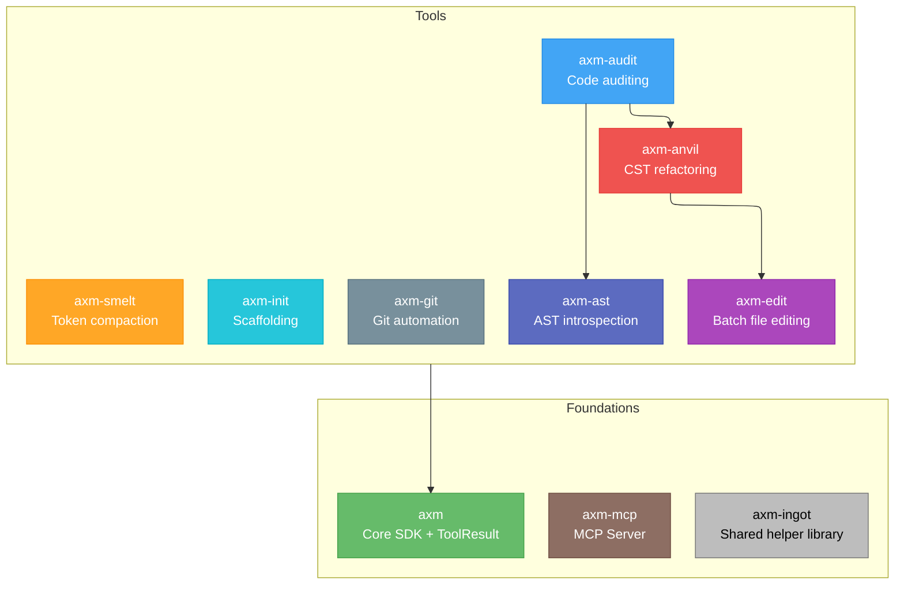

---
hide:
  - toc
---

# Packages

-   :material-package-variant-closed:{ .lg .middle } **axm**

    ---

    AXM CLI — thin autodiscovery wrapper for the ecosystem.

    [:octicons-arrow-right-24: Getting Started](../axm/index.md)

-   :octicons-server-16:{ .lg .middle } **axm-mcp**

    ---

    MCP Server — runtime tool discovery and execution.

    [:octicons-arrow-right-24: Getting Started](../mcp/index.md)

-   :material-file-tree:{ .lg .middle } **axm-ast**

    ---

    AST introspection CLI for AI agents, powered by tree-sitter.

    [:octicons-arrow-right-24: Getting Started](../ast/index.md)

-   :material-shield-check:{ .lg .middle } **axm-audit**

    ---

    Code auditing and quality rules for Python projects.

    [:octicons-arrow-right-24: Getting Started](../audit/index.md)

-   :material-cube-outline:{ .lg .middle } **axm-init**

    ---

    Python project scaffolding CLI with Copier templates.

    [:octicons-arrow-right-24: Getting Started](../init/index.md)

-   :material-source-branch:{ .lg .middle } **axm-git**

    ---

    Git workflow automation for AXM agents.

    [:octicons-arrow-right-24: Getting Started](../git/index.md)

-   :material-arrow-collapse-vertical:{ .lg .middle } **axm-smelt**

    ---

    Deterministic token compaction for LLM inputs.

    [:octicons-arrow-right-24: Getting Started](../smelt/index.md)

-   :material-package-variant-closed:{ .lg .middle } **axm-ingot**

    ---

    Shared helper library — common code factored out and tested once, reused across packages.

    [:octicons-arrow-right-24: Getting Started](../ingot/index.md)

## Architecture

