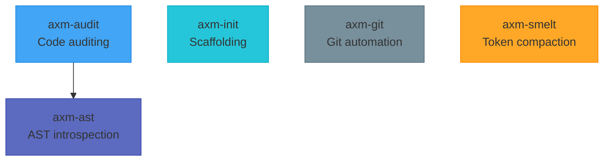

---
hide:
  - toc
---

# Packages

-   :material-file-tree:{ .lg .middle } **axm-ast**

    ---

    AST introspection CLI for AI agents, powered by tree-sitter.

    [:octicons-arrow-right-24: Getting Started](../ast/)

-   :material-shield-check:{ .lg .middle } **axm-audit**

    ---

    Code auditing and quality rules for Python projects.

    [:octicons-arrow-right-24: Getting Started](../audit/)

-   :material-cube-outline:{ .lg .middle } **axm-init**

    ---

    Python project scaffolding CLI with Copier templates.

    [:octicons-arrow-right-24: Getting Started](../init/)

-   :material-source-branch:{ .lg .middle } **axm-git**

    ---

    Git workflow automation for AXM agents.

    [:octicons-arrow-right-24: Getting Started](../git/)

-   :material-compress:{ .lg .middle } **axm-smelt**

    ---

    Deterministic token compaction for LLM inputs.

    [:octicons-arrow-right-24: Getting Started](../smelt/)

## Architecture

