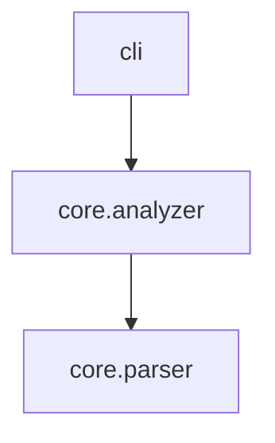

# CLI Reference

## Global Options

```
axm-ast --help       Show help
axm-ast --version    Show version
```

---

## `describe` — Introspect a Package

```
axm-ast describe [OPTIONS] [PATH]
```

| Option | Short | Type | Default | Description |
|---|---|---|---|---|
| `PATH` | | string | `.` | Path to package directory |
| `--detail` | `-d` | string | `summary` | Detail level: `summary`, `detailed`, `full` |
| `--compress` | | bool | `False` | AI-optimized compressed output |
| `--json` | | bool | `False` | Output as JSON |
| `--rank` | | bool | `False` | Sort by PageRank importance |
| `--budget` | `-b` | int | *none* | Limit to top N symbols |

**Example:**

```bash
axm-ast describe src/mylib --compress
```

```
# core.analyzer
"""High-level package analysis engine."""
__all__ = ["analyze_package", "build_import_graph"]

def analyze_package(path: Path) -> PackageInfo:
    """Analyze a Python package directory."""
def build_import_graph(pkg: PackageInfo) -> dict[str, list[str]]:
    """Build an adjacency-list import graph."""
```

---

## `inspect` — Inspect a Single Module

```
axm-ast inspect [OPTIONS] PATH
```

| Option | Short | Type | Default | Description |
|---|---|---|---|---|
| `PATH` | | string | *required* | Path to `.py` file |
| `--symbol` | `-s` | string | *none* | Focus on a specific symbol |
| `--json` | | bool | `False` | Output as JSON |

---

## `graph` — Dependency Graph

```
axm-ast graph [OPTIONS] [PATH]
```

| Option | Short | Type | Default | Description |
|---|---|---|---|---|
| `PATH` | | string | `.` | Path to package or workspace directory |
| `--format` | `-f` | string | `text` | Output format: `text`, `mermaid`, `json` |
| `--json` | | bool | `False` | Output as JSON |

!!! note "Workspace mode"
    When `PATH` is a `uv` workspace root, generates an inter-package dependency graph instead of an intra-package import graph.

**Example (Mermaid):**

```bash
axm-ast graph src/mylib --format mermaid
```



---

## `search` — Search Symbols

```
axm-ast search [OPTIONS] [PATH]
```

| Option | Short | Type | Default | Description |
|---|---|---|---|---|
| `PATH` | | string | `.` | Path to package directory |
| `--name` | `-n` | string | *none* | Filter by name (substring) |
| `--returns` | `-r` | string | *none* | Filter by return type |
| `--kind` | `-k` | string | *none* | Filter by kind: `function`, `method`, `property`, `classmethod`, `staticmethod` |
| `--inherits` | | string | *none* | Filter classes by base class |
| `--json` | | bool | `False` | Output as JSON |

**Example:**

```bash
axm-ast search src/mylib --returns "PackageInfo"
```

---

## `callers` — Find Call-Sites

```
axm-ast callers [OPTIONS] [PATH]
```

| Option | Short | Type | Default | Description |
|---|---|---|---|---|
| `PATH` | | string | `.` | Path to package or workspace directory |
| `--symbol` | `-s` | string | *required* | Symbol to find callers of |
| `--json` | | bool | `False` | Output as JSON |

!!! note "Workspace mode"
    When `PATH` is a `uv` workspace root, searches across all member packages. Module names are prefixed with `pkg_name::` for disambiguation.

**Example:**

```bash
axm-ast callers src/mylib --symbol analyze_package
```

```
📞 7 caller(s) of 'analyze_package':

  cli:89 in describe()
    analyze_package(project_path)
  core.context:246 in build_context()
    analyze_package(path)
```

---

## `context` — Project Context Dump

```
axm-ast context [OPTIONS] [PATH]
```

| Option | Short | Type | Default | Description |
|---|---|---|---|---|
| `PATH` | | string | `.` | Path to package or workspace directory |
| `--json` | | bool | `False` | Output as JSON |

!!! note "Workspace mode"
    When `PATH` is a `uv` workspace root, returns a unified context with all member packages, their inter-package dependency graph, and aggregated statistics.

**Example:**

```bash
axm-ast context src/mylib
```

```
📋 mylib
  layout: src (16 modules, 151 functions, 9 classes)
  python: >=3.12

🔧 Stack
  cli: cyclopts     models: pydantic     tests: pytest

📦 Modules (ranked)
  cli               ★★★★★  (describe, inspect, graph...)
  core.analyzer     ★★★★☆  (analyze_package, build_import_graph...)
  core.docs         ★★★☆☆  (discover_docs, build_docs_tree...)
```

---

## `impact` — Change Impact Analysis

```
axm-ast impact [OPTIONS] [PATH]
```

| Option | Short | Type | Default | Description |
|---|---|---|---|---|
| `PATH` | | string | `.` | Path to package or workspace directory |
| `--symbol` | `-s` | string | *required* | Symbol to analyze |
| `--json` | | bool | `False` | Output as JSON |

!!! note "Workspace mode"
    When `PATH` is a `uv` workspace root, performs cross-package impact analysis — callers, re-exports, and test files from all member packages.

**Example:**

```bash
axm-ast impact src/mylib --symbol analyze_package
```

```
💥 Impact analysis for 'analyze_package' — HIGH

  📍 Defined in: core.analyzer (L38)
  📞 Direct callers (7): cli, core.context, core.impact
  📄 Affected modules (5): axm_ast, cli, core, core.context, core.impact
  🧪 Tests to rerun (7): test_analyzer, test_callers, test_compress...
```

---

## `dead-code` — Dead Code Detection

```
axm-ast dead-code [OPTIONS] [PATH]
```

| Option | Short | Type | Default | Description |
|---|---|---|---|---|
| `PATH` | | string | `.` | Path to package directory |
| `--json` | | bool | `False` | Output as JSON |

**Exemptions** (not flagged as dead):

- Dunder methods (`__init__`, `__repr__`, etc.)
- Test functions (`test_*`)
- `__all__`-exported symbols
- Decorated functions (entry point heuristic)
- `@property`, `@abstractmethod` methods
- Methods on `Protocol` classes
- Exception subclasses

**Example:**

```bash
axm-ast dead-code src/mylib
```

```
💀 3 dead symbol(s) found:

  📄 src/mylib/utils.py
    L  12  function    deprecated_fn
    L  28  method      OldClass.stale_method

  📄 src/mylib/core.py
    L  45  function    _unused_helper
```

---

## `docs` — Documentation Tree Dump

```
axm-ast docs [OPTIONS] [PATH]
```

| Option | Short | Type | Default | Description |
|---|---|---|---|---|
| `PATH` | | string | `.` | Project root directory |
| `--json` | | bool | `False` | Output as JSON |
| `--tree` | | bool | `False` | Only show directory tree |

**Example:**

```bash
axm-ast docs .
```

```
📖 README.md
────────────────────────────────────────
# mylib
Python AST introspection CLI...

⚙️  mkdocs.yml
────────────────────────────────────────
site_name: mylib
...

📁 Documentation tree
────────────────────────────────────────
docs/
├── howto
│   ├── describe.md
│   └── impact.md
├── reference
│   └── cli.md
├── tutorials
│   └── quickstart.md
└── index.md

📄 docs/index.md
────────────────────────────────────────
# Home
...
```

!!! tip "Tree-only mode"
    Use `--tree` to see the documentation structure without file contents.

---

## `stub` — Generate Stubs

```
axm-ast stub [OPTIONS] [PATH]
```

| Option | Short | Type | Default | Description |
|---|---|---|---|---|
| `PATH` | | string | `.` | Path to package directory |

---

## `version` — Show Version

```
axm-ast version
```
