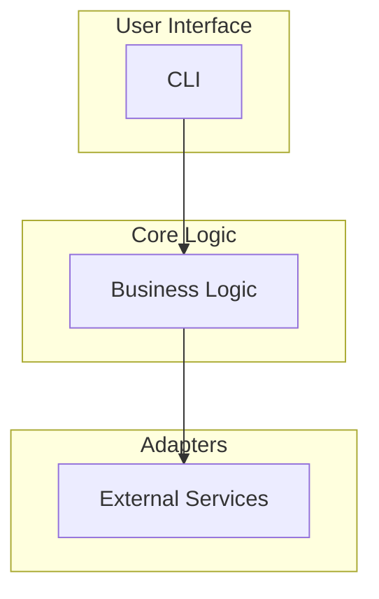

# Architecture

## Overview

`axm-anvil` follows a layered architecture with clear separation of concerns:

## Layers

### 1. CLI

Entry point for user commands. Handles input validation and formatted output.

### 2. Core Logic (`core/`)

Business logic independent of I/O.

### 3. Adapters (`adapters/`)

Each adapter wraps a single external dependency for testability.

## Internal CST primitives (`_cst/`)

The private `axm_anvil._cst` sub-package groups libcst helpers shared by
the move/rename/split tooling. It is intentionally internal — consumers
should use the public `axm_anvil` API.

| Module | Responsibility |
|---|---|
| `_cst.blocks` | Extract top-level symbol `Block` records (node + leading lines + referenced names) |
| `_cst.visitors` | `_ReferenceCollector` (collect referenced root names) and `_dotted_name` (flatten `Attribute` chains) |
| `_cst.transformers` | `_RemoveSymbols` transformer that deletes targeted top-level `ClassDef`, `FunctionDef`, and constant (`Assign` / `AnnAssign`) nodes while preserving surrounding formatting; `_AttributeRewriter` rewrites `old_module.Symbol` attribute chains (and alias-bound equivalents) to `new_module.Symbol`, using `ScopeProvider` to skip shadowed names and tracking residual `old_module.*` references so the caller layer knows when it can drop the bare `import old_module` line |
| `_cst.overloads` | `_detect_overload_group` — find the ordered `@overload` companions of a symbol, with alias-aware detection. Delegates alias discovery to `_collect_overload_aliases`, which composes two small helpers: `_iter_typing_import_names` (walk `from typing import ...` lines) and `_overload_alias_name` (resolve one `ImportAlias` to the local name bound to `typing.overload`, or `None`) |

## Transitive dependency collection in `core.move`

When `move_symbols` relocates a block, it must also carry along the
helpers and constants that block references (and those they transitively
reference). The BFS traversal in `core/move.py` shares a small enqueue
step so callers stay focused on the walk itself:

| Helper | Responsibility |
|---|---|
| `_collect_transitive_deps` | BFS transitive closure over helpers and constants from block refs, stable on cycles |
| `_BfsState` | Dataclass bundling the mutable BFS state (source/collected helpers and constants, `seen`, `queue`) |
| `_visit_dep_name` | Resolve one dequeued name: record it as helper/constant and enqueue its refs |
| `_expand_refs_one_level` | Append unseen refs to the work queue, marking them in `seen` in place |

## Orphan detection in `core.move`

When `move_symbols` copies helpers and constants to a target module, some
of them may no longer be referenced by anything staying in the source. The
orphan-detection pipeline in `core/move.py` is split into three private
helpers to keep each piece small:

| Helper | Responsibility |
|---|---|
| `_compute_source_orphans` | Top-level entry; intersects candidates with actual source names and delegates |
| `_collect_top_level_refs` | Walks the module body to build `(all_top_names, refs_of)` |
| `_filter_still_referenced` | Iterates to stability, promoting candidates reachable from staying names |

## `__all__` synchronization in `core.move`

When `move_symbols` relocates a symbol that is listed in the source
module's `__all__`, the public-API surface of both modules must follow the
move. `_build_trees` runs a post-step (after symbol removal and orphan
pruning) driven by two helpers:

| Helper | Responsibility |
|---|---|
| `_dunder_all_names` | Return the names declared in a module-level `__all__` `List`/`Tuple` literal, in declaration order (`[]` when absent) |
| `SyncDunderAll` (`_cst.transformers`) | Depth-tracked transformer that mutates an **existing** `__all__` literal's `elements` via `.with_changes()` — drops removed names, appends added names (idempotent), preserving quotes/commas/comments of surviving entries |

Only moved names that were actually present in the source `__all__` are
synced: such names are dropped from the source `__all__` and appended to
the target `__all__` **only when the target already declares one**. A
module without `__all__` is never given one (no synthesis), and moving a
symbol absent from the source `__all__` leaves both literals untouched.

## Caller rewriting in `core.callers`

When `move_symbols` relocates a symbol, every other file in the workspace
that imports it via `from old_module import Symbol` must be redirected to
the new module. The `core/callers.py` module isolates this concern behind
a small set of helpers so the main `move.py` pipeline stays focused on
source/target rendering:

| Helper | Responsibility |
|---|---|
| `_module_path_from_file` | Derive a dotted module path from a file path under a workspace root (strips `src/`, drops `.py`) |
| `_discover_callers` | Scan workspace `.py` files for `from <from_module> import` lines that reference any moved name |
| `_discover_module_import_callers` | Scan workspace `.py` files for bare `import old_module` (with optional `as` alias) statements that refer to the source module |
| `_rewrite_caller_text` | Rewrite a caller's text via libcst: remove moved names from the old import, add them to the new import, preserve asnames |
| `_add_new_imports` | Build a `CodemodContext` with `AddImportsVisitor.add_needed_import` calls for each matched moved name, preserving asnames |
| `_format_new_import_stmt` | Render the `from new_module import …` statement (with `as` aliases) used as the `new` side of the `CallerRewrite` record |
| `_rewrite_module_import_caller` | Rewrite `old_module.Symbol` attribute chains to `new_module.Symbol` via `_AttributeRewriter`, add `import new_module`, and drop `import old_module` when it has no residual uses |
| `CallerRewrite` | Per-line record `(file, line, old, new)` surfaced through `MovePlan.callers_updated` |

The `_process_callers` helper in `core/move.py` orchestrates the flow:
discover candidate callers (both `from`-imports and bare module imports),
parse + rewrite each via libcst, re-parse the result as a validation
gate, and stage the `(original, new)` text pairs for atomic write
alongside the source/target diffs through `batch_edit`. A caller that
uses *both* import styles is rewritten in a single pass so the final
text is validated once. The orchestrator delegates to three private
helpers to keep each piece small:

| Helper | Responsibility |
|---|---|
| `_dedup_caller_paths` | Merge `from`-import and module-import caller lists, preserving order while removing duplicates by resolved path |
| `_rewrite_one_caller` | Apply both rewrite passes to a single caller, validate via `cst.parse_module`, and return `None` when the file is unchanged |
| `_caller_relpath` | Render a caller path relative to the workspace root, falling back to the absolute path when outside the root |

## Implied target imports in `core.move`

When a moved block references names that are defined elsewhere in the
workspace, the target module needs a matching `import` so the block stays
valid in its new home. `_block_implied_target_imports` resolves each
referenced name to the module that will own it after the move:

| Helper | Responsibility |
|---|---|
| `_block_implied_target_imports` | Top-level entry; collects refs from moved blocks, dispatches each to the resolvers, and returns the set of internal modules the target should import |
| `_resolve_import_ref` | Resolve a ref via a source-side absolute import (skipping relative imports and refs that already resolve to the target) by walking dotted prefixes through `_resolve_internal_module` |
| `_resolve_symbol_ref` | Resolve a ref to `source_module` when it remains a top-level symbol staying behind in source |
| `_resolve_internal_module` | Resolve a dotted module name (or a parent prefix) to a known internal module |
| `_gather_source_imports` (in `core.deps`) | Map local names in the source module to the `ImportInfo` describing their origin |

Before adding any new import to the target tree, `_apply_imports`
consults `_gather_target_imports` (in `core.deps`) — the target-side
mirror of `_gather_source_imports` — to skip names already in scope.
This avoids `F811` redefinitions when the target file already imports a
name the moved block also references. When the existing target import
points at a different module than the source's import, the name is
still skipped but a `redundant import: …` warning is emitted into
`MovePlan.warnings` so the operator can reconcile the divergence.

### Conditional imports (guarded by `try`/`except` or `if`)

Imports nested in a top-level `try`/`except` (e.g. an optional fast
backend with a stdlib fallback) or an `if` guard (e.g. a
platform-specific import) cannot be reduced to a single flat
`import x` line without losing their fallback semantics.
`gather_source_imports` walks the body, handlers, `orelse` and
`finalbody` suites of every top-level `cst.Try`/`cst.If` and flags each
nested import's `ImportInfo` with `conditional=True`, keeping a handle
on the guarding block node in `ImportInfo.guard`.

When a moved symbol references a name provided by a conditional import,
`_apply_imports` copies the **entire guard block verbatim** into the
target (via `_splice_guard_blocks`) instead of synthesising a flat
import. The splice is idempotent: a guard whose normalised source
already exists among the target's top-level `try`/`if` blocks is not
duplicated. Conditional imports are never auto-removed from the source
module — they are excluded from `_compute_source_orphans` removal
candidates by construction (only copied helpers and constants are
removal candidates), so the fallback machinery survives in both files.

### Relative imports (intra- vs cross-package moves)

A relative import required by moved code (`from . import helper`,
`from .utils import f as g`) cannot be copied verbatim into a target that
lives in a different package — the dot level would resolve against the
wrong package. `move_symbols` builds an `_ImportResolution` context up
front (`_build_import_resolution`): it locates the source and target
package roots via `_find_pkg_root`, derives each module's *containing
package* dotted parts via `_pkg_module_name`, and records whether the two
modules share the same package root.

`_apply_imports` then routes every relative `ImportInfo` through
`_resolve_copied_import`:

- **Intra-package** (same package root) — the import is kept relative,
  re-leveled by `_relevel_intra_package` so its dot count still points at
  the same absolute `from`-module from the target's location. When source
  and target sit in the same directory this reproduces the original import
  verbatim.
- **Cross-package** (different package root) — the import is rewritten to
  the equivalent **absolute** import. `_absolute_from_parts` walks up
  `len(dots) - 1` packages from the source module's package and appends the
  import's module, yielding e.g. `from src_pkg.utils import f as g`.
  Imported names and aliases are always preserved.
- **Unresolvable** (the dot level walks above the package root, e.g.
  `from ... import x` near the top of the tree) — no import is written and
  a structured `unresolvable relative import: … (walks above package root)`
  warning is added to `MovePlan.warnings`.

Absolute imports are untouched. When either endpoint is not inside a
package (no `__init__.py` ancestor), the resolution context is `None` and
relative imports fall back to the historical drop behaviour.

## String forward-reference warnings in `core.move`

Type annotations written as string literals (PEP 484 forward references,
e.g. `def g(x: "Foo")`) are opaque to the caller-rewrite machinery — they
live inside a `SimpleString`/`ConcatenatedString`, not as a `Name` the
import rewriter can see. To keep these from silently breaking after a
move, `_string_forward_ref_warnings` runs the `StringForwardRefScanner`
visitor (in `_cst/visitors.py`) over the source tree once `moved_names`
is known. For each string annotation it parses the content with
`cst.parse_expression`, collects `Name` nodes via `ReferenceCollector`,
and intersects them with the moved names using a **whole-identifier**
match — so `"FooBar"` never matches a moved `Foo`, while `"list[Foo]"`
and `"Foo | None"` do. Every hit appends a structured, actionable
`forward-reference '<name>' in string annotation at <ctx> not rewritten;
update manually` line to `MovePlan.warnings`, identifying the symbol and
its function/parameter context. This is **detection-only**: string
annotations are never rewritten by the move.

## Pytest fixture-scope warnings in `core.move`

Moving a test function (or a `@pytest.fixture`-decorated function) can
silently break it when the fixture it depends on lives in a `conftest.py`
that no longer covers the destination directory. `move_symbols` detects
this without ever blocking the move.

`detect_fixture_dependencies(blocks, local_names)` is the pure,
in-memory layer: for every moved `def test_*` function or
`@pytest.fixture`-decorated function (including methods of a moved class),
it collects parameter names, then drops `self`/`cls`, defaulted
parameters, the pytest builtins in `PYTEST_BUILTIN_FIXTURES` (`tmp_path`,
`monkeypatch`, `capsys`, `request`, …), and any name already resolvable as
a local definition or import (`local_names`, built from the source module
by `_module_local_names`). What remains is the set of fixture names the
moved code needs from a `conftest.py`.

`_fixture_scope_warnings` is the filesystem layer. For each used fixture
it walks up the parent directories from `from_file` reading every
`conftest.py` (parsed with libcst, `@pytest.fixture` names collected) to
find the nearest one that provides it. The destination is in scope iff
that conftest's directory is a parent of — or equal to — `to_file`'s
directory (`Path.is_relative_to`). When it is not, a structured
`moved test depends on fixture '<name>' provided by '<conftest>'; the
target is outside that conftest's scope …` line is appended to
`MovePlan.warnings`. This is **detection-only**: the move always proceeds.

## Re-export mode in `core.move`

When `move_symbols` is called with `reexport=True`, the pipeline skips
caller discovery entirely and instead appends
`from new_module import <Symbol>  # re-export for backwards compat` to
the source module after the removed symbol's slot. The new source text
is parse-validated alongside the target, then emitted in a single
`batch_edit` call containing exactly two replace operations (source +
target) and zero caller ops. `data["reexport"] = True` is surfaced for
observability and `_format_text` prints `Mode: reexport`. `reexport=True`
is incompatible with `rename=` and raises `ValueError` before any I/O.

## Import-cycle detection in `core.cycles`

Moving a symbol can introduce an import cycle when the target module
already depends on the source (directly or transitively), or when the
caller-rewrite step redirects an import in a way that closes a loop.
`core/cycles.py` isolates the graph-level reasoning so `core/move.py`
only has to assemble the edit set:

| Helper | Responsibility |
|---|---|
| `GraphEdits` | Dataclass bundling edge `adds` and `removes` to apply on an import graph |
| `detect_new_cycle` | Copy the current graph, apply `GraphEdits`, and return the first *newly introduced* cycle (ignoring pre-existing cycles) |
| `_TarjanState` | Dataclass holding Tarjan's mutable bookkeeping (indices, lowlinks, stacks, emitted SCCs) so step helpers can share it without long parameter lists |
| `_tarjan_sccs` | Iterative Tarjan SCC driver (no recursion, safe on large packages); delegates per-frame work to `_tarjan_step_descend` and `_tarjan_step_finalize` |
| `_cycles` | Filter SCCs to size > 1 plus genuine self-loops |
| `_order_cycle` | Order nodes along a directed walk for readable `A → B → C → A` output |

The `_cycle_check` helper in `core/move.py` builds the current
package-level module graph by parsing every `.py` file under the
detected package root, computes `GraphEdits` for the move (imports
dropped from the source, imports gained by the target, caller
redirections), and calls `detect_new_cycle`. A non-`None` result raises
`ImportCycleError` with the ordered cycle when `check=True` or during a
normal (non-dry-run) write; pure `dry_run=True` calls skip the raise to
preserve the existing preview contract.

## Design Decisions

| Decision | Rationale |
|---|---|
| Hexagonal architecture | Testable core, swappable adapters |
| Pydantic models | Validation, serialization |
| `src/` layout | PEP 621 best practice, no import conflicts |
| Private `_cst/` sub-package | Share libcst primitives across tools without leaking internals |
