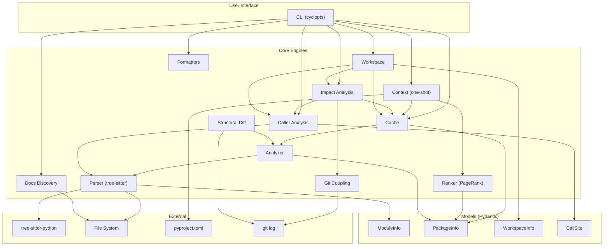

# Architecture

## Overview

`axm-ast` follows a layered architecture: CLI → core engines → models. The core layer is entirely I/O-free — it operates on Pydantic models produced by tree-sitter parsing.

## Layers

### 1. CLI (`cli.py`)

Cyclopts-based commands with input validation and formatted output (text + JSON). Each command follows the pattern: parse arguments → call core → format output.

### 2. Core Engines (`core/`)

Independent, composable analysis engines:

| Engine | Purpose | Key Function |
|---|---|---|
| `parser.py` | Tree-sitter AST parsing → `ModuleInfo` | `extract_module_info()` |
| `analyzer.py` | Package discovery, import graph (absolute + relative), search, stubs | `analyze_package()` |
| `cache.py` | Thread-safe caching of `PackageInfo` — avoids redundant parsing | `get_package()`, `clear_cache()` |
| `ranker.py` | PageRank symbol importance | `rank_symbols()` |
| `callers.py` | Call-site detection | `find_callers()`, `find_callers_workspace()` |
| `context.py` | One-shot project dump | `build_context()` |
| `impact.py` | Change blast radius (callers + reexports + tests + git coupling + cross-package). Workspace analysis delegates to extracted helpers (`_find_workspace_definition`, `_resolve_effective_test_filter`, `_apply_caller_test_filter`) | `analyze_impact()`, `find_definition()`, `analyze_impact_workspace()` |
| `git_coupling.py` | Git co-change coupling analysis (6-month history) | `git_coupled_files()` |
| `structural_diff.py` | Symbol-level branch diff via git worktrees | `structural_diff()` |
| `workspace.py` | Multi-package workspace detection and analysis | `detect_workspace()`, `analyze_workspace()` |
| `docs.py` | Documentation tree discovery | `discover_docs()` |
| `dead_code.py` | Dead code detection with test/lazy-import/base-class scanning; respects `.gitignore` via `_discover_py_files` | `find_dead_code()`, `DeadSymbol` |
| `flows.py` | Entry point detection, BFS flow tracing, source enrichment | `find_entry_points()`, `trace_flow()` |

### 3. Formatters (`formatters.py`)

Output formatting with multiple detail levels:

| Function | Purpose |
|---|---|
| `format_text()` | Human-readable text (summary / detailed / full) |
| `format_compressed()` | AI-friendly compressed view |
| `format_json()` | Machine-readable JSON |
| `format_toc()` | Table-of-contents: module names + counts only |
| `filter_modules()` | Case-insensitive substring filter on module names |
| `format_mermaid()` | Mermaid dependency graph |

### 4. Models (`models/`)

Pydantic models for structured data exchange between layers:

| Model | Purpose |
|---|---|
| `ModuleInfo` | Full introspection result for a single module |
| `PackageInfo` | Full introspection result for a package |
| `FunctionInfo` | Function metadata (params, return type, decorators) |
| `ClassInfo` | Class metadata (bases, methods, docstring) |
| `ParameterInfo` | Function parameter (name, type, default) |
| `VariableInfo` | Module-level variable / constant |
| `ImportInfo` | Import statement (absolute/relative, names) |
| `CallSite` | Call-site location (module, line, context) |
| `WorkspaceInfo` | Multi-package workspace (packages, dependency edges) |

### 5. Hooks (`hooks/`)

Protocol hooks registered via `axm.hooks` entry points. These are called by `axm-engine` as pre/post-hooks in protocol execution.

| Hook | Entry Point | Purpose |
|---|---|---|
| `TraceSourceHook` | `ast:trace-source` | Run `trace_flow(detail="source")` and inject trace into session context |
| `SourceBodyHook` | `ast:source-body` | Fetch raw source body for a symbol and inject it into session context. Supports dotted names via three resolution strategies: `_resolve_as_class_method` (`Class.method`, delegates to `_build_method_body`), `_resolve_as_nested_class` (`Outer.Inner.method`), and `_resolve_as_module_symbol` (`module.func`). Extraction logic lives in `_run_extraction`. |
| `FileHeaderHook` | `ast:file-header` | Extract file-level header (module docstring, `__all__`, top-level imports) and inject into session context |

## Design Decisions

| Decision | Rationale |
|---|---|
| tree-sitter for parsing | Fast, incremental, handles broken files gracefully |
| Pydantic models | Validation, serialization, JSON output for free |
| PageRank for ranking | Graph-based importance adapts to any project structure |
| Composable engines | `impact` = `callers` + `analyzer` + `ranker` + test mapping + git coupling |
| Session cache | `PackageCache` avoids redundant tree-sitter parsing across chained tool calls |
| Workspace auto-detect | `[tool.uv.workspace]` triggers multi-package mode transparently |
| `src/` layout | PEP 621 best practice, no import conflicts |
