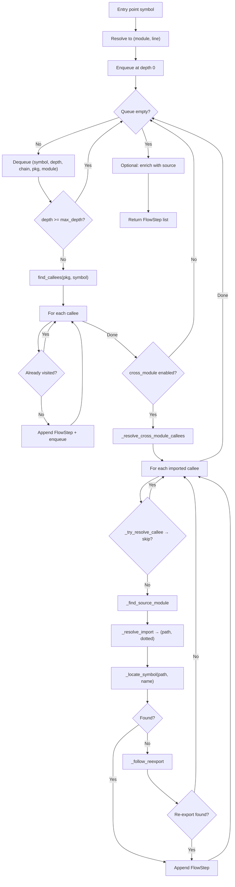

# Cross-Module Resolution

`trace_flow` uses a **breadth-first search (BFS)** to trace execution flow from an entry point through the call graph. When `cross_module=True`, it resolves imported symbols across package boundaries — the most complex subsystem in `axm-ast`.

## Algorithm Overview

## Key Data Structures

### `_CrossModuleContext`

A dataclass carrying shared mutable BFS state, passed by reference so cross-module resolution can append steps and update visited sets without return values:

| Field | Type | Role |
|---|---|---|
| `visited` | `set[tuple[str, str]]` | `(module, symbol)` pairs — prevents re-visiting |
| `queue` | `deque` | BFS frontier: `(symbol, depth, chain, pkg, module)` |
| `steps` | `list[FlowStep]` | Ordered results (depth-then-insertion) |
| `parse_cache` | `dict[str, tuple]` | Avoids re-parsing the same file with tree-sitter |
| `detail` | `str` | `"trace"` or `"source"` — controls enrichment |
| `exclude_stdlib` | `bool` | Whether to skip stdlib/builtin callees |
| `pkg_symbols` | `frozenset[str]` | Package-defined symbol names for stdlib filtering |

### `FlowStep`

Each BFS node produces a `FlowStep` (Pydantic model):

| Field | Role |
|---|---|
| `name` | Symbol name |
| `module` | Dotted module path |
| `line` | Source line number |
| `depth` | BFS depth from entry |
| `chain` | Full ancestor path from entry to this step |
| `resolved_module` | Set when resolved cross-module |
| `source` | Function source text (only when `detail="source"`) |

## BFS Traversal (`trace_flow`)

1. **Symbol resolution** — `_find_symbol_location` maps the entry name to a `(module_dotted, line)` pair. If not found, returns an empty list.
2. **Queue initialization** — The entry is enqueued at depth 0 and immediately appended to `steps` as the root `FlowStep`.
3. **Main loop** — Each iteration dequeues a symbol, resolves callees (from a pre-built index or via `find_callees`), and delegates filtering and enqueuing to `_process_local_callees`, which skips stdlib/visited symbols and appends a `FlowStep` for each new discovery at `depth + 1`.
4. **Depth cap** — When `depth >= max_depth`, the node is dequeued but its callees are not explored.
5. **Cross-module** — After same-package callees are processed, `_resolve_cross_module_callees` follows imported symbols into external files.
6. **Source enrichment** — After the BFS completes, if `detail="source"`, `_enrich_steps_with_source` patches each step with the actual function source text.

## Cross-Module Resolution (`_resolve_cross_module_callees`)

The outer function iterates over callees, delegating each to `_resolve_single_cross_callee`:

1. **Filter callee** — `_try_resolve_callee` skips stdlib/builtins (`_is_stdlib_or_builtin`) and symbols already defined in the current package.
2. **Locate context** — `_find_source_module` finds the `ModuleInfo` for the calling module, first via `find_module_for_symbol` by context name, then by matching `module_dotted_name` against the current module.
3. **Resolve import** — `_resolve_import` maps the symbol's import statement to `(resolved_path, resolved_dotted)`.
4. **Locate symbol** — `_locate_symbol` parses the target file with tree-sitter (single file, no full package traversal).
5. **Follow re-exports** — If not found, `_follow_reexport` chases `__init__.py` re-exports (one level deep).
6. **Record** — On success, deduplicates via `visited` and appends a `FlowStep` with `resolved_module` populated.

!!! note "Cross-module steps are not re-enqueued"
    Resolved symbols are added to `steps` but **not** pushed back into the BFS queue. Cross-module resolution adds visibility into external dependencies without recursing into them.

## Re-Export Following (`_follow_reexport`)

Handles the common pattern where `__init__.py` re-exports a symbol from a submodule:

1. Parse `resolved_path` (the file where the symbol was expected) with tree-sitter.
2. Walk top-level nodes, delegating each to `_try_resolve_reexport_node` which checks if the node is an `import_from_statement` importing the target symbol.
3. Resolve relative imports via `_resolve_relative_module`.
4. Map the import module to a file path using `_module_to_path`.
5. Call `_locate_symbol` on the actual target file.

!!! warning "Single-level only"
    `_follow_reexport` follows **one level** of re-export. Deeply chained re-exports (A → B → C) will not be resolved beyond the first hop.

## Parse Caching

The `parse_cache` dict in `_CrossModuleContext` is threaded through `find_callees` to avoid redundant tree-sitter parsing. During BFS, `find_callees` is called once per depth level per symbol — without caching, this would be quadratic in the worst case.

The cache key is the file path; the value is the parsed tree and source text.
