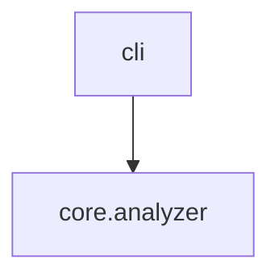

# Output Formats

`axm-ast` offers multiple output formats optimized for different consumers.

## Detail Levels (`describe`)

### Detailed (default)

Adds docstrings, parameter types, return types, and visibility indicators (`🔓` public, `🔒` private). This is the default detail level.

```bash
axm-ast describe src/mylib
```

### Summary

Quick orientation. Shows module names, public function signatures, and class names.

```bash
axm-ast describe src/mylib --detail summary
```

### Full

Everything: imports, variables, private symbols, decorators. Useful for complete documentation generation.

```bash
axm-ast describe src/mylib --detail full
```

### Compressed

AI-optimized format designed to fit large codebases into LLM context windows.

```bash
axm-ast describe src/mylib --compress
```

**Includes:**

- Module docstrings (first line only)
- `__all__` exports
- Public function signatures with first docstring line
- Class stubs with methods
- Relative imports (dependencies)
- Module-level constants

**Excludes:**

- Function bodies
- Absolute imports (e.g., `from pathlib import Path`)
- Private symbols not in `__all__`
- Multi-line docstrings

### TOC (table of contents)

Ultra-lightweight overview returning only module names and symbol counts — no individual function or class details.

```bash
axm-ast describe src/mylib --detail toc
```

**Includes:**

- Module dotted name
- Module docstring (first sentence)
- Function count, class count, total symbol count

**Excludes:**

- Individual function/class details
- Signatures, parameters, imports, variables

Combine with `--modules` to filter:

```bash
axm-ast describe src/mylib --detail toc --modules core
```

## Detail Levels (`docs`)

The `docs` command also supports progressive disclosure via `--detail`:

### Full (default)

Returns complete content for README, mkdocs.yml, and all doc pages. Same as the original behavior.

```bash
axm-ast docs .
```

### TOC

Heading tree + line count per page (~500 tokens). Use this to decide which pages to drill into.

```bash
axm-ast docs . --detail toc
```

### Summary

Headings + first sentence per section. A budget-friendly overview with enough context to identify stale sections.

```bash
axm-ast docs . --detail summary
```

### Page filter

Combine any detail level with `--pages` to narrow the scope:

```bash
axm-ast docs . --detail summary --pages architecture,howto
```

## Flow Detail Levels (`flows`)

The `flows` command supports three detail levels via `--detail`:

### Trace (default)

BFS traversal returning `FlowStep` objects with symbol name, module, depth, and call chain.

```bash
axm-ast flows src/mylib --entry main
```

### Source

Adds function source text to each `FlowStep`. Useful for full code-level tracing.

```bash
axm-ast flows src/mylib --entry main --detail source
```

### Compact

Returns a tree-formatted string with box-drawing characters and metadata keys: `entry`, `compact` (the tree string), `depth` (echoing `max_depth`), `cross_module`, and `count`.

```bash
axm-ast flows src/mylib --entry main --detail compact
```

When `--cross-module` is enabled, the BFS also resolves imported symbols across package boundaries. See [Cross-Module Resolution](cross_module_resolution.md) for the algorithm details.

## Graph Formats

### Text (default)

```bash
axm-ast graph src/mylib
```

### Mermaid

Paste directly into GitHub markdown or MkDocs:

```bash
axm-ast graph src/mylib --format mermaid
```

````

````

### JSON

```bash
axm-ast graph src/mylib --json
```

## Tool Text Rendering

MCP tools that return structured data also include a compact `text` field optimized for token-efficient responses. Each tool uses a consistent format:

### `ast_dead_code`

Header line followed by one symbol per line with abbreviated kind, name, relative path, and line number:

```
ast_dead_code | 3 dead symbols

func  unused_helper  core/utils.py:42
meth  _old_method    models/base.py:108
class DeprecatedMixin  compat.py:15
```

Kind abbreviations: `func` (function), `meth` (method), `class` (class).

### `ast_callers`

Header line with symbol name and caller count, followed by one caller per line:

```
ast_callers | my_function | 2 callers
core.engine:45 run_pipeline
tools.cli:12
```

## JSON Output

Every command supports `--json` for machine-readable output. JSON output follows consistent conventions:

- **Describe**: Full module/function/class trees
- **Graph**: Adjacency list `{module: [dependencies]}`
- **Context**: Structured project metadata
- **Impact**: Callers, affected modules, tests, score
- **Search/Callers**: Symbol lists with location info

!!! tip "Piping to jq"
    ```bash
    axm-ast describe src/mylib --json | jq '.modules[].name'
    axm-ast impact src/mylib --symbol foo --json | jq '.score'
    ```
