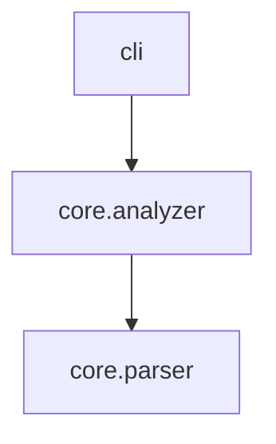

# CLI Reference

## Global Options

```
axm-ast --help       Show help
axm-ast --version    Show version
```

---

## `describe` — Introspect a Package

```
axm-ast describe [OPTIONS] [PATH]
```

| Option | Short | Type | Default | Description |
|---|---|---|---|---|
| `PATH` | | string | `.` | Path to package directory |
| `--detail` | `-d` | string | `detailed` | Detail level: `toc`, `summary`, `detailed` |
| `--compress` | | bool | `False` | AI-optimized compressed output |
| `--modules` | `-m` | string | *none* | Comma-separated module name filters (substring, case-insensitive) |
| `--json` | | bool | `False` | Output as JSON |
| `--rank` | | bool | `False` | Sort by PageRank importance |
| `--budget` | `-b` | int | *none* | Limit to top N symbols |

**Example:**

```bash
axm-ast describe src/mylib --compress
```

```
# core.analyzer
"""High-level package analysis engine."""
__all__ = ["analyze_package", "build_import_graph"]

def analyze_package(path: Path) -> PackageInfo:
    """Analyze a Python package directory."""
def build_import_graph(pkg: PackageInfo) -> dict[str, list[str]]:
    """Build an adjacency-list import graph."""
```

---

## `inspect` — Inspect a Symbol by Name

```
axm-ast inspect [OPTIONS] [PATH]
```

| Option | Short | Type | Default | Description |
|---|---|---|---|---|
| `PATH` | | string | `.` | Path to package directory |
| `--symbol` | `-s` | string | *none* | Symbol name to inspect (supports dotted paths like `Class.method`) |
| `--source` | | bool | `False` | Include source code in output |
| `--json` | | bool | `False` | Output as JSON |

Operates on **packages** (not individual files). Supports dotted paths like `ClassName.method`. Returns file path, line numbers, and optionally source code — matching MCP `ast_inspect`.

When `--symbol` matches a **module name** rather than a symbol, returns module-level metadata instead: `kind: "module"`, `functions`, `classes`, `symbol_count`, `docstring`, and `file`.

**Examples:**

```bash
# List all symbols in a package
axm-ast inspect src/mylib

# Inspect a specific function
axm-ast inspect src/mylib --symbol my_function

# Inspect a class method with source code
axm-ast inspect src/mylib --symbol Calculator.add --source

# JSON output with line info
axm-ast inspect src/mylib --symbol my_function --json
```

---

## `graph` — Dependency Graph

```
axm-ast graph [OPTIONS] [PATH]
```

| Option | Short | Type | Default | Description |
|---|---|---|---|---|
| `PATH` | | string | `.` | Path to package or workspace directory |
| `--format` | `-f` | string | `text` | Output format: `text`, `mermaid`, `json` |
| `--json` | | bool | `False` | Output as JSON |

!!! note "Workspace mode"
    When `PATH` is a `uv` workspace root, generates an inter-package dependency graph instead of an intra-package import graph.

**Example (Mermaid):**

```bash
axm-ast graph src/mylib --format mermaid
```



---

## `search` — Search Symbols

```
axm-ast search [OPTIONS] [PATH]
```

| Option | Short | Type | Default | Description |
|---|---|---|---|---|
| `PATH` | | string | `.` | Path to package directory |
| `--name` | `-n` | string | *none* | Filter by name (substring) |
| `--returns` | `-r` | string | *none* | Filter by return type |
| `--kind` | `-k` | string | *none* | Filter by kind: `function`, `method`, `property`, `classmethod`, `staticmethod`, `variable` |
| `--inherits` | | string | *none* | Filter classes by base class |
| `--json` | | bool | `False` | Output as JSON |

**Example:**

```bash
axm-ast search src/mylib --returns "PackageInfo"
```

---

## `callers` — Find Call-Sites

```
axm-ast callers [OPTIONS] [PATH]
```

| Option | Short | Type | Default | Description |
|---|---|---|---|---|
| `PATH` | | string | `.` | Path to package or workspace directory |
| `--symbol` | `-s` | string | *required* | Symbol to find callers of |
| `--json` | | bool | `False` | Output as JSON |

!!! note "Workspace mode"
    When `PATH` is a `uv` workspace root, searches across all member packages. Module names are prefixed with `pkg_name::` for disambiguation.

**Example:**

```bash
axm-ast callers src/mylib --symbol analyze_package
```

```
📞 7 caller(s) of 'analyze_package':

  cli:89 in describe()
    analyze_package(project_path)
  core.context:246 in build_context()
    analyze_package(path)
```

---

## `context` — Project Context Dump

```
axm-ast context [OPTIONS] [PATH]
```

| Option | Short | Type | Default | Description |
|---|---|---|---|---|
| `PATH` | | string | `.` | Path to package or workspace directory |
| `--depth` | `-d` | int \| None | `None` | Detail level: 0=top-5, 1=sub-packages, 2=modules, 3=symbols |
| `--json` | | bool | `False` | Output as JSON |

!!! note "Workspace mode"
    When `PATH` is a `uv` workspace root, returns a unified context with all member packages, their inter-package dependency graph, and aggregated statistics. The `--depth` flag controls detail: `0` returns package names only, `>= 1` includes full stats and the dependency graph.

**Example:**

```bash
axm-ast context src/mylib
```

```
📋 mylib
  layout: src (16 modules, 151 functions, 9 classes)
  python: >=3.12

🔧 Stack
  cli: cyclopts     models: pydantic     tests: pytest

📦 Modules (ranked)
  cli               ★★★★★  (describe, inspect, graph...)
  core.analyzer     ★★★★☆  (analyze_package, build_import_graph...)
  core.docs         ★★★☆☆  (discover_docs, build_docs_tree...)
```

---

## `impact` — Change Impact Analysis

```
axm-ast impact [OPTIONS] [PATH]
```

| Option | Short | Type | Default | Description |
|---|---|---|---|---|
| `PATH` | | string | `.` | Path to package or workspace directory |
| `--symbol` | `-s` | string | *required* | Symbol to analyze |
| `--exclude-tests` | | bool | `False` | Exclude test modules from callers and affected modules |
| `--test-filter` | | string | `None` | Test caller filter mode: `none`, `all`, or `related` |
| `--json` | | bool | `False` | Output as JSON |
| `--compact` | | bool | `False` | Output a compact markdown table summary |

!!! note "Workspace mode"
    When `PATH` is a `uv` workspace root, performs cross-package impact analysis — callers, re-exports, and test files from all member packages.

**Example:**

```bash
axm-ast impact src/mylib --symbol analyze_package
```

```
💥 Impact analysis for 'analyze_package' — HIGH

  📍 Defined in: core.analyzer (L38)
  📞 Direct callers (7): cli, core.context, core.impact
  📄 Affected modules (5): axm_ast, cli, core, core.context, core.impact
  🧪 Tests to rerun (7): test_analyzer, test_callers, test_compress...
```

---

## `dead-code` — Dead Code Detection

```
axm-ast dead-code [OPTIONS] [PATH]
```

| Option | Short | Type | Default | Description |
|---|---|---|---|---|
| `PATH` | | string | `.` | Path to package directory |
| `--include-tests` | | bool | `False` | Also scan test modules as targets (not just as consumers) |
| `--json` | | bool | `False` | Output as JSON |

Dead code detection automatically scans a sibling `tests/` directory for callers and detects lazy imports inside function bodies (`from X import Y` inside `def`). Symbols used exclusively in tests are **not** flagged as dead.

**Exemptions** (not flagged as dead):

- Dunder methods (`__init__`, `__repr__`, etc.)
- Test functions (`test_*`)
- `__all__`-exported symbols
- Decorated functions (entry point heuristic)
- `@property`, `@abstractmethod` methods
- Methods on `Protocol` classes
- Exception subclasses
- `pyproject.toml` entry points (`[project.entry-points]`, `[project.scripts]`)
- Dict/list dispatch targets (symbols referenced in data structures)
- Method overrides (inherited from base classes)

**Example:**

```bash
axm-ast dead-code src/mylib
```

```
💀 3 dead symbol(s) found:

  📄 src/mylib/utils.py
    L  12  function    deprecated_fn
    L  28  method      OldClass.stale_method

  📄 src/mylib/core.py
    L  45  function    _unused_helper
```

---

## `diff` — Structural Branch Diff

```
axm-ast diff REFS [PATH] [OPTIONS]
```

| Option | Short | Type | Default | Description |
|---|---|---|---|---|
| `REFS` | | string | *required* | Git refs in `base..head` format |
| `PATH` | | string | `.` | Path to package directory |
| `--json` | | bool | `False` | Output as JSON |

Compares two git branches at symbol level. Uses git worktrees to checkout both refs and `analyze_package()` on each version, then diffs the symbol sets.

**Example:**

```bash
axm-ast diff main..feature src/mylib
```

```
🔀 Structural diff main..feature — 3 change(s)

  Symbols added (1):
    + new_func (function) — core.py

  Symbols modified (1):
    ~ process (function) — engine.py

  Symbols removed (1):
    - old_helper (function) — utils.py
```

---

## `flows` — Entry Points & Execution Flow Tracing

```
axm-ast flows [OPTIONS] [PATH]
```

| Option | Short | Type | Default | Description |
|---|---|---|---|---|
| `PATH` | | string | `.` | Path to package directory |
| `--trace` | `-t` | string | *none* | Entry point name to trace BFS flow from |
| `--max-depth` | | int | `5` | Maximum BFS depth for flow tracing |
| `--cross-module` | | bool | `False` | Resolve imports and trace into external modules |
| `--detail` | `-d` | string | `trace` | Detail level: `trace` (names only), `source` (include function source code), or `compact` (tree with box-drawing chars) |
| `--exclude-stdlib` | | bool | `True` | Exclude stdlib/builtin callees from BFS trace |
| `--json` | | bool | `False` | Output as JSON |

Without `--trace`, detects entry points (cyclopts, click, Flask, FastAPI, pytest, `__main__`, `__all__` exports). With `--trace`, performs BFS call-graph traversal from the named symbol.

!!! note "Cross-module resolution"
    With `--cross-module`, the tracer resolves `from X import Y` statements and traces into the target module. When the target is a **sibling package** (e.g. `tests/` importing from `django/`), the tracer walks up to the **project root** (detected via `.git`, `pyproject.toml`, `setup.py`) as a fallback search path.

**Examples:**

```bash
# Detect all entry points
axm-ast flows src/mylib

# Trace BFS flow from an entry point
axm-ast flows src/mylib --trace main

# Cross-module trace with source code
axm-ast flows tests/ --trace test_response --cross-module --detail source

# JSON output for CI/agents
axm-ast flows src/mylib --trace main --json
```

```
🔀 Flow from 'test_response' (3 step(s)):

  depth 0  test_response   (test_http:3)
  depth 1  HttpResponse    (test_http:4) → mylib.http
  depth 1  assertEqual     (test_http:5)
```

---

## `docs` — Documentation Tree Dump

```
axm-ast docs [OPTIONS] [PATH]
```

| Option | Short | Type | Default | Description |
|---|---|---|---|---|
| `PATH` | | string | `.` | Project root directory |
| `--detail` | `-d` | string | `full` | Detail level: `toc`, `summary`, `full` |
| `--pages` | `-p` | string | *none* | Comma-separated page name substrings to filter |
| `--json` | | bool | `False` | Output as JSON |
| `--tree` | | bool | `False` | Only show directory tree |

### Detail levels

| Level | Returns | Use case |
|---|---|---|
| `toc` | Heading tree + line count per page (~500 tokens) | Quick scan, decide which pages to read |
| `summary` | Headings + first sentence per section | Budget-friendly overview with context |
| `full` | Complete page content (default) | Full doc sync, initial exploration |

**Examples:**

```bash
# Full content (default, same as before)
axm-ast docs .

# Heading scan only
axm-ast docs . --detail toc

# Summary with page filter
axm-ast docs . --detail summary --pages architecture,howto

# Tree-only mode
axm-ast docs . --tree
```

---

## `version` — Show Version

```
axm-ast version
```
