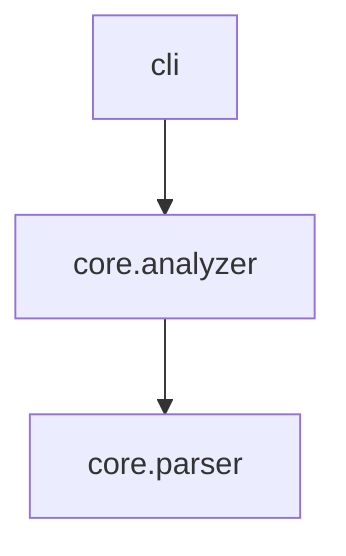

# CLI Reference

This page describes the dedicated `axm-ast` binary, registered in `[project.scripts]`.
The generic SDK CLI `axm <tool>` uses the [AXM tool contracts](tools.md).
Their defaults, workspace coverage and JSON envelopes can differ. `--json` is
an analysis option, not a global option; text-only compression/compact modes
take precedence when combined with it.

## Additional tools

`ast_coupling_gaps`, `ast_doc_impact` and `ast_file_header` are available via
AXM tools rather than separate dedicated subcommands. See [tool reference](tools.md).

## Global Options

```
axm-ast --help       Show help
axm-ast version      Show version
```

---

## `describe` — Introspect a Package

TOC text output includes a docstring summary when available and still lists
modules without one. In JSON mode, the `docstring` key is omitted when absent.

```
axm-ast describe [OPTIONS] [PATH]
```

| Option | Short | Type | Default | Description |
|---|---|---|---|---|
| `PATH` | | string | `.` | Path to package directory |
| `--detail` | `-d` | string | `detailed` | Detail level: `toc`, `names`, `summary`, `detailed` |
| `--compress` | | bool | `False` | AI-optimized compressed output. Allowed with `--detail summary` or `detailed` (default `detailed`); rejected with `--detail toc` |
| `--modules` | `-m` | string | *none* | Comma-separated module name filters (substring, case-insensitive) |
| `--json` | | bool | `False` | Output as JSON |
| `--rank` | | bool | `False` | Sort by PageRank importance |
| `--budget` | `-b` | int | *none* | Limit output to the top N lines (intelligent truncation) |

**Example:**

```bash
axm-ast describe src/mylib --compress
```

```
# core.analyzer
"""High-level package analysis engine."""
__all__ = ["analyze_package", "build_import_graph"]

def analyze_package(path: Path) -> PackageInfo:
    """Analyze a Python package directory."""
def build_import_graph(pkg: PackageInfo) -> dict[str, list[str]]:
    """Build an adjacency-list import graph."""
```

---

## `inspect` — Inspect a Symbol by Name

```
axm-ast inspect [OPTIONS] [PATH]
```

| Option | Short | Type | Default | Description |
|---|---|---|---|---|
| `PATH` | | string | `.` | Path to package directory |
| `--symbol` | `-s` | string | *none* | Symbol name to inspect (supports dotted paths like `Class.method`) |
| `--symbols` | | list[str] | *none* | Symbol names to inspect in batch (mutually exclusive with `--symbol`) |
| `--source` | | bool | `False` | Include source code in output |
| `--json` | | bool | `False` | Output as JSON |

Operates on **packages** (not individual files). Supports dotted paths like `ClassName.method`. Returns file path, line numbers, and optionally source code — matching MCP `ast_inspect`.

When `--symbol` matches a **module name** rather than a symbol, returns module-level metadata instead: `kind: "module"`, `functions`, `classes`, `symbol_count`, `docstring`, and `file`.

Simple symbol names resolve by **exact name**: `--symbol Trajectory` returns `Trajectory`, never a substring superset like `TrajectoryReader`. When several symbols across different modules share the exact requested name, the command reports a disambiguation error listing the module-qualified matches (e.g. `Multiple symbols match 'Dup': pkg.a.Dup, pkg.b.Dup`) and exits non-zero; qualify with a dotted path to pick one. When no symbol matches exactly, resolution falls through to the module fallback and then "not found".

**Examples:**

```bash
# List all symbols in a package
axm-ast inspect src/mylib

# Inspect a specific function
axm-ast inspect src/mylib --symbol my_function

# Inspect a class method with source code
axm-ast inspect src/mylib --symbol Calculator.add --source

# Batch inspect multiple symbols
axm-ast inspect src/mylib --symbols my_function Calculator.add

# JSON output with line info
axm-ast inspect src/mylib --symbol my_function --json
```

---

## `graph` — Dependency Graph

```
axm-ast graph [OPTIONS] [PATH]
```

| Option | Short | Type | Default | Description |
|---|---|---|---|---|
| `PATH` | | string | `.` | Path to package or workspace directory |
| `--format` | `-f` | string | `text` | Output format: `text`, `mermaid`, `json` |
| `--json` | | bool | `False` | Output as JSON |
| `--scope` | | string | *none* | Graph scope: `package`, `workspace`, or `workspace-deps`. Omit for auto-detection. |

!!! note "Workspace mode"
    When `PATH` is a `uv` workspace root and `--scope` is omitted, generates an inter-package dependency graph instead of an intra-package import graph (auto-detection, unchanged).

!!! note "`--scope` values"
    - `package` — intra-package module import graph (forces single-package mode even on a workspace root).
    - `workspace` — **merged module-level graph across all workspace packages**, with every node namespaced `{package}.{module}` and cross-package edges resolved to their owning package (e.g. `axm-mcp.cli → axm.tools`). Renders in `text`, `json`, and `mermaid`.
    - `workspace-deps` — inter-package dependency graph (the legacy workspace-root behavior, explicitly selected).

**Example (workspace module-level graph):**

```bash
axm-ast graph /path/to/workspace --scope workspace --format json
```

**Example (Mermaid):**

```bash
axm-ast graph src/mylib --format mermaid
```


```mermaid
graph TD
    cli["cli"]
    core_analyzer["core.analyzer"]
    core_parser["core.parser"]
    cli --> core_analyzer
    core_analyzer --> core_parser
```

---

## `search` — Search Symbols

```
axm-ast search [OPTIONS] [PATH]
```

| Option | Short | Type | Default | Description |
|---|---|---|---|---|
| `PATH` | | string | `.` | Path to package directory |
| `--name` | `-n` | string | *none* | Filter by name (substring) |
| `--returns` | `-r` | string | *none* | Filter by return type |
| `--kind` | `-k` | string | *none* | Filter by kind: `function`, `method`, `property`, `classmethod`, `staticmethod`, `abstract`, `class`, `variable` |
| `--inherits` | | string | *none* | Filter classes by base class |
| `--json` | | bool | `False` | Output as JSON |

**Example:**

```bash
axm-ast search src/mylib --returns "PackageInfo"
```

!!! note "Fuzzy suggestions"
    When `--name` matches no symbols, the tool returns fuzzy suggestions based on `difflib` similarity matching (cutoff 0.6). If `--kind` is also set, suggestions are filtered to that kind. Suggestions appear as `?`-prefixed lines in the text output and under `data.suggestions` in JSON mode.

---

## `callers` — Find Call-Sites

```
axm-ast callers [OPTIONS] [PATH]
```

| Option | Short | Type | Default | Description |
|---|---|---|---|---|
| `PATH` | | string | `.` | Path to package or workspace directory |
| `--symbol` | `-s` | string | *required* | Symbol to find callers of |
| `--json` | | bool | `False` | Output as JSON |

!!! note "Workspace mode"
    When `PATH` is a `uv` workspace root, searches across all member packages. Module names are prefixed with `pkg_name::` for disambiguation.

**Example:**

```bash
axm-ast callers src/mylib --symbol analyze_package
```

```
📞 7 caller(s) of 'analyze_package':

  cli:89 in describe()
    analyze_package(project_path)
  core.context:246 in build_context()
    analyze_package(path)
```

---

## `callees` — Find Callees of a Symbol

```
axm-ast callees [OPTIONS] [PATH]
```

| Option | Short | Type | Default | Description |
|---|---|---|---|---|
| `PATH` | | string | `.` | Path to package directory |
| `--symbol` | `-s` | string | *required* | Symbol to find callees of |
| `--json` | | bool | `False` | Output as JSON |

The inverse of `callers`: given a function name, returns all call-sites *within* that function body.

**Example:**

```bash
axm-ast callees src/mylib --symbol execute
```

```
📞 3 callee(s) of 'execute':

  core.analyzer:38 → analyze_package in execute()
    analyze_package(project_path)
  core.cache:12 → get_package in execute()
    get_package(project_path)
```

---

## `context` — Project Context Dump

```
axm-ast context [OPTIONS] [PATH]
```

| Option | Short | Type | Default | Description |
|---|---|---|---|---|
| `PATH` | | string | `.` | Path to package or workspace directory |
| `--depth` | `-d` | int \| None | `None` | Detail level: 0=top-5, 1=sub-packages, 2=modules, 3=symbols |
| `--json` | | bool | `False` | Output as JSON |

!!! note "Workspace mode"
    When `PATH` is a `uv` workspace root, returns a unified context with all member packages, their inter-package dependency graph, and aggregated statistics. The `--depth` flag controls detail: `0` returns package names only, `>= 1` includes full stats and the dependency graph.

**Example:**

```bash
axm-ast context src/mylib
```

```
📋 mylib
  layout: src (16 modules, 151 functions, 9 classes)
  python: >=3.12

🔧 Stack
  cli: cyclopts     models: pydantic     tests: pytest

📦 Modules (ranked)
  cli               ★★★★★  (describe, inspect, graph...)
  core.analyzer     ★★★★☆  (analyze_package, build_import_graph...)
  core.docs         ★★★☆☆  (discover_docs, build_docs_tree...)
```

---

## `impact` — Change Impact Analysis

```
axm-ast impact [OPTIONS] [PATH]
```

| Option | Short | Type | Default | Description |
|---|---|---|---|---|
| `PATH` | | string | `.` | Path to package or workspace directory |
| `--symbol` | `-s` | string | *required* | Symbol to analyze |
| `--exclude-tests` | | bool | `False` | Exclude test modules from callers and affected modules |
| `--test-filter` | | string | `None` | Test caller filter mode: `none`, `all`, or `related` |
| `--json` | | bool | `False` | Output as JSON |
| `--compact` | | bool | `False` | Output a compact markdown table summary |
| `--precise-callers` | | bool | `False` | Exclude callers proven to import a distinct homonym; unresolved imports remain |

!!! note "Workspace mode"
    When `PATH` is a `uv` workspace root, performs cross-package impact analysis — callers, re-exports, and test files from all member packages.

**Example:**

```bash
axm-ast impact src/mylib --symbol analyze_package
```

```
💥 Impact analysis for 'analyze_package' — HIGH

  📍 Defined in: core.analyzer (L38)
  📞 Direct callers (7): cli, core.context, core.impact
  📄 Affected modules (5): axm_ast, cli, core, core.context, core.impact
  🧪 Tests to rerun (7): test_analyzer, test_callers, test_compress...
```

---

## `dead-code` — Dead Code Detection

```
axm-ast dead-code [OPTIONS] [PATH]
```

| Option | Short | Type | Default | Description |
|---|---|---|---|---|
| `PATH` | | string | `.` | Path to package directory |
| `--include-tests` | | bool | `False` | Also scan test modules as targets (not just as consumers) |
| `--json` | | bool | `False` | Output as JSON |

Dead code detection automatically scans a sibling `tests/` directory for callers and detects lazy imports inside function bodies (`from X import Y` inside `def`). Symbols used exclusively in tests are **not** flagged as dead.

**Exemptions** (not flagged as dead):

- Dunder methods (`__init__`, `__repr__`, etc.)
- Test functions (`test_*`)
- `__all__`-exported symbols
- Decorated functions (entry point heuristic)
- `@property`, `@abstractmethod` methods
- Methods on `Protocol` classes
- Exception subclasses
- `pyproject.toml` entry points (`[project.entry-points]`, `[project.scripts]`)
- Dict/list dispatch targets (symbols referenced in data structures)
- Method overrides (inherited from base classes)

**Example:**

```bash
axm-ast dead-code src/mylib
```

```
💀 3 dead symbol(s) found:

  📄 src/mylib/utils.py
    L  12  function    deprecated_fn
    L  28  method      OldClass.stale_method

  📄 src/mylib/core.py
    L  45  function    _unused_helper
```

---

## `diff` — Structural Branch Diff

See [diff options and limitations](cli-tracing.md#diff-structural-branch-diff).

## `flows` — Entry Points & Execution Flow Tracing

See [flow options and tracing](cli-tracing.md#flows-entry-points-execution-flow-tracing).

## `docs` — Documentation Tree Dump

See [documentation dump options](cli-tracing.md#docs-documentation-tree-dump).

## `version` — Show Version

```
axm-ast version
```
