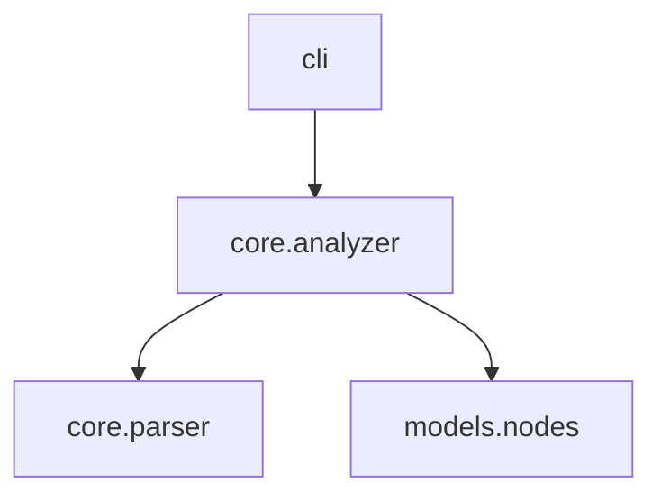

# Quick Start

This tutorial walks you through installing `axm-ast` and exploring a Python project.

## Prerequisites

- Python 3.12+
- [uv](https://docs.astral.sh/uv/) (recommended) or pip

## Installation

```bash
uv add axm-ast
```

Or with pip:

```bash
pip install axm-ast
```

Verify the installation:

```bash
axm-ast version
```

## Step 1: Get Project Context

The `context` command gives an AI agent everything it needs in one call:

```bash
axm-ast context src/mylib
```

```
📋 mylib
  layout: src (16 modules, 151 functions, 9 classes)
  python: >=3.12

🔧 Stack
  cli: cyclopts     models: pydantic     tests: pytest
  lint: ruff         types: mypy          packaging: hatchling

🛠 AXM Tools
  axm-ast: ✅

📐 Patterns
  exports: __all__ in 13 modules
  tests: 12 test files

📦 Modules (ranked)
  cli               ★★★★★  (describe, inspect, graph, search, callers...)
  core.analyzer     ★★★★☆  (analyze_package, build_import_graph...)
  core.docs         ★★★☆☆  (discover_docs, build_docs_tree...)
```

!!! tip "JSON output"
    Add `--json` to any command for machine-readable output.

## Step 2: Describe the Package

Get a detailed view of all symbols:

```bash
axm-ast describe src/mylib --detail detailed
```

Or a compressed AI-friendly view:

```bash
axm-ast describe src/mylib --compress
```

The compressed view shows only signatures, first docstring lines, `__all__`, and relative imports — ideal for fitting into LLM context windows.

## Step 3: Visualize the Dependency Graph

```bash
axm-ast graph src/mylib --format mermaid
```



## Step 4: Find Who Calls a Function

```bash
axm-ast callers src/mylib --symbol analyze_package
```

```
📞 7 caller(s) of 'analyze_package':

  cli:89 in describe()
    analyze_package(project_path)
  cli:272 in graph()
    analyze_package(project_path)
  core.context:246 in build_context()
    analyze_package(path)
  core.impact:203 in analyze_impact()
    analyze_package(path)
```

## Step 5: Analyze Change Impact

Before modifying a function, check the blast radius:

```bash
axm-ast impact src/mylib --symbol analyze_package
```

```
💥 Impact analysis for 'analyze_package' — HIGH

  📍 Defined in: core.analyzer (L38)
  📞 Direct callers (7): cli, core.context, core.impact
  📄 Affected modules (5): axm_ast, cli, core, core.context, core.impact
  🧪 Tests to rerun (7): test_analyzer, test_callers, test_compress...
  📦 Re-exported in (5): axm_ast, cli, core, core.context, core.impact
```

## Step 6: Dump Documentation

Get the full documentation tree in one call:

```bash
axm-ast docs .
```

```
📖 README.md
────────────────────────────────────────
# mylib
Python AST introspection CLI...

📁 Documentation tree
────────────────────────────────────────
docs/
├── howto
│   └── describe.md
├── tutorials
│   └── quickstart.md
└── index.md

📄 docs/index.md
────────────────────────────────────────
# Home
...
```

!!! tip "Tree-only mode"
    Use `--tree` to quickly see the documentation structure without file contents.

## Next Steps

- [Describe a package](../howto/describe.md) — All detail levels and output formats
- [Analyze change impact](../howto/impact.md) — Pre-refactoring risk assessment
- [How-To Guides](../howto/index.md) — Advanced usage patterns
- [CLI Reference](../reference/cli.md) — Full command documentation
- [Architecture](../explanation/architecture.md) — How it works under the hood
