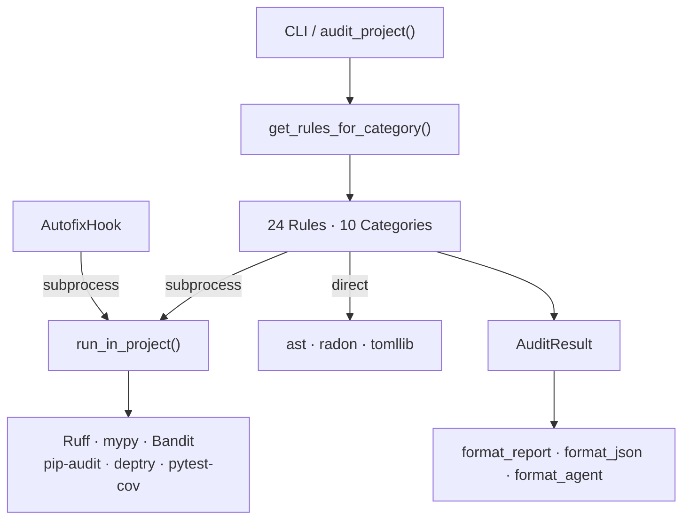
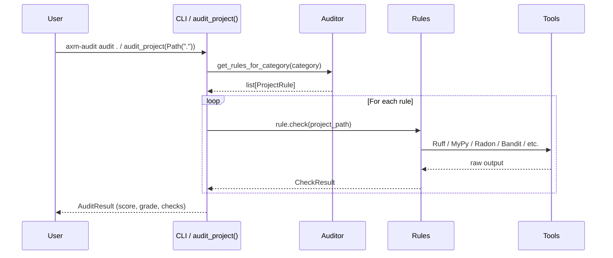

# Architecture

## Overview

`axm-audit` follows a layered architecture with clear separation of concerns:

## Layers

### 1. Public API

- **CLI** — `axm-audit audit .` via cyclopts
- **`audit_project()`** — Python entry point
- **`get_rules_for_category()`** — Get rule instances, optionally filtered

Both return typed Pydantic models for safe agent consumption.

### 2. Rule Engine

`get_rules_for_category()` returns rule instances from the auto-discovery registry (populated by `@register_rule` decorators):

| Category | Rules | Count |
|---|---|---|
| `lint` | `LintingRule`, `FormattingRule`, `DiffSizeRule`, `DeadCodeRule` | 4 |
| `type` | `TypeCheckRule` | 1 |
| `complexity` | `ComplexityRule` | 1 |
| `security` | `SecurityRule`, `SecurityPatternRule` | 2 |
| `deps` | `DependencyAuditRule`, `DependencyHygieneRule` | 2 |
| `testing` | `TestCoverageRule` | 1 |
| `architecture` | `CircularImportRule`, `GodClassRule`, `CouplingMetricRule`, `DuplicationRule` | 4 |
| `practices` | `DocstringCoverageRule`, `BareExceptRule`, `BlockingIORule`, `SecurityPatternRule`, `TestMirrorRule` | 5 |
| `structure` | `PyprojectCompletenessRule` | 1 |
| `tooling` | `ToolAvailabilityRule` | 3 instances |

**Total: 24 rule instances across 10 categories.**

### 3. Tool Integration

All subprocess-based rules use `run_in_project()` from `core/runner.py`, which detects the target project's `.venv/` and executes tools via `uv run --directory` to ensure the correct environment is used. Most rules pass `with_packages=[...]` to inject audit dependencies (ruff, bandit, etc.) at runtime — the target project does **not** need these tools in its own environment. **Exception:** `TypeCheckRule` does **not** inject mypy — it uses the project's own mypy from the venv, ensuring the same type-stub availability and configuration as the project's pre-commit hooks. All subprocess calls have a **300-second timeout** (configurable) — on timeout, a synthetic result with `returncode=124` is returned to prevent indefinite hangs.

| Rule | Tool | Integration |
|---|---|---|
| `LintingRule` | Ruff | `run_in_project(["ruff", "check", ...])` |
| `FormattingRule` | Ruff | `run_in_project(["ruff", "format", "--check", ...])` |
| `TypeCheckRule` | MyPy | `run_in_project(["mypy", ...])` |
| `ComplexityRule` | Radon | `radon.complexity.cc_visit(source)` (fallback: `radon cc --json` subprocess) |
| `SecurityRule` | Bandit | `run_in_project(["bandit", ...])` |
| `DependencyAuditRule` | pip-audit | `run_in_project(["pip-audit", ...])` |
| `DependencyHygieneRule` | deptry | `run_in_project(["deptry", ...])` |
| `TestCoverageRule` | pytest-cov | `run_tests()` via `test_runner.py` (always collects failures + coverage; `mode` param accepted for backward compat but ignored) |
| Architecture rules | Python `ast` | Direct AST parsing |
| Structure rules | `tomllib` | TOML parsing |
| `ToolAvailabilityRule` | `shutil.which` | PATH lookup |

### 4. Hooks

Pre-gate hooks run before quality evaluation to auto-fix common issues:

| Hook | Commands | Behavior |
|---|---|---|
| `AutofixHook` | `ruff check --fix .`, `ruff format .` | Registered as `audit:autofix` in the `axm.hooks` entry-point group. Runs via `run_in_project()`. Returns `HookResult.ok(fixed=N)` with fix count parsed from ruff stdout. Skips gracefully when ruff is missing (`skipped=True`). Tolerates config errors (returncode 2) without failing. |

### 5. Scoring

10-category weighted composite (see [Scoring & Grades](scoring.md)):

| Category | Weight |
|---|---|
| Linting | 20% |
| Type Safety | 15% |
| Complexity | 15% |
| Security | 10% |
| Dependencies | 10% |
| Testing | 15% |
| Architecture | 10% |
| Practices | 5% |

### 6. Models

`AuditResult`, `CheckResult`, `Severity` — Pydantic models with `extra = "forbid"` for strict validation.

### 7. Output

- **Formatters**: `format_report()` (human-readable), `format_json()` (machine-readable), `format_agent()` (agent-optimized), `format_agent_text()` (compact text for LLM consumption). `format_agent` uses `_has_actionable_detail()` to promote passing checks with non-empty list-valued detail keys (e.g. `missing`, `top_offenders`) from summary strings to full dicts. `format_agent_text` consumes the dict from `format_agent` and renders a minimal text representation with `✓`/`✗` lines, achieving ~55-60% token savings.

## Data Flow

