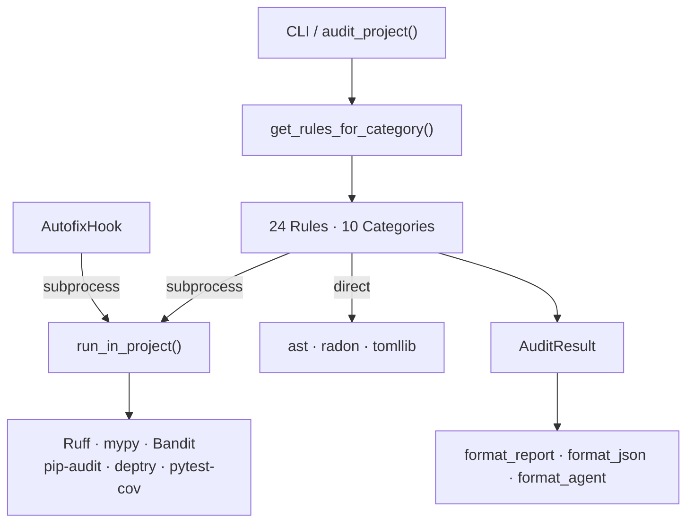
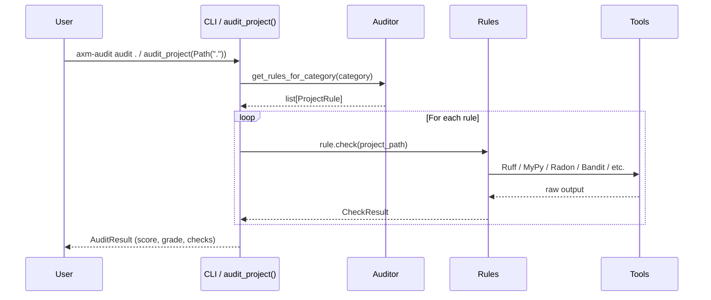

# Architecture

## Overview

`axm-audit` follows a layered architecture with clear separation of concerns:

## Layers

### 1. Public API

- **CLI** — `axm-audit audit .` via cyclopts
- **`audit_project()`** — Python entry point
- **`get_rules_for_category()`** — Get rule instances, optionally filtered

Both return typed Pydantic models for safe agent consumption.

### 2. Rule Engine

`get_rules_for_category()` returns rule instances from the auto-discovery registry (populated by `@register_rule` decorators):

| Category | Rules | Count |
|---|---|---|
| `lint` | `LintingRule`, `FormattingRule`, `DiffSizeRule`, `DeadCodeRule` | 4 |
| `type` | `TypeCheckRule` | 1 |
| `complexity` | `ComplexityRule` | 1 |
| `security` | `SecurityRule`, `SecurityPatternRule` | 2 |
| `deps` | `DependencyAuditRule`, `DependencyHygieneRule` | 2 |
| `testing` | `TestCoverageRule` | 1 |
| `architecture` | `CircularImportRule`, `GodClassRule`, `CouplingMetricRule`, `DuplicationRule` | 4 |
| `practices` | `DocstringCoverageRule`, `BareExceptRule`, `BlockingIORule`, `TestMirrorRule` | 4 |
| `structure` | `PyprojectCompletenessRule` | 1 |
| `tooling` | `ToolAvailabilityRule` | 3 instances |

**Total: 24 rule instances across 10 categories.**

### 3. Tool Integration

All subprocess-based rules use `run_in_project()` from `core/runner.py`, which detects the target project's `.venv/` and executes tools via `uv run --directory` to ensure the correct environment is used. Most rules pass `with_packages=[...]` to inject audit dependencies (ruff, bandit, etc.) at runtime — the target project does **not** need these tools in its own environment. **Exception:** `TypeCheckRule` does **not** inject mypy — it uses the project's own mypy from the venv, ensuring the same type-stub availability and configuration as the project's pre-commit hooks. All subprocess calls have a **300-second timeout** (configurable) — on timeout, a synthetic result with `returncode=124` is returned to prevent indefinite hangs.

| Rule | Tool | Integration |
|---|---|---|
| `LintingRule` | Ruff | `run_in_project(["ruff", "check", ...])` |
| `FormattingRule` | Ruff | `run_in_project(["ruff", "format", "--check", ...])` |
| `TypeCheckRule` | MyPy | `run_in_project(["mypy", ...])` |
| `ComplexityRule` | Radon | `radon.complexity.cc_visit(source)` (fallback: `radon cc --json` subprocess) |
| `SecurityRule` | Bandit | `run_in_project(["bandit", ...])` |
| `DependencyAuditRule` | pip-audit | `run_in_project(["pip-audit", ...])` |
| `DependencyHygieneRule` | deptry | `run_in_project(["deptry", ...])` |
| `TestCoverageRule` | pytest-cov | `run_tests()` via `test_runner.py` (collects failures + coverage; skips coverage when `files` is specified; `mode` param accepted for backward compat but ignored) |
| Architecture rules | Python `ast` | Direct AST parsing |
| Structure rules | `tomllib` | TOML parsing |
| `ToolAvailabilityRule` | `shutil.which` | PATH lookup |

### 4. Hooks

Pre-gate hooks run before quality evaluation to auto-fix common issues:

| Hook | Commands | Behavior |
|---|---|---|
| `AutofixHook` | `ruff check --fix .`, `ruff format .` | Registered as `audit:autofix` in the `axm.hooks` entry-point group. Runs via `run_in_project()`. Returns `HookResult.ok(fixed=N)` with fix count parsed from ruff stdout. Skips gracefully when ruff is missing (`skipped=True`). Tolerates config errors (returncode 2) without failing. |

### 5. Fix System — CST rewriters

The fix subsystem (`core/fix/cst_rewrite.py`) carries two parallel
surfaces over the same libcst primitives. File-level helpers (the
`_prefixed` ones) load with `_cst_load`, transform, then save with
`_cst_save`. In-memory rewriters take a `cst.Module` and return a
`cst.Module`, leaving I/O to the caller — useful for composing several
edits without redundant parse/serialize round-trips.

| In-memory rewriter | File-level counterpart | Operation |
|---|---|---|
| `flatten_class(module, class_name)` | `_flatten_class_to_top_level` | Promote test methods of `class_name` to module top level, lifting pytest marks |
| `rename_function(module, old, new)` | `_rename_name_in_module` | Rename a top-level function, its references, and matching parametrize string literals |
| `delete_function(module, name)` | `_delete_function_from_source` | Drop a top-level function while preserving adjacent blank-line spacing |
| `patch_file_depth(module, delta)` | `_patch_file_dunder_depth` | Adjust `Path(__file__).parents[N]` subscripts after a directory move |
| `dedupe_imports(module)` | `_dedupe_imports_cst` | Collapse duplicate `import` / `from … import` statements |
| `backfill_import(module, mapping)` | `_insert_imports_cst` | Insert `from {mod} import {name}` entries (idempotent, post-`__future__`) |

Import resolution is backed by a project-wide cache:
`_resolve_import_for_symbol(project_path, symbol)` returns a fresh
`ast.ImportFrom` statement that brings `symbol` into scope, building
the index lazily via `_build_project_symbol_index` and caching it in
`_PROJECT_IMPORT_INDEX_CACHE`. Call `_invalidate_import_index(project_path)`
after mutating the file tree so the next lookup rebuilds.

Layout & move (`core/fix/layout_and_move.py`) wraps axm-anvil's
`move_symbols` with collision detection so the pipeline can reshape
the test tree without losing fixtures or shadowing conftests:

| Symbol | Stage | Purpose |
|---|---|---|
| `relocate_non_canonical_tiers` | 0.5 | Move legacy `tests/<non-canonical>/test_*.py` into `tests/integration/` so RELOCATE only sees canonical tiers |
| `flatten_tier_layout` | 1.5 | Collapse nested `tests/integration//` and `tests/e2e//` to flat layout, renaming on collision |
| `_safe_move_units` | per-op | Wrap `move_symbols` with collision dedup/rename, helper-body conflict resolution, conftest-shadow guards, marker-fixture follow-up |
| `_resolve_helper_conflicts` | per-op | Rename source helpers whose body diverges from a same-named helper in target (or shadows conftest) before anvil runs |
| `_resolve_conftest_shadowing` | per-op | Rename target-local helpers that would shadow conftest fixtures the moved tests depend on |

Stage executors (`core/fix/stages_execute.py`) apply the plan: one
function per `FileOp.kind` (`_execute_flatten`, `_execute_relocate`,
`_execute_rename`, `_execute_split`, `_execute_merge`) dispatched by
`execute(ops, project_path)`. The plan itself is a list of `FileOp`
records (`core/fix/models.py`) — each carries `kind`, `source`,
`target` (a single `Path` for non-split ops, `list[Path]` for SPLIT),
`rationale`, `source_rule`, and an optional `split_map` for SPLIT
routing.

The orchestrator (`core/fix/pipeline.py`) exposes `run(project_path,
*, apply, rules) -> PipelineReport`. In `apply=True` mode it iterates
RELOCATE → SPLIT → MERGE → RENAME inside a fixed-point loop capped at
`MAX_ITERATIONS = 6` (re-classification cascade — see the
`MAX_ITERATIONS` docstring); dry-run takes a single pass. After
convergence, two post-pipeline polish steps run (apply-mode only):

| Step | Module | Purpose |
|---|---|---|
| `_extract_shared_helpers` | `core/fix/extract_helpers.py` | Promote helpers/fixtures duplicated across a tier into `tests/<tier>/_helpers.py`. Iterates per-tier until fixed-point (capped at `_EXTRACT_MAX_ITERS = 10`) so promoting helper A can expose helper B. |
| `_ruff_format_tests` | `core/fix/pipeline.py` | Idempotent `ruff format` + `ruff check --fix-only --select F401,I001,UP034` over `tests/`. Failures degrade to warnings — polish never aborts a successful apply. |

`PipelineReport` aggregates the result: `ops` (every planned mutation
across iterations), `unfixable` (findings the pipeline declined),
`applied` (dry-run vs. applied), `warnings` (per-stage + polish
messages), and `iterations` (passes until convergence; 1 in dry-run).

Pipeline invariants (idempotence, parity, convergence, monotonicity,
tree-diff against an expected layout) are validated by
`tests/integration/test_pipeline_invariants.py` over the [fix
corpus](glossary.md#concepts) — synthetic mini-packages under
`tests/fixtures/fix_corpus/` consumed via the `fix_corpus_case(name)`
factory. A slow self-copy variant (`@pytest.mark.slow`,
`test_pipeline_invariants_slow.py`) re-runs the same invariants
against a `git clone --depth 1` of `axm-audit` itself; opt-in via
`uv run pytest -m slow`.

### 6. Scoring

10-category weighted composite (see [Scoring & Grades](scoring.md)):

| Category | Weight |
|---|---|
| Linting | 20% |
| Type Safety | 15% |
| Complexity | 15% |
| Security | 10% |
| Dependencies | 10% |
| Testing | 15% |
| Architecture | 10% |
| Practices | 5% |

### 7. Models

`AuditResult`, `CheckResult`, `Severity` — Pydantic models with `extra = "forbid"` for strict validation.

### 8. Output

- **Formatters**: `format_report()` (human-readable), `format_json()` (machine-readable), `format_agent()` (agent-optimized), `format_agent_text()` (compact text for LLM consumption). `format_agent` uses `_has_actionable_detail()` to promote passing checks with non-empty list-valued detail keys (e.g. `missing`, `top_offenders`) from summary strings to full dicts. `format_agent_text` consumes the dict from `format_agent` and renders a minimal text representation with `✓`/`✗` lines, achieving ~55-60% token savings.

## Data Flow

