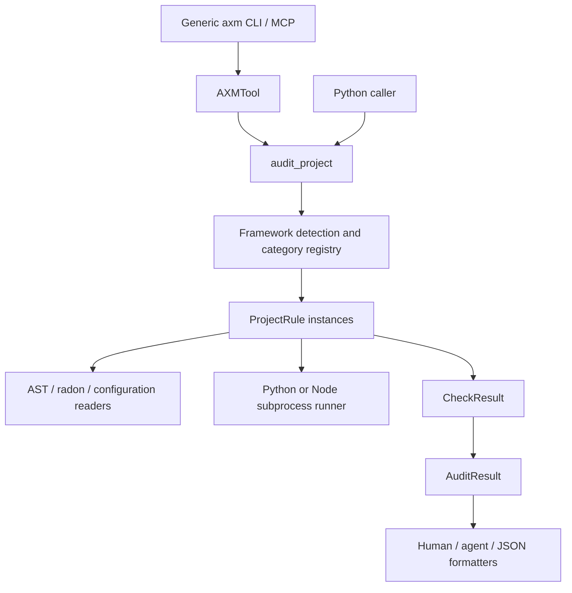

# Architecture

## Request and analysis layers

```mermaid
graph TD
    CLI["Generic axm CLI / MCP"] --> Tool["AXMTool"]
    Tool --> Auditor["audit_project"]
    Python["Python caller"] --> Auditor
    Auditor --> Framework["Framework detection and category registry"]
    Framework --> Rules["ProjectRule instances"]
    Rules --> Native["AST / radon / configuration readers"]
    Rules --> Process["Python or Node subprocess runner"]
    Rules --> Checks["CheckResult"]
    Checks --> Result["AuditResult"]
    Result --> Formatters["Human / agent / JSON formatters"]
```

The root Python surface returns typed audit models.
`get_rules_for_category` returns a list of rule instances, not a result model.
Rule registration happens when modules are imported via `register_rule`;
the registry is indexed by category and framework. A class may expand to
multiple instances. Use the [category guide](../howto/categories.md) to
inspect the current registry instead of relying on a fixed rule count.

## Workspace dispatch and concurrency

The dispatcher recognizes `packages/<member>/src/` and audits members
concurrently with a bounded outer pool. Each member has its own context-local
AST cache shared across that member's rule workers. Results are collected in
input order and merged by rule ID using worst-of-member scores and failures.
An exception at the rule boundary becomes a failed result; it does not
abort the other rules.

[Frameworks and workspaces](../reference/frameworks.md) describes the layout
limits and the current override/quick-mode caveats.

## External tools

Python subprocess checks use `run_in_project` where implemented.
It resolves the nearest project environment and optionally requests runtime
packages with uv. Type checking uses the project's own mypy.
Its default timeout is 300 seconds; pytest/coverage uses 900 seconds.
On timeout the shared runner kills the process group and returns exit 124,
or re-raises under `check=True`.

Node subprocess rules use their own runner and project-local binaries or
PATH tools. Expected finding return codes depend on the tool: TypeScript
exit 2 can mean type errors rather than an environment failure.

Not every rule uses the same subprocess helper or failure classifier.
The exact integration and external tool configuration affect which checks
can run. See [configuration](../reference/configuration.md).

## Fix system

The audit path reports findings; `audit_fix` separately applies Python
test-tree transformations using libcst and axm-anvil. Planning, file moves,
fixture/helper management and reporting live in `core/fix/`.
The orchestrator performs a bounded fixed-point loop, then helper extraction,
formatting and a syntax gate in apply mode.

The [pipeline reference](../fix_pipeline.md) explains why a one-pass preview,
a restored test directory, and a successful syntax check each provide
different evidence. None replaces test execution and caller-owned parity
checks.

## Models and output

`AuditResult` and `CheckResult` are Pydantic models with
`extra="forbid"`. `Severity` is an enum. Numeric scoring is separate
from `passed`; the tool transport's `success` is separate again.

The audit tool uses `format_agent` for data and `format_agent_text`
for compact text. Passing checks can be strings or structured entries;
failures preserve available text, details and metadata. Strict
`format_json` is a different API. See [results](../howto/results.md)
and [scoring](scoring.md).

## Other entry points

`audit_test` wraps pytest and validates requested targets.
`doc_gate` wraps a strict MkDocs build and classifies output.
The `audit_quality` witness adapts category results to the witness contract.
The MCP server's `verify` composes audit/governance tools separately;
it is not an entry point shipped by this package.
