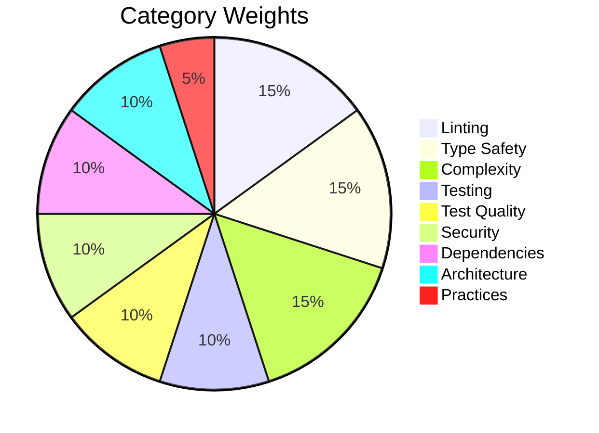

# Scoring & Grades

## Composite Quality Score

The quality score is a **weighted average** across 9 categories, on a 100-point scale.
Computed by `AuditResult.quality_score` — returns `None` when no scored checks
are present, and normalizes by the sum of present weights so filtered audits
(e.g. `category="lint"`) are not penalized for missing categories.

| Category | Tool | Weight |
|---|---|---|
| Linting | Ruff | **15%** |
| Type Safety | mypy | **15%** |
| Complexity | radon | **15%** |
| Testing | pytest-cov | **10%** |
| Test Quality | AST analysis | **10%** |
| Security | Bandit | **10%** |
| Dependencies | pip-audit + deptry | **10%** |
| Architecture | AST analysis | **10%** |
| Practices | AST analysis | **5%** |



Each category produces a score from 0 to 100. The composite score is:

```
score = lint × 0.15 + type × 0.15 + complexity × 0.15
      + testing × 0.10 + test_quality × 0.10
      + security × 0.10 + deps × 0.10
      + architecture × 0.10 + practices × 0.05
```

!!! info "Why no Structure or Tooling categories?"
    Structure validation (project layout, `pyproject.toml` completeness) is
    handled by `axm-init` with dedicated checks. Tooling availability checks
    (`ruff`, `mypy`, `uv` on PATH) emit informational findings only. Both
    categories produce findings but are intentionally excluded from the
    composite score — `axm-audit` focuses on **code quality**.

## Category Scoring

### Lint Score

```
score = max(0, 100 − issue_count × 2)
```

Per-category pass threshold: ≥ 90 (≤ 5 issues). The same threshold
applies to the composite score — see [Grading Scale](#grading-scale).

### Format Score

```
score = max(0, 100 − unformatted_count × 5)
```

Per-category pass threshold: ≥ 90 (≤ 2 unformatted files).

### Diff Size Score

```
score = 100                    if lines ≤ ideal
score = 0                      if lines ≥ max
score = 100 − (lines − ideal) × 100 / (max − ideal)   otherwise
```

Defaults: `ideal = 400`, `max = 1200`. Configurable via `pyproject.toml`:

```toml
[tool.axm-audit]
diff_size_ideal = 400   # lines — perfect score ceiling
diff_size_max = 1200    # lines — zero score floor
```

Per-category pass threshold: ≥ 90 (≤ 480 lines with defaults).

### Type Score

```
score = max(0, 100 − error_count × 5)
```

Per-category pass threshold: ≥ 90 (≤ 2 errors).

### Complexity Score

```
score = max(0, 100 − high_complexity_count × 10)
```

High complexity = cyclomatic complexity ≥ 10. Per-category pass threshold: ≥ 90 (≤ 1 complex function).

### Security Score

Average of two sub-scores:

- **Bandit**: `max(0, 100 − high_count × 15 − medium_count × 5)` — vulnerability scanning
- **Hardcoded secrets**: `max(0, 100 − count × 25)` — regex pattern detection

### Dependencies Score

Average of two sub-scores:

- **pip-audit**: `max(0, 100 − vuln_count × 15)` — known CVEs (env tools `pip`, `setuptools`, `wheel`, `uv`, `pip-audit` are excluded from the count)
- **deptry**: `max(0, 100 − issue_count × 10)` — unused/missing deps

### Testing Score

```
score = coverage_percentage
```

Uses `pytest-cov` to measure line coverage. Per-category pass threshold: ≥ 90%.

### Test Quality Score

Average of four sub-scores, each penalising structural defects in the test suite:

- **Pyramid level**: `max(0, 100 − misplaced_count × P)` — tests living at the
  wrong layer (`tests/unit/` vs `tests/integration/` vs `tests/e2e/`)
- **Tautology**: `max(0, 100 − tautological_count × P)` — tests whose body
  cannot fail (e.g. `assert True`, asserting against the SUT's own output)
- **Private imports**: `max(0, 100 − private_count × P)` — tests importing
  underscore-prefixed names instead of going through the public API
- **Duplicate tests**: `max(0, 100 − duplicate_pair_count × P)` — tests with
  near-identical bodies clustered together

Where `P` is each rule's per-finding penalty defined in `core/rules/test_quality/`.

### Architecture Score

Average of four sub-scores:

- **Circular imports**: `max(0, 100 − cycle_count × 20)`
- **God classes**: `max(0, 100 − god_class_count × 15)`
- **Coupling**: `max(0, 100 − N(modules > threshold) × 5)` — fan-out exceeding 10 imports
- **Duplication**: `max(0, 100 − duplicate_pair_count × 10)`

### Practices Score

Average of four sub-scores:

- **Docstring coverage**: `int(coverage_pct × 100)`
- **Bare excepts**: `max(0, 100 − count × 20)`
- **Blocking I/O**: `max(0, 100 − count × 15)` — detects `time.sleep` in async contexts and HTTP calls without `timeout` parameter
- **Test mirroring**: `max(0, 100 − missing_count × 15)`

## Grading Scale

| Grade | Score | Meaning |
|---|---|---|
| **A** | ≥ 90 | Excellent — production-ready |
| **B** | ≥ 80 | Good — minor issues |
| **C** | ≥ 70 | Acceptable — needs attention |
| **D** | ≥ 60 | Poor — significant issues |
| **F** | < 60 | Failing — critical problems |

## Severity Levels

Each individual check carries a severity:

| Severity | Effect | Example |
|---|---|---|
| `error` | Blocks audit pass | Missing `pyproject.toml` |
| `warning` | Non-blocking | High complexity function |
| `info` | Informational only | Docstring coverage stats |

## Type Safety

All results use Pydantic models (`AuditResult`, `CheckResult`, `Severity`) with `extra = "forbid"` for strict validation — safe for both human and agent consumption.
