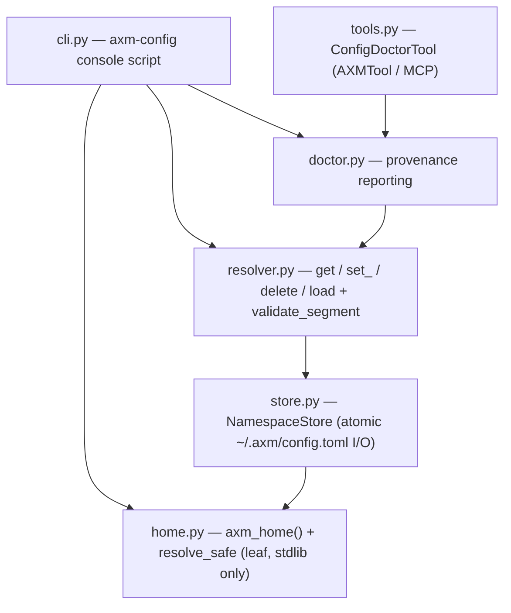

# Architecture

`axm-config` is a small, flat package: five source modules layered by
responsibility, no hexagonal `core/`/`adapters/` split. The dependency arrow
points one way — the CLI and the AXMTool sit at the edge, the resolver is the
brain, and the store/home modules own the on-disk contact.

## The modules

| Module | Role |
|---|---|
| `home.py` | The leaf. Resolves `~/.axm` (`axm_home()`, created `0700`) and hosts `resolve_safe`, the guard that refuses any path resolving inside a git checkout. Pure stdlib. |
| `store.py` | `NamespaceStore` — reads/writes the single `~/.axm/config.toml`, atomically, `0600`. Degrades to `{}` on an absent/corrupt file; re-types an unsafe HOME as `UnsafeHomeError`. |
| `resolver.py` | The public key–value surface: `get` / `set_` / `delete` / `load`, plus `validate_segment` and the `AXM_<NS>_<KEY>` env-name derivation. Owns the `env > file > default` precedence. |
| `doctor.py` | Read-only provenance: for each visible key, which layer would win. Never reads a value into a consumer, never mutates. |
| `tools.py` | `ConfigDoctorTool` — the AXMTool boundary over `doctor.py` (MCP + `axm config_doctor` CLI). Business logic stays in `doctor.py`. |
| `cli.py` | The `axm-config` console script. Process-lifecycle only; every command delegates to the central function. |

## Why a single `config.toml` (and how migration works)

An earlier layout kept one file per namespace (`~/.axm/<ns>.toml`). The current
layout is a **single** `~/.axm/config.toml` whose top-level tables are the
namespaces (a dotted namespace such as `storage.portfolio` maps to the nested
table `[storage.portfolio]`). One file means one atomic swap per write and no
directory scan to enumerate namespaces.

Migration is read-through and lazy: a legacy `~/.axm/<ns>.toml` is still visible
via `NamespaceStore.read`, and on the next `write`/`delete` for that namespace
its contents are folded into `config.toml` and the legacy file removed — no
silent data loss.

Every write is a read-modify-write of the whole file: load the full mapping,
update the one section, serialise to a same-directory temp file, and
`os.replace` it into place (the temp file is unlinked even if the swap fails).
Because a namespace section holds only its own scalar/array keys, a nested
sub-table is treated as a **child namespace**, not a key of the parent — a node
can be both a leaf (it carries keys) and a prefix (it nests further namespaces).
Since a section is read back without its child sub-tables, a write that updates
only the parent's own keys **re-attaches** those children before the atomic
swap, so setting a key on `[git]` never erases a sibling `[git.default]`.

## Env-name derivation and its injectivity

The env layer maps `(namespace, key)` to a single deterministic variable name,
`AXM_<NS>_<KEY>`, upper-cased, with each namespace dot folded to a **double**
underscore (`research.fred` + `api_key` → `AXM_RESEARCH__FRED_API_KEY`).

This map is **provably injective** and always POSIX-valid, and the property is
enforced entirely by `validate_segment`:

- **Lowercase-only segments.** Both a namespace and a key are lowercase; the
  upper-casing is therefore a bijection on the input charset. `"Demo"` is
  rejected upstream, so it can never share `AXM_DEMO_*` with `"demo"`.
- **Only dots fold to `__`.** A namespace (`^[a-z0-9]+(\.[a-z0-9]+)*$`) carries
  no `_` and no `-`; a key (`^[a-z0-9]+(_[a-z0-9]+)*$`) joins runs with a
  *single* `_` and forbids leading/trailing/doubled `_`. So a `__` in the
  output can only come from a namespace dot, never from a key, and the lone
  single `_` marks the namespace/key boundary.

The reverse direction (`doctor.py`'s `_env_keys`, which recovers a namespace's
keys from the environment) shares the same guarantee, with one subtlety: the
prefix `AXM_A_` is *also* a prefix of a **child** namespace's variables
(`AXM_A__B_C` belongs to `a.b`, key `c`). The reverse map therefore validates
each recovered suffix against the key pattern and drops a suffix that is not a
legal key — otherwise a child's variable would surface as a phantom
leading-underscore key of the parent.

## Threat model

`axm-config` stores non-sensitive config, but it still shares `~/.axm` with the
secrets manager (`axm-vault`), so its on-disk discipline matters:

- **Containment.** `validate_segment` runs at every public boundary before any
  path is built, rejecting path separators, `..` traversal, the empty string
  and NUL. A namespace/key can never widen the `~/.axm/<ns>.toml` path.
- **In-repo refusal.** `resolve_safe` refuses a `~/.axm` that resolves inside a
  git checkout (a misconfigured `HOME`, e.g. dotfiles under a `~/.git`). The
  store re-types that refusal as `UnsafeHomeError` (a `ConfigError`) so the CLI
  exits cleanly and `load` propagates a typed error rather than a raw
  `ValueError`.
- **Permissions.** The `~/.axm` directory is `0700` (tightened on every call)
  and `config.toml` is written `0600`, so a config value never lands
  world-readable.

`resolve_safe` is also the primitive `axm-vault` builds on: a `0600` secrets
file can never be written into a repo.
