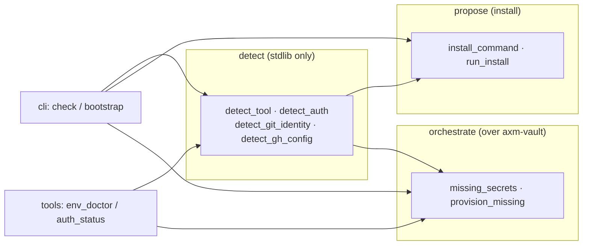

# Architecture

`axm-doctor` is a small, flat package: five modules under `src/axm_doctor/`,
no `core/` or `adapters/` layering. Its shape follows one pipeline —
**detect → propose → orchestrate** — wrapped by two thin interface surfaces
(a CLI and two AXM tools).

## The three stages

- **detect** (`detect.py`) — answers "is `uv` installed?", "is `gh` logged in?",
  "is a git committer identity resolvable?". Read-only: it inspects an exit
  code or the *existence* of a credential/store entry, never a value.
- **propose** (`install.py`) — turns "`uv` is absent" into the **official**
  install command as an `InstallPlan`. Building a plan runs nothing.
- **orchestrate** (`orchestrate.py`) — reads the **axm-vault** catalog and its
  value-free provenance to list the secrets that resolve to `missing`, and (on
  confirmation) delegates provisioning to vault's setup driver.

`cli.py` and `tools.py` are interface shells only: they parse input / shape a
`ToolResult` and print, but hold no detection logic — the same central
functions back both the CLI and the MCP tools.

## The three invariants

1. **Value-free.** No detection ever reads a token, identity or config value.
   Auth is an exit code or a *stat* of a credential file (a 0-byte file is
   `logged_out`); the git/gh config checks read only presence and exit codes.
   No `ToolResult` ever serializes a secret.
2. **Dry-run by default.** `run_install` and `provision_missing` are
   `confirm=False` by default — they *describe* what they would do and change
   nothing. A system change happens only on an explicit `confirm=True` (the CLI
   gates it behind a `y` prompt, honouring no-system-install-without-consent).
   A confirmed run reports success from a **re-check**, never from the mere fact
   that a command ran: `run_install` re-detects the tool, and `provision_missing`
   re-scans `missing_secrets()` and lists any spec still unresolved.
3. **Orchestrates, never possesses.** doctor never *stores* a secret itself —
   every write goes through vault's API (`run_setup`). It reads the vault
   catalog and provenance but owns no credential store. This is the SRP seam
   with axm-vault.

## The dependency boundary (why the split)

`detect` is **bootstrap-sensitive**: it must import on a machine where only
stdlib + pydantic are present, because it is the probe that runs *before* the
rest of AXM is installable. So `detect.py` imports no AXM package at module
load (its `axm-config` use for git-identity is deferred into the function
body), and the package's top-level re-exports are resolved lazily via
PEP 562 `__getattr__` — importing `axm_doctor` does **not** eager-load
`orchestrate` (which imports `axm-vault`) or `tools` (which imports
`axm.tools.base`).

`orchestrate` sits on the other side of that line: it is the orchestration seam
with **axm-vault** (catalog + provenance + setup driver) and with **axm-config**
(the `[git].default` identity store). doctor reads both; it writes neither
directly.

## Interface posture: AXMTool vs CLI

The read-only report is exposed as two `axm.tools` AXMTools — `env_doctor` and
`auth_status` — so it is reachable over MCP, the `axm` CLI and as a DAG node
from a single declaration. A request→response that *returns a value* is an
AXMTool. The `axm-doctor bootstrap` **process** (an interactive install/prompt
loop that mutates the machine) stays a cyclopts CLI: it is a lifecycle, not a
value-returning call.
