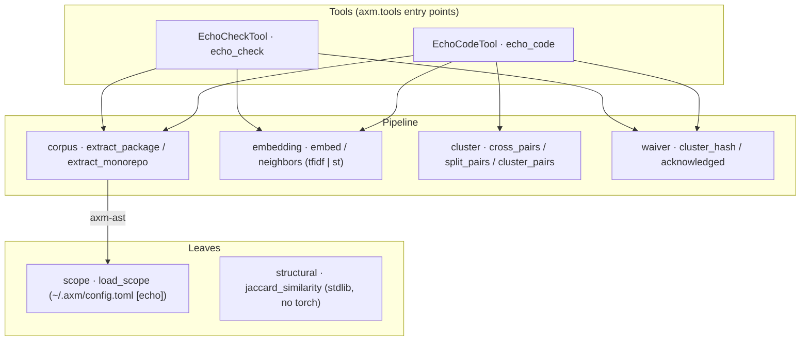

# Architecture

`axm-echo` is a flat set of single-responsibility modules — no `core/` /
`adapters/` split, no hexagonal layering. The two `axm.tools` entry points
(`echo_code`, `echo_check`) orchestrate a shared
**corpus → embed → compare** pipeline; everything else is a leaf the tools
compose.

## Modules

| Module | Role |
|---|---|
| `tools` | The `echo_code` / `echo_check` `AXMTool`s (MCP + CLI + DAG node). They run the pipeline and shape the `ToolResult`. |
| `corpus` | Extract public symbols from a package (`extract_package`) or the whole scope (`extract_monorepo`) via `axm-ast`; each `Symbol` carries an `embed_text`. |
| `embedding` | The two backends behind `embed()` — `tfidf` (scikit-learn, pure CPU) and `st` (MiniLM, neural). `neighbors()` does exact cosine top-k. |
| `cluster` | Cross-package candidate pairs (`cross_pairs`), the v7 anti-signal split (`split_pairs`: dupes / parallel-API / boilerplate), and union-find clustering. |
| `waiver` | The acknowledged-cluster mechanism: a stable `cluster_hash` and the `[[tool.axm-echo.acknowledged]]` waiver lifecycle (mark / stale). |
| `scope` | Resolve the workspace roots to scan from the shared `~/.axm/config.toml` `[echo]` section (via axm-config, `env > file > default`), degrading to the current directory when absent. |
| `structural` | 100%-structural similarity over `ast.FunctionDef` bodies (`statement_set` + `jaccard_similarity`); pure stdlib, never loads torch. The primitive `duplicate_tests` reuses. |

## Design decisions

| Decision | Rationale |
|---|---|
| Neural by default (`st`/MiniLM) | Docstring similarity wants semantics; `torch` + `sentence-transformers` ship in the base install. |
| `tfidf` backend kept | A pure-CPU opt-out for callers that must avoid loading torch — `embed(texts, backend="tfidf")` and `--backend tfidf`. |
| Lazy torch import | `torch` is imported only inside the `st` backend, so the `tfidf` path stays light at runtime even though torch is installed. |
| Flat modules, no hexagonal split | Each module is one concern with a small public surface; the tools compose them. No abstract ports to swap. |
| Exact cosine (no ANN) | Corpora are monorepo-sized; brute-force matmul is exact and fast enough, with no index to maintain. |
