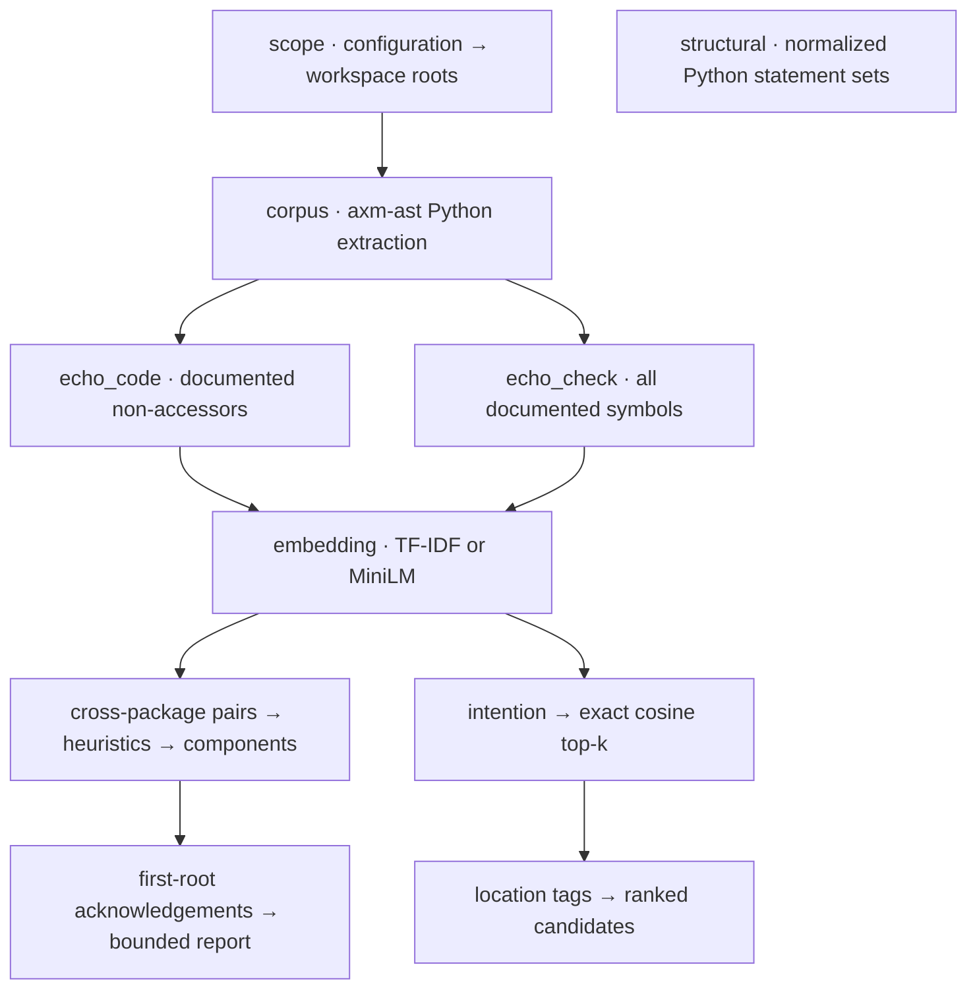

# Architecture

Echo has two AXMTools over a shared extraction and embedding pipeline.
Structural statement comparison is a separate library capability; it does
not verify the candidates returned by either tool.

```mermaid
graph TD
    Scope["scope · configuration → workspace roots"] --> Corpus["corpus · axm-ast Python extraction"]
    Corpus --> Code["echo_code · documented non-accessors"]
    Corpus --> Check["echo_check · all documented symbols"]
    Code --> Embedding["embedding · TF-IDF or MiniLM"]
    Check --> Embedding
    Embedding --> Clusters["cross-package pairs → heuristics → components"]
    Embedding --> Ranking["intention → exact cosine top-k"]
    Clusters --> Waivers["first-root acknowledgements → bounded report"]
    Ranking --> Candidates["location tags → ranked candidates"]
    Structural["structural · normalized Python statement sets"]
```

## Modules

| Module | Responsibility |
|---|---|
| `tools` | Orchestration, validation and ToolResult/text rendering. |
| `corpus` | Discover packages and extract functions/classes via axm-ast. |
| `scope` | Read `echo.workspace_roots` through axm-config. |
| `embedding` | TF-IDF or MiniLM embeddings and exact neighbour search. |
| `cluster` | Cross-package pairs, heuristic demotion and union-find components. |
| `waiver` | Hash identities, mark acknowledgements and report stale entries. |
| `structural` | Normalized statement shapes and Jaccard similarity. |

## What similarity measures

Both tools embed signatures plus docstrings. They exclude undocumented
symbols, even though the library corpus extractor returns them with a
signature fallback. No function bodies are embedded by the corpus pipeline.
Extraction is Python-only; axm-ast's broader language support does not make
echo a multi-language scanner. It prefers `src/` when present. Its excluded
path segments include literal `tests`, `.venv`, `venv`, `site-packages`,
`__pycache__`, `node_modules`, `.tox`, `build`, `dist` and `.git`. A flat
package's `tests_axm_*` directory is not covered by that literal `tests`
exclusion, so test helpers can enter the corpus.

`echo_code` drops accessor-shaped promises, then finds pairs with distinct
package names. Pairs whose two sides have boilerplate promises are demoted;
package-prefixed names can be demoted as parallel APIs. First-line frequency
and short docstrings are heuristics, not proof of boilerplate. A real
duplicate can be filtered out.

Surviving edges form connected components. The tool ranks components by
their maximum edge score and discards components above `max_cluster_size`.
This does not prove that every pair within a component is similar. Same-package
duplication is outside this tool's search.

`echo_check` retains documented accessors and embeds the intention together
with the corpus. Its location verdict and docstring-length promotion flag
help triage; they do not establish a valid import contract. An empty search
does not demonstrate that the behaviour is absent.

## Backend tradeoffs and effects

| Surface | Default |
|---|---|
| `EchoCodeTool`, `EchoCheckTool` / CLI / MCP | `st` |
| `embed(texts)` | `tfidf` |

TF-IDF fits a new vocabulary on each call and returns a dense NumPy matrix.
Embed query and corpus in the **same call**: separately fitted matrices do
not share a feature space. It never loads torch. Empty text input or an
empty vocabulary can raise a vectorizer error.

MiniLM uses `all-MiniLM-L6-v2` through sentence-transformers in-process.
Loading may fetch model files over the network and write its cache. The
model is memoized for subsequent calls within a process; it attempts MPS
placement when available. Its loader sets `TOKENIZERS_PARALLELISM=false`
only if unset. Backend failures do not automatically switch to TF-IDF;
the caller must retry explicitly.

Reading the corpus does not execute scanned Python code or modify it.
Configuration resolution reads axm-config's store, and neural initialization
has the cache/environment effects above. Use [explicit scope](../howto/configure-scope.md)
and TF-IDF for a local scan without a model download.

## Scale and interpretation

Exact cosine search has no ANN index. `echo_code` computes pair blocks
against the full matrix, so pair generation remains quadratic in corpus
size. Dense TF-IDF storage can also be large. Output caps do not cap that
work. Narrow the scope before a large scan.

Package identity comes from the directory name, not project metadata.
Two checkouts with the same package directory name are treated as the same
package for pair exclusion; waiver identities also omit paths and workspace
names. Avoid overlapping versions of a package in a scope when interpreting
cross-package results.

Module-level public symbols are not necessarily exported from their package
root. Unreadable/unparseable files can be skipped, filters may suppress valid
reuse candidates, and textual similarity may reward inaccurate docstrings.
Read the implementation before changing dependencies or removing code.
