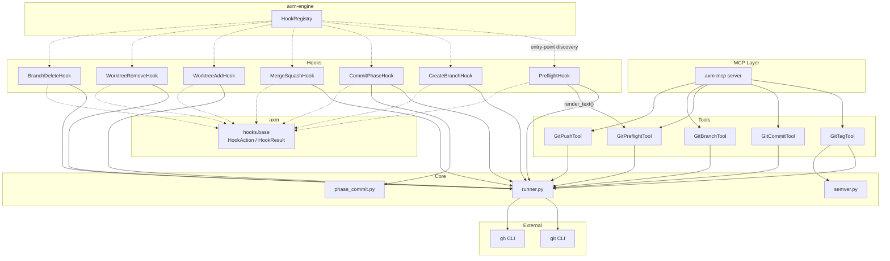

# Architecture

## Overview

`axm-git` provides deterministic MCP tools that wrap Git and GitHub CLI operations. Each tool satisfies the `AXMTool` protocol (from `axm`) and is auto-discovered via Python entry points.

## Layers

### 1. Tools (`tools/`)

Each tool exposes an `execute(*, path, ..., **kwargs) → ToolResult` method with explicit typed parameters:

- **`GitTagTool`** — Full tag workflow: check clean tree, check CI, compute semver bump, create tag, verify hatch-vcs, push. The CI check (`check_ci`) correlates the gh run's `headSha` with the current HEAD — a stale green on an older commit or a red on an unrelated commit never decides the verdict; when no run matches HEAD it returns `pending`.
- **`GitCommitTool`** — Stage files, commit with pre-commit hooks, auto-retry on linter fixes. Supports batched commits. Each commit spec is processed by `_process_single_commit()` (validate → stage → commit → record). Staging resolves the repository root from the supplied `path` via `find_git_root()` and delegates to the shared `stage_spec_files()` resolver (see `core/runner.py`), so a commit invoked with `path` pointing at a package sub-directory of the git root succeeds with git-root-relative file paths — no duplicated prefix, and the autofix-retry re-stage is subdir-aware too.
- **`GitPreflightTool`** — Parse `git status --porcelain` and `git diff --stat` into structured data. Uses `find_git_root()` to scope status and diff to the target subdirectory via pathspec, matching the behaviour of `PreflightHook`.
- **`GitBranchTool`** — Create or checkout a branch. Supports `from_ref` (branch from tag/commit) and `checkout_only` (switch without creating).
- **`GitPushTool`** — Push with dirty-check guard, auto-upstream detection, custom remote, and safe force-push support. `force=True` uses `--force-with-lease` (the remote is overwritten only if it has not advanced past our remote-tracking ref); the opt-in `force_unconditional=True` falls back to a bare `--force` for a deliberate unconditional overwrite (data-loss risk).

### 2. Core (`core/`)

Shared logic used by multiple tools:

- **`runner.py`** — `find_git_root()` locates the repository root via `rev-parse --show-toplevel`, `run_git()` and `run_gh()` subprocess wrappers, `gh_available()` auth check, `detect_package_name()` from `pyproject.toml`. `stage_spec_files()` is the shared subdir-aware staging resolver: it stages each spec file against the git root first then a `working_dir` fallback (so both git-root-relative and package-relative inputs work), handles tracked-but-deleted files via a `git ls-files -d` probe, and skips gitignored files with a warning — used by both `CommitPhaseHook` and `GitCommitTool`. Also provides `suggest_git_repos()` (scans for child directories that are git repos), `not_a_repo_error()` (enriches "not a git repository" errors with suggestions for nearby repos), and `parse_porcelain_z()` (the shared NUL-aware parser for `git status --porcelain -z`, reused by `PreflightHook` and `GitPushTool` — it survives renames by keeping the destination path and returns spaced paths unquoted). All subprocess call-sites pass an explicit `timeout=` kwarg (defaults: `DEFAULT_GIT_TIMEOUT=30s`, `DEFAULT_GH_TIMEOUT=120s`, `uv sync`=600s); `run_git`/`run_gh` log a warning and re-raise `subprocess.TimeoutExpired`, which tool entry points catch and convert to `ToolResult` via `timeout_error_result()`. This is an interim shim pending `axm-common.run_safe`.
- **`semver.py`** — `parse_tag()` for version parsing, `compute_bump()` for Conventional Commits analysis (returns `VersionBump` with next version + reason). `compute_bump()` tolerates both `git log --oneline` lines (`<short-hash> <message>`) and raw conventional-commit messages: the leading token is stripped only when it matches a short-hash shape (hex), so a bare `feat:` keeps its bump.
- **`phase_commit.py`** — `get_phase_commit()` looks up the commit hash for a given protocol phase name by searching git log.
- **`commit_spec.py`** — single source of truth for the commit plumbing shared by `GitCommitTool` and `CommitPhaseHook`. `validate_commit_spec()` is the pure spec validator returning `(spec, err)` with the stricter contract (non-empty `message` **and** non-empty `files`); each surface wraps the error string in its own result type. `attempt_commit_with_autofix_retry()` unifies the pre-commit autofix detection (`"files were modified"`) + re-stage (via `stage_spec_files`) + single retry, returning an `AutofixRetry(result, retried, auto_fixed)`; `retry_commit_on_autofix()` is the thin hook-facing wrapper that returns only the result. `build_commit_result()` assembles the success `HookResult` (HEAD short hash + optional identity/warnings). The tool keeps its own per-batch result dict (different shape) but routes validation + autofix-retry through these helpers.

### 3. Hooks (`hooks/`)

Lifecycle hook actions conforming to the `HookAction` protocol from `axm.hooks.base`. Auto-discovered via `axm.hooks` entry-points.

All hooks accept an `enabled` param (default `True`). Pass `enabled=False` to skip git operations entirely (returns `HookResult.ok(skipped=True, reason="git disabled")`).

- **`PreflightHook`** — Runs a structured working tree status check before a phase begins. Returns a compact `text` render (via `render_text` from `commit_preflight`) alongside structured metadata. Entry point: `git:preflight`.
- **`CreateBranchHook`** — Creates a session branch. Accepts `branch`, `ticket_id`, `ticket_title`, and `ticket_labels` params; `_resolve_branch()` derives the final branch name from those inputs. Skips if not a git repo.
- **`BranchDeleteHook`** — Deletes a branch via `git branch -D`. Branch name resolved from `branch` param then `branch` context key. Entry point: `git:branch-delete`.
- **`CommitPhaseHook`** — Stages all changes, commits with `[axm] {phase_name}`. Pass `from_outputs=True` to derive staged files from protocol outputs instead of staging everything. Skips if nothing to commit.
- **`MergeSquashHook`** — Squash-merges a branch back to the target branch. Accepts `branch` and `message` params; `_resolve_branch()` reads the branch from context when `branch` is not explicitly supplied. The squash commit resolves its author via `resolve_identity` and injects `--author` through the shared `build_commit_cmd`, so squash merges honour the identity-profile system (falls back to the default git identity when no profile is configured). When a `profile_override` names an unknown profile, `resolve_identity` logs a `WARNING` (naming the typo and the available profiles, or noting that no profiles are configured) and still falls back to the default identity, so a mistyped profile is observable rather than silently swallowed.
- **`WorktreeAddHook`** — Creates a git worktree + branch for a ticket at `<repo_parent>/<ticket_id>/`, deriving the branch name from ticket metadata. Entry point: `git:worktree-add`.
- **`WorktreeRemoveHook`** — Removes a worktree previously created by `WorktreeAddHook` using `git worktree remove --force`. Entry point: `git:worktree-remove`.

## Design Decisions

| Decision | Rationale |
|---|---|
| `AXMTool` protocol | Consistent interface, auto-discovery via entry points |
| `subprocess` over `gitpython` | Zero dependency, deterministic, same behavior as manual CLI |
| Auto-retry on pre-commit fix | Agents waste a tool call without it |
| `git add -A --` | Handles additions, modifications, AND deletions in one command |
| Soft CI check | `gh` is optional — tagging still works without GitHub CLI |
