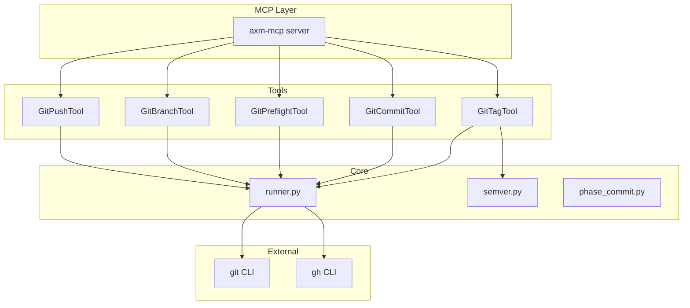

# Architecture

## Overview

`axm-git` provides deterministic MCP tools that wrap Git and GitHub CLI operations. Each tool satisfies the `AXMTool` protocol (from `axm`) and is auto-discovered via Python entry points.

```mermaid
graph TD
    subgraph "MCP Layer"
        MCP["axm-mcp server"]
    end

    subgraph "Tools"
        Tag["GitTagTool"]
        Commit["GitCommitTool"]
        Preflight["GitPreflightTool"]
        Branch["GitBranchTool"]
        Push["GitPushTool"]
    end


    subgraph "Core"
        Runner["runner.py"]
        Semver["semver.py"]
        PhaseCommit["phase_commit.py"]
    end

    subgraph "External"
        Git["git CLI"]
        GH["gh CLI"]
    end


    MCP --> Tag
    MCP --> Commit
    MCP --> Preflight
    MCP --> Branch
    MCP --> Push
    Tag --> Runner
    Tag --> Semver
    Commit --> Runner
    Preflight --> Runner
    Branch --> Runner
    Push --> Runner
    Runner --> Git
    Runner --> GH
```

## Layers

### 1. Tools (`tools/`)

Each tool exposes an `execute(*, path, ..., **kwargs) → ToolResult` method with explicit typed parameters:

- **`GitTagTool`** — Full tag workflow: check clean tree, check CI, compute semver bump, create tag, verify hatch-vcs, push. The CI check (`check_ci`) correlates the gh run's `headSha` with the current HEAD — a stale green on an older commit or a red on an unrelated commit never decides the verdict; when no run matches HEAD it returns `pending`. An explicit `version` override is **validated** before tagging: it must be a well-formed semver (parsed through `parse_tag`) **and** strictly greater than the current tag — otherwise the tool returns `ToolResult(success=False)` (it rejects e.g. `version="banana"`). Without an override, the version is derived from the commits since the last tag via `compute_bump`.
- **`GitCommitTool`** — Stage files, commit with the repo's commit hooks, auto-retry on linter fixes. Supports batched commits. Each commit spec is processed by `_process_single_commit()` (validate → stage → commit → record). Staging resolves the repository root from the supplied `path` via `find_git_root()` and delegates to the shared `stage_spec_files()` resolver (see `core/runner.py`), so a commit invoked with `path` pointing at a package sub-directory of the git root stages files using git-root-relative paths (and the autofix-retry re-stage does the same).
    - **Verdict-Carrying Patch invariant** — when a commit hook mutates staged content during the autofix-retry, the paths captured *before* re-staging (`AutofixRetry.auto_fixed`, `git diff --name-only`) are aggregated across the batch and surfaced at the top level as `data["hook_autofixed_files"]: list[str]` (repo-root relative, deduplicated, sorted). The field is **always present** — an empty list on the clean path (no hooks, or no mutation), never `None` — so a consumer can always tell whether the patch that landed is byte-for-byte the patch it staged. When non-empty, the compact `text` rendering appends a `⚠ hooks auto-fixed N file(s): …` line.
- **`GitPreflightTool`** — Parse `git status --porcelain` and `git diff --stat` into structured data. Uses `find_git_root()` to scope status and diff to the target subdirectory via pathspec.
- **`GitBranchTool`** — Create or checkout a branch. Supports `from_ref` (branch from tag/commit) and `checkout_only` (switch without creating).
- **`GitPushTool`** — Push with dirty-check guard, auto-upstream detection, custom remote, and safe force-push support. `force=True` uses `--force-with-lease` (the remote is overwritten only if it has not advanced past our remote-tracking ref); the opt-in `force_unconditional=True` falls back to a bare `--force` for a deliberate unconditional overwrite (data-loss risk).

### 2. Core (`core/`)

Shared logic used by multiple tools:

- **`runner.py`** — `find_git_root()` locates the repository root via `rev-parse --show-toplevel`; `run_git()` and `run_gh()` wrap subprocesses with explicit timeouts. `stage_spec_files()` resolves git-root-relative and package-relative paths, supports tracked deletions, and skips gitignored files with a warning. The module also provides repository suggestions, structured not-a-repository errors, and NUL-aware porcelain parsing for the tools.
- **`semver.py`** — `parse_tag()` for version parsing (its regex is **anchored** with `^…$`, so prerelease suffixes like `v1.2.3-rc1`, trailing segments like `v1.2.3.4`, and any non-semver input raises `ValueError`), `compute_bump()` for Conventional Commits analysis (returns `VersionBump` with next version + reason). `compute_bump()` tolerates both `git log --oneline` lines (`<short-hash> <message>`) and raw conventional-commit messages: the leading token is stripped only when it matches a short-hash shape (hex), so a bare `feat:` message is read as-is. `classify_commit()` is the internal-public per-commit labeller (importable, absent from `__all__`) consumed by `GitReleaseDiffTool` for **display**: it returns the *true* conventional type (`feat`, `fix`, `docs`, `refactor`, `chore`, `build`, `ci`, `perf`, `style`, `revert`, …) by reusing the shared regexes, falling back to `other` only for an unprefixed subject — so the release-diff summary tallies every type rather than collapsing them. This type tally is display-only and does not affect the bump decision.
- **`phase_commit.py`** — `get_phase_commit()` looks up the commit hash for a given protocol phase name by searching git log.
- **`identity.py`** — `resolve_identity()` selects the git author for a working dir (schedule/profile aware), `load_config()` resolves the `GitProfileConfig`. On the default (`config_path=None`) path, config is delegated to the shared **`axm-config`** single store. Because `axm-config` persists a dict-valued key as its **own child namespace** (not a scalar key of `[git]`), the resolver reads each dict-shaped value through `NamespaceStore.read()` on the dotted namespace — `[git.default]`, the enumerated `[git.profiles.<name>]` tables, and `[git.schedule]` — rather than `axm_config.get("git", <key>)` (which only sees `[git]`'s own scalar/array keys and would silently return `None` for every real config); `workspace_paths` stays the flat `[echo].workspace_roots` array so the followed-roots list has a single source (no duplicate `[git].workspace_paths`). A transitional fallback still reads the legacy `~/axm/git-profiles.toml` (with a migration `WARNING`) while the store has no `[git.default]`. An **unusable** `~/.axm` home (e.g. a `HOME` resolving inside a git checkout, surfaced as `axm-config`'s `UnsafeHomeError`) is deliberately **not** swallowed: it propagates so resolution fails loud instead of masking a broken store as an indistinguishable "no config". The explicit-path form `load_config(config_path=<file>)` is unchanged and still parses that exact TOML file.
- **`commit_spec.py`** — shared validation and autofix-retry plumbing used by `GitCommitTool`. `validate_commit_spec()` requires a non-empty message and file list; `attempt_commit_with_autofix_retry()` captures modified paths, re-stages once, and reconciles the result against the repository HEAD.

## Design Decisions

| Decision | Rationale |
|---|---|
| `AXMTool` protocol | Consistent interface, auto-discovery via entry points |
| `subprocess` over `gitpython` | Zero dependency, deterministic, same behavior as manual CLI |
| Auto-retry on commit-hook fix | Avoids a wasted tool call on hook autofix |
| Per-file staging (`stage_spec_files`) | Stages each spec file with `git add -- <file>` (subdir-aware path resolution); a `git ls-files -d` probe covers tracked-but-deleted files and gitignored paths are skipped with a warning — handles additions, modifications, AND deletions without an indiscriminate `git add -A` |
| Soft CI check | `gh` is optional — tagging still works without GitHub CLI |
