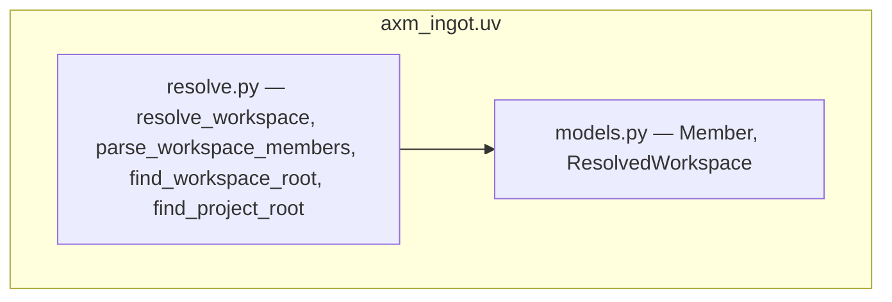

# Architecture

## Overview

`axm-ingot` is a **canonical leaf library**: it factors logic that was
duplicated across forge packages into one stdlib-only home that everyone can
depend on without creating a dependency cycle.

## Module map

### `axm_ingot.uv.models`

Frozen value types — `Member` (`name`, `path`) and `ResolvedWorkspace`
(`root`, `members`). Plain `@dataclass(frozen=True)`, no behavior.

### `axm_ingot.uv.resolve`

The resolution logic — `resolve_workspace`, `find_workspace_root`, and
`find_project_root`, plus `parse_workspace_members` (the pure-text reader of
the raw `[tool.uv.workspace].members` array, no glob/filesystem), and private
helpers (`_load_pyproject`, `_get_workspace_config`, `_resolve_glob_dirs`).
Pure functions over the filesystem; all TOML parsing is defensive.

## Design Decisions

| Decision | Rationale |
|---|---|
| Leaf of the forge dep graph | `dependencies = []`; callers (audit, init) depend on it, it depends on no forge package — no cycles |
| Stdlib only (`tomllib`, `pathlib`, `dataclasses`) | No Pydantic, no third-party runtime deps; trivially importable everywhere |
| Frozen dataclasses, not Pydantic | This is a leaf — adding Pydantic would pull a dependency and break the leaf invariant |
| `Member` carries both `name` and `path` | Callers project trivially: audit wants `[m.path …]`, init wants `[m.name …]` |
| Defensive parsing returns `None` | A missing/malformed `pyproject.toml` is a normal "not a workspace" answer, not an error |
| Workspace semantics for `find_workspace_root` | Stops at the first `[tool.uv.workspace]`, not the first project `pyproject.toml` |
| Project semantics for `find_project_root` | Stops at the first `pyproject.toml` of any kind and never returns `None` (start-dir fallback) — distinct from `find_workspace_root`, so callers anchoring relative imports never propagate a `None` root |
