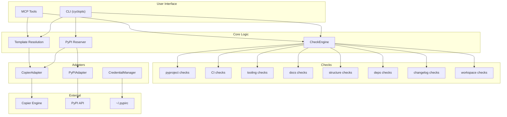

# Architecture

## Overview

`axm-init` follows a layered architecture with clear separation of concerns:

## Layers

### 1. CLI (`cli.py`)

Cyclopts-based commands with input validation and formatted output (text, JSON, agent).

| Command | Function | Description |
|---|---|---|
| `scaffold` | `scaffold()` | Scaffold a new project |
| `check` | `check()` | Score against AXM standard |
| `reserve` | `reserve()` | Reserve PyPI package name |
| `version` | `version()` | Show version |

### 2. Core Logic (`core/`)

Business logic independent of I/O:

| Module | Key Symbols | Purpose |
|---|---|---|
| `checker.py` | `CheckEngine`, `format_report()`, `format_json()`, `format_agent()` | Run checks (dynamic discovery via `importlib`), format output. Every result is re-stamped with the *canonical* check name — `get_check_name()`'s `category.function_name_without_check_` form — so context skips (`SKIP_FOR_*`), member redirects (`REDIRECT_FOR_*`), `[tool.axm-init].exclude` matching, and the displayed name all key off one string |
| `templates.py` | `TemplateInfo`, `TemplateType`, `get_template_path()` | Template catalog, type dispatch (standalone/workspace/member), and resolution |
| `reserver.py` | `reserve_pypi()`, `create_minimal_package()`, `build_package()`, `publish_package()` | PyPI name reservation workflow (the `ReserveResult` model lives in `models/results.py`) |

### 3. Checks (`checks/`)

49 checks across 8 categories, each a pure function `(Path) → CheckResult`:

| Module | Category | # Checks |
|---|---|---|
| `_utils.py` | *(internal)* | Shared utilities: `load_toml` for TOML parsing, `@requires_toml` decorator that loads `pyproject.toml` once and short-circuits with a failure if missing. For workspace members, `load_toml_with_workspace_fallback` deep-merges the workspace root's tool sections as a base layer — `merge_tool_sections` uses `_deep_merge` to recursively merge nested dicts (member wins on conflicts; lists and non-dict values are replaced, not merged) |
| `pyproject.py` | pyproject | 10 |
| `ci.py` | CI | 6 |
| `tooling.py` | tooling | 7 |
| `docs.py` | docs | 6 |
| `structure.py` | structure | 7 |
| `deps.py` | deps | 2 |
| `changelog.py` | changelog | 2 |
| `workspace.py` | workspace | 9 |
| `_workspace.py` | *(internal)* | Context detection: `detect_context()`, plus `find_workspace_root()` / `get_workspace_members()` which delegate uv-workspace resolution to `axm_ingot.uv` (`find_workspace_root` / `resolve_workspace`) and only project the result |

### 4. Adapters (`adapters/`)

Each adapter wraps a single external dependency:

| Adapter | Wraps | Purpose |
|---|---|---|
| `CopierAdapter` / `CopierConfig` | `copier.run_copy()` | Template-based scaffolding (`CopierConfig` is the Pydantic input model) |
| `PyPIAdapter` / `AvailabilityStatus` | PyPI JSON API | Package name availability check |
| `CredentialManager` | `PYPI_API_TOKEN` / `~/.pypirc` | Token retrieval, validation, and persistence (returns `False` on `PermissionError`) |

| `patch_all()` | `pyproject.toml`, `Makefile`, CI workflows | Workspace root file patching after member scaffold |

### 5. Models (`models/`)

Pydantic models for structured data exchange between layers:

| Model | Module | Purpose |
|---|---|---|
| `CheckResult` | `check.py` | Single check outcome (passed, message, fix) |
| `CategoryScore` | `check.py` | Aggregated score per category |
| `ProjectResult` | `check.py` | Full project check result |
| `Grade` | `check.py` | A–F grade enum |
| `ScaffoldResult` | `results.py` | Outcome of a scaffolding operation |

### 6. Tools (`tools/`)

MCP tool wrappers for AI agent integration. All tools satisfy the `AXMTool` protocol (imported from `axm.tools.base`).

| Tool | Class | Entry Point |
|---|---|---|
| `init_check` | `InitCheckTool` | `axm.tools` → `check` |
| `init_scaffold` | `InitScaffoldTool` | `axm.tools` → `scaffold` |
| `init_reserve` | `InitReserveTool` | `axm.tools` → `reserve` |

## Design Decisions

| Decision | Rationale |
|---|---|
| Hexagonal architecture | Testable core, swappable adapters |
| Pydantic models | Validation, serialization, `extra = "forbid"` |
| Copier for scaffolding | Jinja2 templates, supports project updates |
| `src/` layout | PEP 621 best practice, no import conflicts |
| Pure check functions | Each check is `(Path) → CheckResult`, easy to test and extend |
| Dynamic check registry | `checker.py` discovers checks via `importlib`/`inspect`, reducing coupling |
| Parallel check execution | `ThreadPoolExecutor` — checks are I/O-bound and independent |
