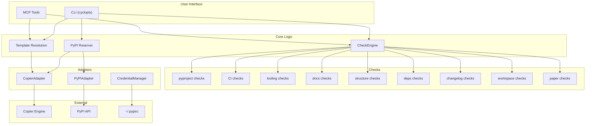

# Architecture

## Overview

`axm-init` follows a layered architecture with clear separation of concerns:

```mermaid
graph TD
    subgraph "User Interface"
        CLI["CLI (cyclopts)"]
        MCP["MCP Tools"]
    end

    subgraph "Core Logic"
        CheckEngine["CheckEngine"]
        Templates["Template Resolution"]
        Reserver["PyPI Reserver"]
    end

    subgraph "Checks"
        PyprojectChecks["pyproject checks"]
        CIChecks["CI checks"]
        ToolingChecks["tooling checks"]
        DocsChecks["docs checks"]
        StructureChecks["structure checks"]
        DepsChecks["deps checks"]
        ChangelogChecks["changelog checks"]
        WorkspaceChecks["workspace checks"]
        PaperChecks["paper checks"]
    end

    subgraph "Adapters"
        Copier["CopierAdapter"]
        PyPI["PyPIAdapter"]
        Creds["CredentialManager"]
    end

    subgraph "External"
        CopierEngine["Copier Engine"]
        PyPIAPI["PyPI API"]
        PyPIRC["~/.pypirc"]
    end

    CLI --> CheckEngine
    CLI --> Templates
    CLI --> Reserver
    MCP --> CheckEngine
    MCP --> Templates
    CheckEngine --> PyprojectChecks
    CheckEngine --> CIChecks
    CheckEngine --> ToolingChecks
    CheckEngine --> DocsChecks
    CheckEngine --> StructureChecks
    CheckEngine --> DepsChecks
    CheckEngine --> ChangelogChecks
    CheckEngine --> WorkspaceChecks
    CheckEngine --> PaperChecks
    Reserver --> PyPI
    Reserver --> Copier
    Templates --> Copier
    Copier --> CopierEngine
    PyPI --> PyPIAPI
    Creds --> PyPIRC
```

## Layers

### 1. CLI (`cli.py`)

Cyclopts-based commands with input validation and formatted output (text, JSON, agent).

| Command | Function | Description |
|---|---|---|
| `scaffold` | `scaffold()` | Scaffold a new project |
| `check` | `check()` | Score against AXM standard |
| `reserve` | `reserve()` | Reserve PyPI package name |
| `version` | `version()` | Show version |

### 2. Core Logic (`core/`)

Business logic independent of I/O:

| Module | Key Symbols | Purpose |
|---|---|---|
| `checker.py` | `CheckEngine`, `SKIP_BY_CONTEXT`, `REDIRECT_BY_CONTEXT`, `validate_context_tables()`, `format_report()`, `format_json()`, `format_agent()` | Run checks (dynamic discovery via `importlib`), format output. Every result is re-stamped with the *canonical* check name — `get_check_name()`'s `category.function_name_without_check_` form — so context skips (`SKIP_BY_CONTEXT`), member redirects (`REDIRECT_BY_CONTEXT`), `[tool.axm-init].exclude` matching, and the displayed name all key off one string |
| `templates.py` | `TemplateInfo`, `TemplateType`, `get_template_path()` | Template catalog, type dispatch (standalone/workspace/member/paper/experiment), and resolution. The `paper` type resolves the bundled `paper-submodule` template, which renders in two flavours keyed on its `has_package` answer: *autonomous* (ships its own `src/` package plus a `[tool.axm-lab]` pyproject marker) or *satellite* (no pyproject and no `src/` at all — marked structurally by `PLAN.md` + `paper/` + `experiments/`, the exact triple `detect_context()` keys on). The template declares no Copier `_tasks`, so it renders under the nominal `trust_template=False` path, and re-declares the full `_exclude` block since Copier replaces (not extends) its default list. The `experiment` type resolves the bundled `experiment` template — an experiment only ever lives inside a paper, and its manifest is born declared: `manifest.yaml` renders the 1.0.0 experiment contract (`contract_version` pinned to the quoted string `"1.0.0"`, `id`, `title`, `question`, `type` ∈ hypothesis_testing/descriptive/exploratory, `repro_level` ∈ exact/tolerance/attested, plus `inputs`/`steps` and a `falsifier` for the hypothesis kind — that `falsifier` is a MAPPING, `{spec: "<non-empty string>", conditions: []}` and no other key (the contract is extra-forbid), emitted if and only if `type` is `hypothesis_testing` and absent for `descriptive`/`exploratory`), pre-filled from the five Copier answers (`experiment_id`, `experiment_title`, `research_question`, `type`, `reproduction_level`) — the kind answer is deliberately named `type`, the very contract key it feeds, because the conditional `freeze/` directory embeds that answer name: any drift between the answer and the key renders an empty directory name and Copier silently drops the directory — beside `README.md`, `inputs/SOURCES.md`, `scripts/`, `outputs/`, `analysis/metrics.json` + `analysis/ANALYSIS.md`, `figures/FIGURES.md` and `.gitignore`. It renders FLAT at the destination root — naming and indexing of the experiment directory belong to the scaffold tool, never to the template — and adds `freeze/model_spec.json` only for the `hypothesis_testing` kind, via the empty-path Jinja directory idiom keyed on that same `type` answer. That freeze stays versioned on purpose (a downstream check proves pre-registration antecedence by git genealogy), so the rendered `.gitignore` excludes caches and virtualenvs only, never the evidence. Same `_exclude` re-declaration trap as every bundled template. axm-init owns the rendered surface (tree, keys, choice sets); the authoritative round-trip against the axm-lab manifest model stays in axm-lab, with no dependency either way |
| `reserver.py` | `reserve_pypi()`, `create_minimal_package()`, `build_package()`, `publish_package()` | PyPI name reservation workflow (the `ReserveResult` model lives in `models/results.py`) |

### 3. Checks (`checks/`)

Checks across 9 categories, each a pure function `(Path) → CheckResult`. The registry is discovered dynamically (`_discover_checks()` walks `checks/` with `pkgutil`), so a new public module under `checks/` IS a new category — no registration:

| Module | Category | # Checks |
|---|---|---|
| `_utils.py` | *(internal)* | Shared utilities: `load_toml` for TOML parsing, `@requires_toml` decorator that loads `pyproject.toml` once and short-circuits with a failure if missing. For workspace members, `load_toml_with_workspace_fallback` deep-merges the workspace root's tool sections as a base layer — `merge_tool_sections` uses `_deep_merge` to recursively merge nested dicts (member wins on conflicts; lists and non-dict values are replaced, not merged) |
| `pyproject.py` | pyproject | 10 |
| `ci.py` | CI | 6 |
| `tooling.py` | tooling | 7 |
| `docs.py` | docs | 6 |
| `structure.py` | structure | 7 |
| `deps.py` | deps | 2 |
| `changelog.py` | changelog | 2 |
| `workspace.py` | workspace | 10 |
| `paper.py` | paper | 2 | Paper invariants, run only in the `PAPER` context: `check_paper_structure` (`paper/`, `experiments/`, `README.md`) and `check_plan_present` (`PLAN.md` opening with a `---` YAML front-matter block, parsed by the pure `_parse_front_matter` helper) |
| `_workspace.py` | *(internal)* | Context detection: `detect_context()` resolves four `ProjectContext` shapes — `paper`, `workspace`, `member`, `standalone`. The paper branch is evaluated FIRST, keyed on an explicit `[tool.axm-lab]` pyproject section OR (for a satellite paper carrying no pyproject) the full structural triple `PLAN*.md` + `paper/` + `experiments/`, all three required, so a paper nested in a uv workspace stays a paper instead of inheriting the Python-packaging rulebook. Plus `find_workspace_root()` / `get_workspace_members()` which delegate uv-workspace resolution to `axm_ingot.uv` (`find_workspace_root` / `resolve_workspace`) and only project the result |

### 4. Adapters (`adapters/`)

Each adapter wraps a single external dependency:

| Adapter | Wraps | Purpose |
|---|---|---|
| `CopierAdapter` / `CopierConfig` | `copier.run_copy()` | Template-based scaffolding (`CopierConfig` is the Pydantic input model) |
| `PyPIAdapter` / `AvailabilityStatus` | PyPI JSON API | Package name availability check |
| `CredentialManager` | `PYPI_API_TOKEN` / `~/.pypirc` | Token retrieval, validation, and persistence (returns `False` on `PermissionError`) |
| `patch_all()` / `PatchReport` | `pyproject.toml`, `Makefile`, CI workflows | Workspace root file patching after member scaffold; returns a `PatchReport` that truthfully partitions files into `patched` (real writes only), `skipped` (no-op or absent), and `failed` (caught `PermissionError`/`UnicodeDecodeError` — partial-state signal, never raised) |

### 5. Models (`models/`)

Pydantic models for structured data exchange between layers:

| Model | Module | Purpose |
|---|---|---|
| `CheckResult` | `check.py` | Single check outcome (passed, message, fix) |
| `CategoryScore` | `check.py` | Aggregated score per category |
| `ProjectResult` | `check.py` | Full project check result |
| `Grade` | `check.py` | A–F grade enum |
| `ScaffoldResult` | `results.py` | Outcome of a scaffolding operation |

### 6. Tools (`tools/`)

MCP tool wrappers for AI agent integration. All tools satisfy the `AXMTool` protocol (imported from `axm.tools.base`).

| Tool | Class | Entry Point |
|---|---|---|
| `init_check` | `InitCheckTool` | `axm.tools` → `check` |
| `init_scaffold` | `InitScaffoldTool` | `axm.tools` → `scaffold` |
| `init_reserve` | `InitReserveTool` | `axm.tools` → `reserve` |

## Design Decisions

| Decision | Rationale |
|---|---|
| Hexagonal architecture | Testable core, swappable adapters |
| Pydantic models | Validation, serialization, `extra = "forbid"` |
| Copier for scaffolding | Jinja2 templates, supports project updates |
| `src/` layout | PEP 621 best practice, no import conflicts |
| Pure check functions | Each check is `(Path) → CheckResult`, easy to test and extend |
| Dynamic check registry | `checker.py` discovers checks via `importlib`/`inspect`, reducing coupling |
| Context-keyed skip/redirect tables | `SKIP_BY_CONTEXT` / `REDIRECT_BY_CONTEXT` map every `ProjectContext` to a frozenset of check ids — a new context is a new row, not a new branch. `validate_context_tables()` runs at `CheckEngine` construction, so an id no discovered check declares raises `ValueError` up front instead of being a silently inert skip |
| A paper is graded only on paper invariants | `SKIP_BY_CONTEXT[PAPER]` is *derived*, not hand-listed: `_known_check_ids() - _PAPER_CHECKS`. Every Python-packaging id (Trusted Publishing, CI matrix, Diataxis nav, mkdocs, dependabot, `py.typed`, lock file, classifiers, coverage, ruff/mypy config) is therefore skipped on a paper, and a packaging check added later is skipped the day it lands. Symmetrically the two `paper.*` ids sit in the standalone, workspace and member rows |
| Parallel check execution | `ThreadPoolExecutor` — checks are I/O-bound and independent |
