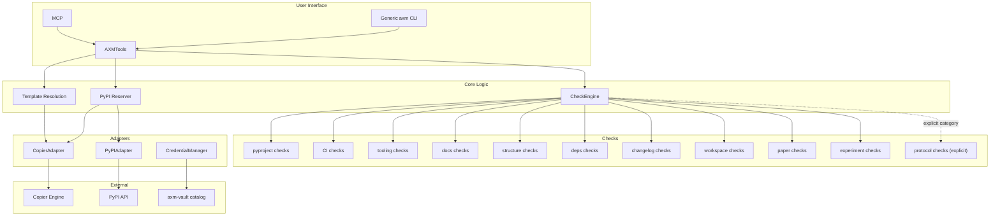

# Architecture

## Overview

`axm-init` follows a layered architecture with clear separation of concerns:

```mermaid
graph TD
    subgraph "User Interface"
        CLI["Generic axm CLI"]
        MCP["MCP"]
        Tools["AXMTools"]
    end

    subgraph "Core Logic"
        CheckEngine["CheckEngine"]
        Templates["Template Resolution"]
        Reserver["PyPI Reserver"]
    end

    subgraph "Checks"
        PyprojectChecks["pyproject checks"]
        CIChecks["CI checks"]
        ToolingChecks["tooling checks"]
        DocsChecks["docs checks"]
        StructureChecks["structure checks"]
        DepsChecks["deps checks"]
        ChangelogChecks["changelog checks"]
        WorkspaceChecks["workspace checks"]
        PaperChecks["paper checks"]
        ExperimentChecks["experiment checks"]
        ProtocolChecks["protocol checks (explicit)"]
    end

    subgraph "Adapters"
        Copier["CopierAdapter"]
        PyPI["PyPIAdapter"]
        Creds["CredentialManager"]
    end

    subgraph "External"
        CopierEngine["Copier Engine"]
        PyPIAPI["PyPI API"]
        Vault["axm-vault catalog"]
    end

    CLI --> Tools
    MCP --> Tools
    Tools --> CheckEngine
    Tools --> Templates
    Tools --> Reserver
    CheckEngine --> PyprojectChecks
    CheckEngine --> CIChecks
    CheckEngine --> ToolingChecks
    CheckEngine --> DocsChecks
    CheckEngine --> StructureChecks
    CheckEngine --> DepsChecks
    CheckEngine --> ChangelogChecks
    CheckEngine --> WorkspaceChecks
    CheckEngine --> PaperChecks
    CheckEngine --> ExperimentChecks
    CheckEngine -. explicit category .-> ProtocolChecks
    Reserver --> PyPI
    Reserver --> Copier
    Templates --> Copier
    Copier --> CopierEngine
    PyPI --> PyPIAPI
    Creds --> Vault
```

## Layers

### 1. AXMTool interfaces (`tools/`)

Each request-response operation is declared once as an AXMTool. The shared
`axm` package derives the generic CLI, MCP exposure and DAG node from its typed
signature.

| Command | Tool | Description |
|---|---|---|
| `init_scaffold` | `InitScaffoldTool` | Scaffold a new project |
| `init_check` | `InitCheckTool` | Score against AXM standard |
| `init_reserve` | `InitReserveTool` | Reserve PyPI package name |

### 2. Core Logic (`core/`)

Application orchestration and domain logic separated from tool presentation:

| Module | Key Symbols | Purpose |
|---|---|---|
| `checker.py` | `CheckEngine`, `SKIP_BY_CONTEXT`, `REDIRECT_BY_CONTEXT`, `validate_context_tables()`, `format_report()`, `format_json()`, `format_agent()` | Run checks (dynamic discovery via `importlib`), format output. Every result is re-stamped with the *canonical* check name — `get_check_name()`'s `category.function_name_without_check_` form — so context skips (`SKIP_BY_CONTEXT`), member redirects (`REDIRECT_BY_CONTEXT`), `[tool.axm-init].exclude` matching, and the displayed name all key off one string |
| `templates.py` | `TemplateInfo`, `TemplateType`, `get_template_path()` | Exact type/framework template selection; see [template catalogue](../reference/templates.md) and [research contracts](../reference/research-templates.md) |
| `reserver.py` | `reserve_pypi()`, `create_minimal_package()`, `build_package()`, `publish_package()` | PyPI name reservation workflow (the `ReserveResult` model lives in `models/results.py`) |
| `protocol_planner.py` | `plan_protocol_scaffold()`, `ProtocolScaffoldPlan`, `PlanOperation` | Pure, deterministic protocol filesystem planning; owned compatible implementations are preserved as unchanged |
| `protocol_scaffolder.py` | `prepare_protocol_request()`, `preview_protocol_scaffold()` | Preview or apply the planner result. Application serializes preflight-through-rollback by canonical target root, while distinct roots remain concurrent; it preflights confinement and symlinks before writing, then provides in-memory rollback for partial application failures. Missing profiles and profile-domain conflicts are rejected at the external `InitScaffoldTool` boundary before mutation; lower-level preview and registration deliberately retain automatic profile adoption |

### 3. Checks (`checks/`)

The default Python registry spans 10 categories; each is an independently callable filesystem check `(Path) → CheckResult`. `_discover_checks()` walks `checks/` with `pkgutil`. Modules marked explicit-only are resolved lazily when their category is selected and stay out of unfiltered runs, preserving scores and check counts for projects that did not request them:

| Module | Category | Checks | Purpose |
|---|---|---|---|
| `_utils.py` | *(internal)* | — | Shared utilities: `load_toml` for TOML parsing, `@requires_toml` decorator that loads `pyproject.toml` once and short-circuits with a failure if missing. For workspace members, `load_toml_with_workspace_fallback` deep-merges the workspace root's tool sections as a base layer — `merge_tool_sections` uses `_deep_merge` to recursively merge nested dicts (member wins on conflicts; lists and non-dict values are replaced, not merged) |
| `pyproject.py` | pyproject | 10 |  |
| `ci.py` | CI | 7 declared, 6 active (workflow_exists superseded) |  |
| `tooling.py` | tooling | 7 |  |
| `docs.py` | docs | 7 |  |
| `structure.py` | structure | 7 |  |
| `deps.py` | deps | 2 |  |
| `changelog.py` | changelog | 2 |  |
| `workspace.py` | workspace | 10 |  |
| `paper.py` | paper | 3 | [Form checks and implementation boundary](../reference/checks/catalogue.md#paper-check-implementation-boundary) |
| `experiment.py` | experiment | 2 | [Form checks and implementation boundary](../reference/checks/catalogue.md#experiment-check-implementation-boundary) |
| `protocols.py` | protocols *(explicit-only)* | 2 | Statically validate `[tool.axm-init.protocols]`, distribution/module identity, required package layout, and bidirectional component inventory. A separate resource check verifies both that every declared `prompts/*.md` file exists and that Hatch `force-include` ships the protocol package; at a workspace root, both checks aggregate profiled-member findings under each member's identity, without importing inspected code |
| `_workspace.py` | *(internal)* | — | Context detection and uv workspace resolution; see [context policy](project-contexts.md) |

### 4. Adapters (`adapters/`)

Each adapter wraps a single external dependency:

| Adapter | Wraps | Purpose |
|---|---|---|
| `CopierAdapter` / `CopierConfig` | `copier.run_copy()` | Template-based scaffolding (`CopierConfig` is the Pydantic input model) |
| `PyPIAdapter` / `AvailabilityStatus` | PyPI JSON API | Package name availability check |
| `CredentialManager` | axm-vault catalog (`PYPI_API_TOKEN` or `pypi.token`); optional interactive adapter method | Token retrieval, validation, and persistence (returns `False` on `PermissionError`) |
| `patch_all()` / `PatchReport` | `pyproject.toml`, `Makefile`, CI workflows | Workspace root file patching after member scaffold; returns a `PatchReport` that truthfully partitions files into `patched` (real writes only), `skipped` (no-op or absent), and `failed` (caught `PermissionError`/`UnicodeDecodeError` — partial-state signal, never raised) |

#### Credential resolution

`CredentialManager.get_pypi_token()` resolves the declared `pypi/token`
credential from the axm-vault catalog. The catalog owns its own resolution
layers, including `PYPI_API_TOKEN`; this method returns None if resolution fails.
The reservation tool calls this non-interactive method.

`CredentialManager.resolve_pypi_token()` returns that catalog value when it is
available. Otherwise, it exits with code 1 in non-interactive sessions and
points the user to `PYPI_API_TOKEN` or the axm-vault catalog. On a TTY it prompts
for a `pypi-` token, validates it, persists it as `pypi/token` in the catalog,
and returns the typed value.

### 5. Models (`models/`)

Pydantic models for structured data exchange between layers:

| Model | Module | Purpose |
|---|---|---|
| `CheckResult` | `check.py` | Single check outcome (passed, message, fix) |
| `CategoryScore` | `check.py` | Aggregated score per category |
| `ProjectResult` | `check.py` | Full project check result |
| `Grade` | `check.py` | A–F grade enum |
| `ScaffoldResult` | `results.py` | Outcome of a scaffolding operation |

### 6. Tools (`tools/`)

MCP tool wrappers for AI agent integration. All tools satisfy the `AXMTool` protocol (imported from `axm.tools.base`).

| Tool | Class | Entry Point |
|---|---|---|
| `init_check` | `InitCheckTool` | `axm.tools` → `init_check` |
| `init_scaffold` | `InitScaffoldTool` | `axm.tools` → `init_scaffold` |
| `init_reserve` | `InitReserveTool` | `axm.tools` → `init_reserve` |

## Design Decisions

| Decision | Rationale |
|---|---|
| Hexagonal architecture | Testable core, swappable adapters |
| Pydantic models | Structured validation and serialization |
| Copier for project scaffolding | Jinja2 templates, supports project updates |
| Plans for protocol scaffolding | The deterministic plan is authoritative for preview and application; a canonical-root lock covers snapshot, preflight, writes and rollback so compatible concurrent declarations cannot overwrite one another, without serializing distinct roots |
| `src/` layout | PEP 621 best practice, no import conflicts |
| Independent check functions | Each check takes a project path and returns a CheckResult; filesystem access remains explicit in tests |
| Dynamic check registry | `checker.py` discovers default checks via `importlib`/`inspect`; explicit-only categories are loaded by name only when selected, avoiding score and count drift in unrelated projects |
| Parallel check execution | `ThreadPoolExecutor` — checks are I/O-bound and independent |

Protocol planning/application is implemented in `core/protocol_planner.py`
and `core/protocol_scaffolder.py`. Its [declaration contract](../reference/protocol-scaffold.md)
and [workflow](../howto/scaffold-protocols.md) describe preflight and rollback.
