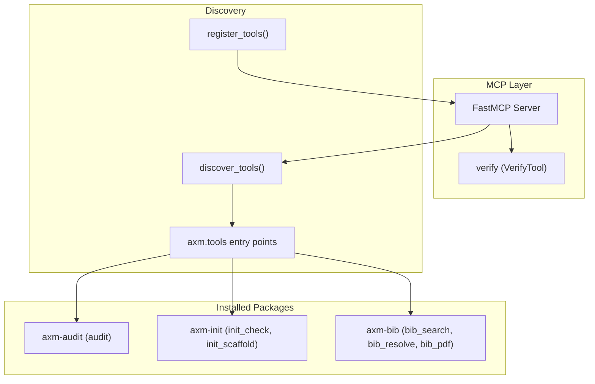
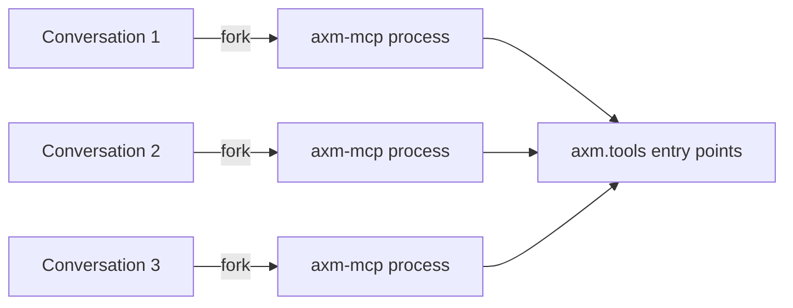
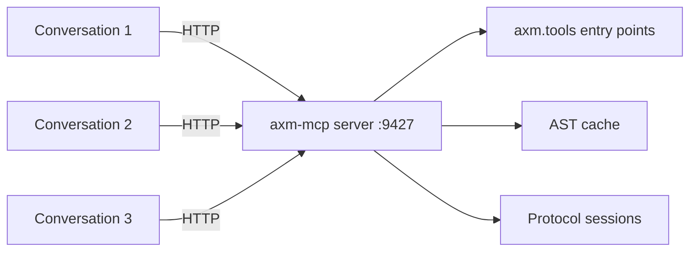
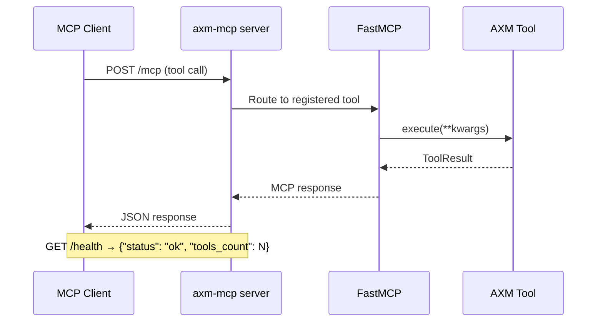
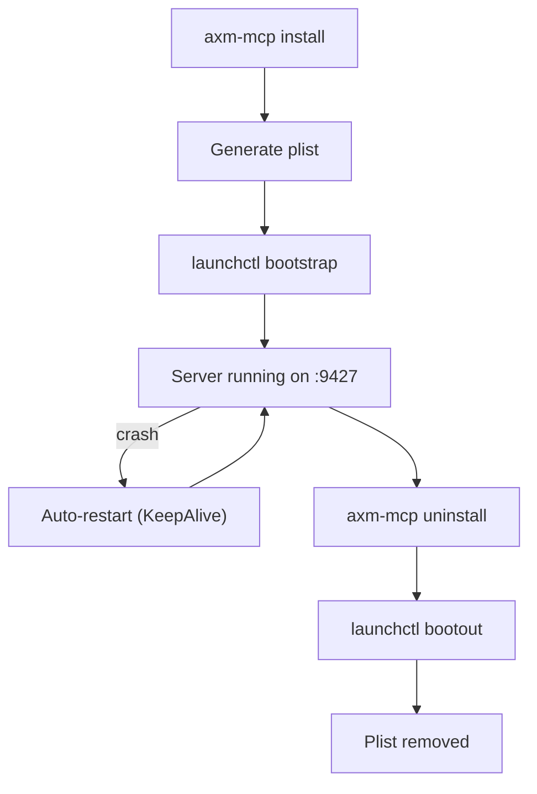

# Architecture

## Overview

`axm-mcp` is a thin MCP shell whose only import from AXM core is `axm.tools.base` (shared types + `tool_metadata`) — no business-tool implementations. It discovers tools at runtime via Python entry points and exposes them over the Model Context Protocol. Two transport modes are supported: **stdio** (the simple default, one process per conversation) and **Streamable HTTP** (an advanced option, single shared server).

By default (`AXM_MCP_FACADE=1`) the discovered tools are surfaced through a **compact facade**: four meta-tools (`axm_search` / `axm_describe` / `axm_call` / `axm_capabilities`) index the catalog and keep the `tools/list` payload small, while a *hot path* of tools opting in via `expose_directly` plus the built-ins (`verify`, `web_fetch`, `list_tools`) are registered individually. Setting `AXM_MCP_FACADE=0` falls back to the legacy behaviour — every discovered tool registered directly.

## Transport Modes

### stdio (default)

The MCP client forks a new `axm-mcp` process per conversation. Each process has its own memory and state.

### Streamable HTTP (advanced)

A single persistent server on port 9427 handles all conversations. AST cache, protocol sessions, and keyed locks are shared.

### Request flow (HTTP)

## Modules

| Module | Key Symbols | Purpose |
|---|---|---|
| `mcp_app.py` | `mcp`, `discovered_tools` | FastMCP server instance — discovers tools, registers them, and registers the `verify` meta-tool (`VerifyTool`). The process entry points live in `cli.py` |
| `cli.py` | `app`, `main()`, `serve` (cmd), `_stdio` (default) | Lifecycle CLI. `main()` (the `axm-mcp` entry point) dispatches the cyclopts `app`: `serve` → `server.serve()` (HTTP), no subcommand → `_stdio()` → `mcp.run()` (stdio, default) |
| `server.py` | `serve()`, `health_check()`, `DEFAULT_PORT` | Streamable HTTP transport — sets `wrapping._HTTP_MODE = True` then runs the FastMCP instance over HTTP on port 9427 (or `AXM_MCP_PORT`) |
| `concurrency.py` | `KeyedLock` | Per-key asyncio lock manager — prevents concurrent execution of the same session or git operation |
| `discovery.py` | `discover_tools()`, `register_tools()`, `register_one()`, `register_list_tools()`, `ToolLike` | Entry point scanning + MCP registration of discovered tools |
| `facade/catalog.py` | `ToolCatalog`, `UnknownToolError` | Searchable index over discovered tools — backs the four facade meta-tools (`search`/`describe`/`call`/`capabilities`, `hot_path()`) |
| `facade/tools.py` | `register_facade()`, `FACADE_TOOLS` | Registers `axm_search` / `axm_describe` / `axm_call` / `axm_capabilities` against a `ToolCatalog` |
| `web_fetch.py` | `fetch_page()`, `WebFetchTool` | Built-in `web_fetch` tool — anti-bot page fetching via Scrapling (modes: auto / basic / dynamic / stealth) |
| `wrapping.py` | `log_external_step()`, `_session_lock`, `_git_lock` | Wraps each tool as a sync callable; `protocol_*` and `git_*` tools are serialized with async keyed locks |
| `schema.py` | `signature_params()`, `apply_signature()`, `extract_docstring_params()` | Derives a tool's typed `__signature__` from its `execute()` (falling back to docstring params) so FastMCP and `ToolCatalog.describe` build the right schema |
| `verify.py` | `verify_project()`, `enrich_failure()`, `VerifyTool` | Orchestrate audit + init check + AST enrichment (impact scores: LOW/MEDIUM/HIGH) |
| `verify_format.py` | `format_verify_text()` | Compact text rendering of a `verify_project` result |
| `lifecycle.py` | `find_binary()`, `generate_plist()`, `install()`, `uninstall()` | launchd service management — install/uninstall axm-mcp as a macOS background service |
| `plist_template.py` | `PLIST_TEMPLATE` | launchd plist XML template used by `lifecycle.generate_plist()` |

## Design Decisions

| Decision | Rationale |
|---|---|
| Imports from `axm` core limited to `axm.tools.base` | Only the shared types + `tool_metadata` (and `ToolResult`, used by the `verify`/`web_fetch` built-ins) — never a business-tool implementation, so `axm-mcp` stays decoupled from any specific tool package and works with any combination of installed packages |
| `ToolLike` Protocol | Duck typing via `Protocol` — no class inheritance needed |
| Entry points for discovery | Standard Python mechanism, no config files needed |
| `verify` as meta-tool | Single call replaces 3 separate tool invocations |
| AST enrichment of failures | Adds blast-radius context to help agents prioritize fixes |
| Compact facade (default) | Four meta-tools keep the `tools/list` payload small; the full catalog stays reachable via `axm_call`. Reversible with `AXM_MCP_FACADE=0` |

## Tool Lifecycle

1. **Startup**: `discover_tools()` scans `axm.tools` entry points
2. **Registration** (facade, default): the `expose_directly` hot path is registered individually via `register_one()`, the built-ins (`verify`, `web_fetch`) are registered directly, and `register_facade()` registers the four facade meta-tools over a `ToolCatalog`. In legacy mode (`AXM_MCP_FACADE=0`), `register_tools()` registers **every** discovered tool individually instead.
3. **Listing**: `register_list_tools()` registers `list_tools`, which always enumerates the **full** surface (so facade-only tools remain discoverable)
4. **Execution**: MCP client calls a tool **directly or via `axm_call`** → both paths go through the *same* wrapper pair built by `wrapping.build_wrappers()` (there is a single execution path; `ToolCatalog` holds the same wrappers `register_one` registers). The wrapper delegates to `tool.execute(**kwargs)` → on a **successful** `ToolResult` with `text` set, returns the raw string (rendered as `TextContent`); a failing result (or a raised exception) is flattened to a structured error dict (`success=False` + `error`) instead of short-circuiting. So tracing (1 call = 1 trace), exception flattening and the per-key lock are invariant regardless of which path reached the tool.
5. **Verify**: `verify_project()` chains audit → init_check → AST enrichment

## Concurrency Model (HTTP mode)

Multiple conversations run concurrently on the same server. To prevent conflicts:

- **Mode gate** — `server.serve()` sets `wrapping._HTTP_MODE = True` before
  `mcp.run(transport="streamable-http")`. This single flag gates the
  `asyncio.to_thread` offload + `KeyedLock` acquisition in `_wrap_with_lock`
  and the implicit-path warning in `_warn_implicit_path`. The stdio default
  path (`cli._stdio`) leaves it `False` — one process per conversation means
  no cross-session contention, and the tool runs inline
- **Never block the event loop** — in HTTP mode **every** tool's synchronous
  body is offloaded to a worker thread via `asyncio.to_thread`, so one slow
  call (a multi-minute `verify`) cannot freeze `/health`, keep-alives, or the
  other conversations. Per-key serialization is layered on top of this offload
- **Protocol sessions** are serialized per `session_id` via `KeyedLock`
- **Git operations** are serialized per normalized `repo_path` via `KeyedLock`
  (`/repo` and `/repo/` resolve to the same key)
- **Lock timeout** — a `KeyedLock` acquire that exceeds its timeout is
  flattened into the AXM error envelope (`success=False`, "resource busy,
  retry") rather than propagating a raw `TimeoutError` to the MCP client
- **Bounded memory** — `KeyedLock` reaps idle (unheld, unawaited) entries
  opportunistically on release via per-key refcounting, so its map does not
  grow unbounded with session ids / repo paths over the server's lifetime

## Service Lifecycle (macOS)

| Item | Path |
|---|---|
| Plist | `~/Library/LaunchAgents/io.axm.mcp-server.plist` |
| PID file | `~/.axm/mcp-server.pid` |
| stdout log | `~/Library/Logs/axm-mcp/stdout.log` |
| stderr log | `~/Library/Logs/axm-mcp/stderr.log` |
