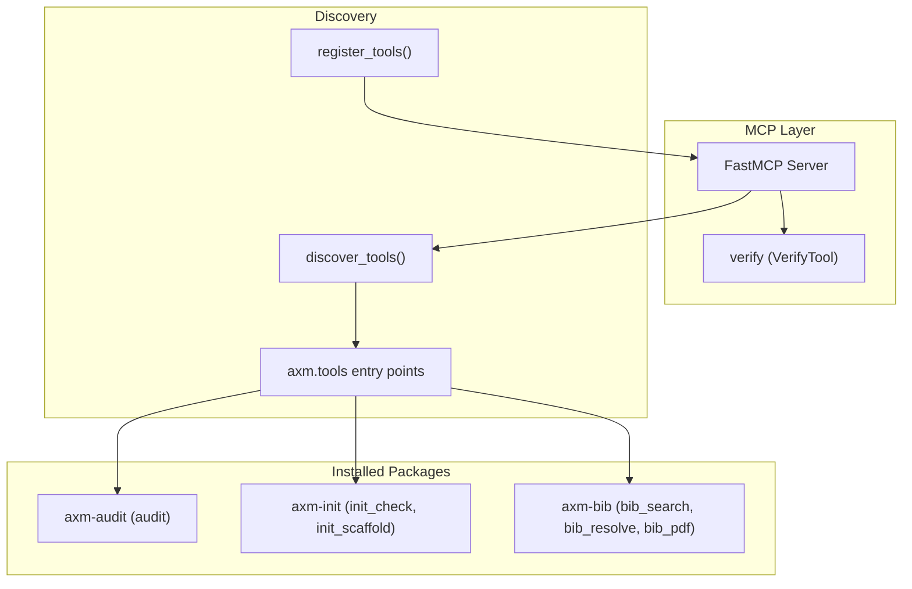
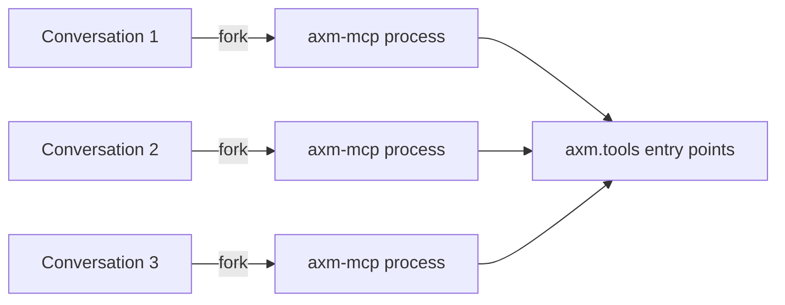
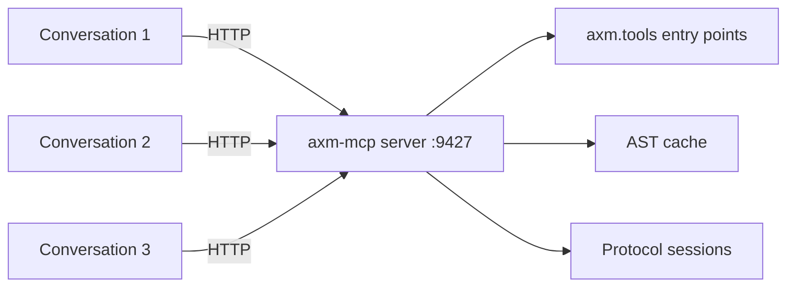
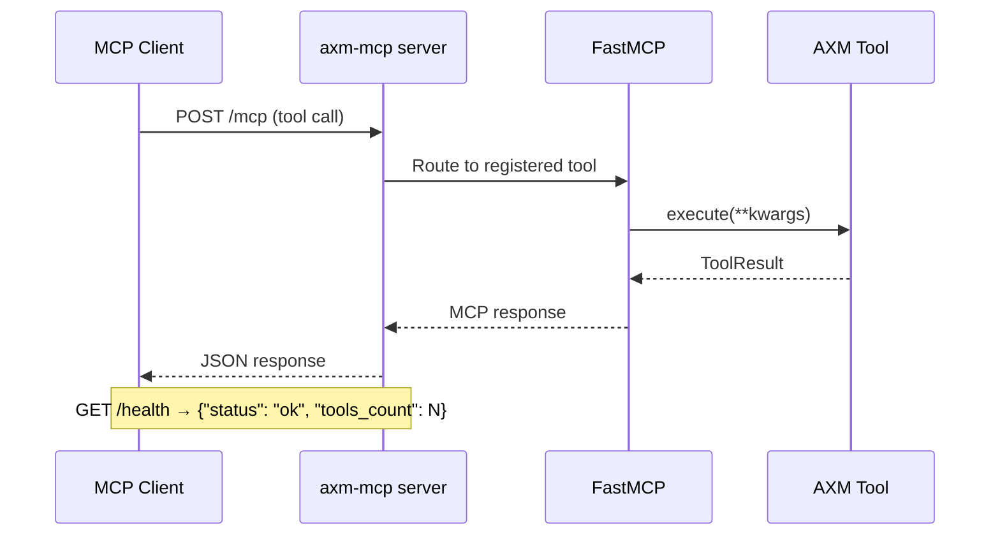
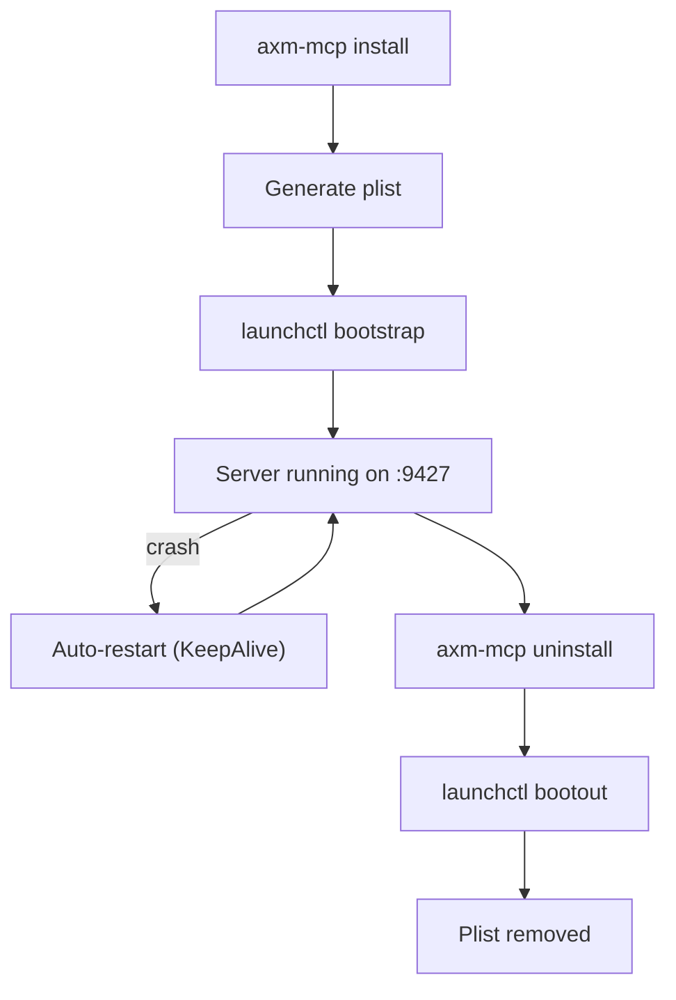

# Architecture

## Overview

`axm-mcp` is a thin MCP shell with zero imports from AXM core. It discovers tools at runtime via Python entry points and exposes them over the Model Context Protocol. Two transport modes are supported: **stdio** (the simple default, one process per conversation) and **Streamable HTTP** (an advanced option, single shared server).

## Transport Modes

### stdio (default)

The MCP client forks a new `axm-mcp` process per conversation. Each process has its own memory and state.

### Streamable HTTP (advanced)

A single persistent server on port 9427 handles all conversations. AST cache, protocol sessions, and keyed locks are shared.

### Request flow (HTTP)

## Modules

| Module | Key Symbols | Purpose |
|---|---|---|
| `mcp_app.py` | `mcp`, `discovered_tools`, `main()` | FastMCP server instance — discovers tools, registers them, and registers the `verify` meta-tool (`VerifyTool`) |
| `server.py` | `serve()`, `health_check()`, `DEFAULT_PORT` | Streamable HTTP transport — runs the FastMCP instance over HTTP on port 9427 (or `AXM_MCP_PORT`) |
| `concurrency.py` | `KeyedLock` | Per-key asyncio lock manager — prevents concurrent execution of the same session or git operation |
| `discovery.py` | `discover_tools()`, `register_tools()`, `register_one()`, `ToolLike` | Entry point scanning + MCP registration of discovered tools |
| `wrapping.py` | `log_external_step()`, `_session_lock`, `_git_lock` | Wraps each tool as a sync callable; `protocol_*` and `git_*` tools are serialized with async keyed locks |
| `verify.py` | `verify_project()`, `enrich_failure()`, `VerifyTool` | Orchestrate audit + init check + AST enrichment (impact scores: LOW/MEDIUM/HIGH) |

| `lifecycle.py` | `find_binary()`, `generate_plist()`, `install()`, `uninstall()` | launchd service management — install/uninstall axm-mcp as a macOS background service |
| `plist_template.py` | `PLIST_TEMPLATE` | launchd plist XML template used by `lifecycle.generate_plist()` |

## Design Decisions

| Decision | Rationale |
|---|---|
| Zero imports from `axm` core | Fully decoupled — `axm-mcp` works with any combination of installed packages |
| `ToolLike` Protocol | Duck typing via `Protocol` — no class inheritance needed |
| Entry points for discovery | Standard Python mechanism, no config files needed |
| `verify` as meta-tool | Single call replaces 3 separate tool invocations |
| AST enrichment of failures | Adds blast-radius context to help agents prioritize fixes |

## Tool Lifecycle

1. **Startup**: `discover_tools()` scans `axm.tools` entry points
2. **Registration**: `register_tools()` wraps each tool as an MCP callable
3. **Verify tool**: `register_one()` registers the `verify` meta-tool from `VerifyTool`
4. **Execution**: MCP client calls tool → wrapper delegates to `tool.execute(**kwargs)` → on a **successful** `ToolResult` with `text` set, returns the raw string (rendered as `TextContent`); a failing result (or a raised exception) is flattened to a structured error dict (`success=False` + `error`) instead of short-circuiting
5. **Verify**: `verify_project()` chains audit → init_check → AST enrichment

## Concurrency Model (HTTP mode)

Multiple conversations run concurrently on the same server. To prevent conflicts:

- **Protocol sessions** are serialized per `session_id` via `KeyedLock`
- **Git operations** are serialized per `repo_path` via `KeyedLock`
- **Bounded memory** — `KeyedLock` reaps idle (unheld, unawaited) entries
  opportunistically on release via per-key refcounting, so its map does not
  grow unbounded with session ids / repo paths over the server's lifetime
- **Graceful shutdown** drains in-flight requests (5s timeout) before exit

## Service Lifecycle (macOS)

| Item | Path |
|---|---|
| Plist | `~/Library/LaunchAgents/io.axm.mcp-server.plist` |
| PID file | `~/.axm/mcp-server.pid` |
| stdout log | `~/Library/Logs/axm-mcp/stdout.log` |
| stderr log | `~/Library/Logs/axm-mcp/stderr.log` |
