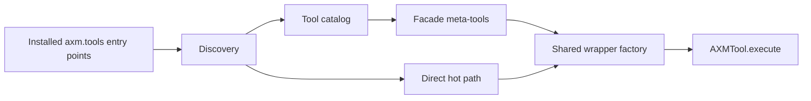

# Architecture

## Overview

`axm-mcp` supplies an MCP server, entry-point discovery, a compact tool
catalog, execution wrappers and lifecycle commands. Business operations live
in installed tool packages. The server itself registers `verify` and
`web_fetch`; it publishes no `axm.tools` entry point for those built-ins.

```mermaid
flowchart LR
    Packages["Installed axm.tools entry points"] --> Discovery["Discovery"]
    Discovery --> Catalog["Tool catalog"]
    Catalog --> Facade["Facade meta-tools"]
    Discovery --> Direct["Direct hot path"]
    Facade --> Wrappers["Shared wrapper factory"]
    Direct --> Wrappers
    Wrappers --> Tools["AXMTool.execute"]
```

A class entry point is instantiated without arguments. A plain callable is
retained as-is. Failed loads are logged and skipped. The registry is a
startup snapshot; installing a new package requires restarting the server.

## Transport and policy

Stdio runs inside the process launched by the client. The client decides
whether to share or restart that process; the server does not enforce one
process per conversation.

HTTP keeps one process available to multiple clients. Imported module state,
tool instances and any provider caches can be reused. This does not provide
durable sessions or cache persistence across process restarts.

Serving policy is independent of transport: dedicated HTTP uses an
environment-backed write contract when present; shared HTTP resolves a
contract by MCP session identity. The header-binding mechanism and its
limitations are described in [shared contracts](../reference/shared-contracts.md).

### Port ownership

A listening point is a profile-owned resource, so `resolve_http_port()` does
not decide one. It delegates to `axm_config.service_port("mcp")`, the single
seam every port path in this package funnels through. Production keeps the
adopted `9427` unchanged; any other profile gets a port derived from the
profile name in the 20000-49151 band, deterministic across restarts so two
installations on one machine do not fight over a socket; and the historical
`AXM_MCP_PORT` variable is still honoured, through that resolver's alias
registry rather than by a read performed here.

That last point is the reason this package reads no port variable of its own:
a concurrent local read would short-circuit the upstream
`environment > file > default` precedence instead of deferring to it. The
consequence for an operator is that a self-contained installation running
under its own profile starts without anyone supplying a port, where the
previous local decision refused outside production.

Every port path funnels through that same seam rather than duplicating it.
`generate_plist()` and `lifecycle.install()` take `port: int | None = None`
and call `resolve_http_port()` when the caller supplied nothing, at render
time instead of binding a constant at import time. The `serve`, `status` and
`install` CLI commands now do the same, and `server.serve()` resolves there
too instead of re-reading `AXM_MCP_PORT` for its own account — a concurrent
local read would short-circuit the upstream precedence the paragraph above
defers to. No `DEFAULT_PORT` constant survives anywhere in the package, so
exactly one value decides where the service listens. An explicit port still
wins verbatim — the resolution only supplies a value nobody chose, it never
pre-empts a choice.

## Execution and data

Direct tools and catalog calls are constructed using `build_wrappers`.
In facade mode both receive the same registration policy. The facade uses
the asynchronous catalog route so HTTP offloading and locks also apply to
tools absent from the direct list.

The wrapper resolves access, unwraps nested kwargs, warns about certain
implicit paths, runs the tool, records an external trace when available and
renders the result. Trace integration is best-effort; scope refusals occur
before normal execution tracing. It is not a durable audit log for every
rejected request.

String results and ToolResult text are intended for the model. They do not
preserve structured data as an additional MCP channel. Failures with nonempty
text keep their diagnostics; data-only results use an envelope. See the
[exact result behavior](../reference/facade.md#toolresult-at-the-mcp-boundary).

## Concurrency

In HTTP mode synchronous tool bodies run through `asyncio.to_thread`.
A slow synchronous call therefore does not directly occupy the event loop.
This is not a bound on provider resource use or a guarantee that every
provider is thread-safe.

The async wrapper additionally selects in-process keyed locks:

| Calls | Key |
|---|---|
| Git-prefixed tools | Explicit `path` |
| Session-prefixed dispatcher family | Explicit `session_id` |
| `write_file`, `edit_file` | Explicit target `path` |
| `batch_edit` | Normalized root plus each `operations[].file`, deduplicated and acquired in sorted order |

The session-prefixed dispatcher family is matched by the literal
`protocol_` name prefix. This is a wrapper routing rule; it does not
declare any such tools in this package.

Without the expected key, the tool still runs in a worker thread but lacks
that keyed serialization. These locks coordinate calls within one process,
not external writers or other server processes. They do not cover every
mutation tool (for example `batch_rollback`) and cannot substitute for a
tool's own atomicity/rollback behavior. `ToolCatalog.call()` is synchronous
and does not take HTTP async locks; `acall()` is the lock-aware route.

Lock acquisition timeout becomes a resource-busy error. Idle entries are
reaped on release. Stdio calls execute inline with the HTTP locking/offload
mode disabled.

## Implementation map

| Module | Responsibility |
|---|---|
| `cli`, `server` | Process lifecycle, PID handling, HTTP serve and health |
| `settings`, `daemon`, `lifecycle` | Policy/port/PID resolution, supervisor descriptor, launchd install |
| `mcp_app` | Startup registration and HTTP contract middleware |
| `discovery`, `schema` | Entry points and callable signatures |
| `facade` | Search, describe, execute and capability text |
| `wrapping`, `concurrency` | Result/exception handling, access checks, thread offload and keyed locks |
| `session_contracts` | In-memory identity-to-contract bindings |
| `verify`, `verify_format` | Aggregation and human-readable quality output |
| `web_fetch` | Optional Scrapling adapter |

These implementation modules are not all a root-exported SDK.
[Python API](../reference/api/index.md) distinguishes the package contract
from implementation seams.
