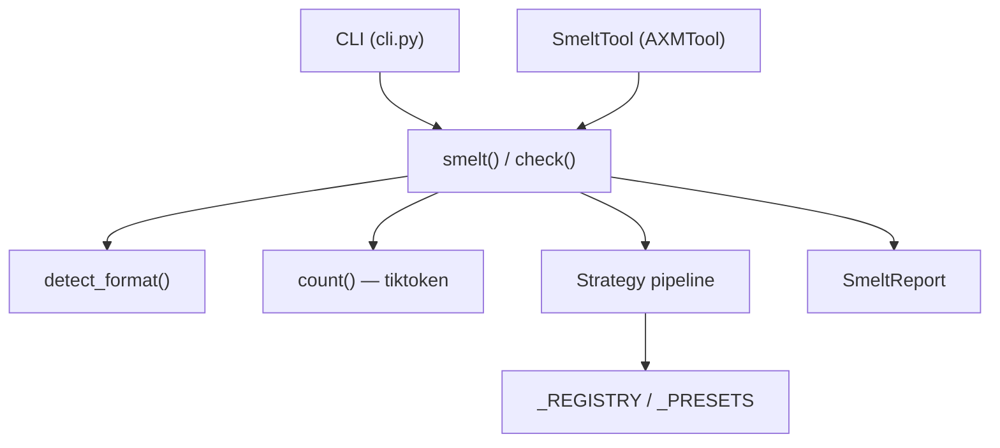
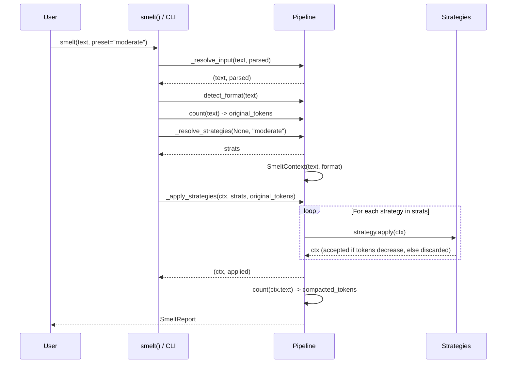

# Architecture

## Overview

`axm-smelt` follows a layered architecture with clear separation of concerns:

## Layers

### 1. Public API (`__init__.py`)

Three exported functions:

- **`smelt(text?, strategies?, preset?, *, parsed?)`** — run the pipeline and return a `SmeltReport`. Accepts either `text` (str) or `parsed` (dict/list); at least one is required.
- **`check(text?, *, parsed?)`** — dry-run every registered strategy and return per-strategy savings estimates. Same input contract as `smelt`.
- **`count(text, model?)`** — count tokens via tiktoken (`o200k_base` by default)

### 2. CLI (`cli.py`)

Four commands via cyclopts: `compact`, `check`, `count`, `version`. All read from stdin or `--file`. `compact` also accepts `--strategies`, `--preset`, and `--output`. The CLI calls the same core functions as the Python API — no business logic lives in the CLI layer.

### 3. MCP Tool (`tools/smelt.py`)

`SmeltTool(AXMTool)` and `SmeltCheckTool(AXMTool)` expose the pipeline as MCP tools registered under the `axm.tools` entry point group. When `data` is already a dict or list, the tools pass it via `parsed=` to skip the serialize→deserialize round-trip.

### 4. Pipeline (`core/pipeline.py`)

`smelt()` composes three private helpers:

1. **`_resolve_input(text, parsed)`** — normalizes inputs into `(text, parsed)`. If `parsed` is provided it is JSON-serialized; if neither argument is given, raises `ValueError`
2. **`_resolve_strategies(strategies, preset)`** — returns strategy instances from explicit names, a preset name, or the `"safe"` default
3. **`_apply_strategies(ctx, strats, current_tokens)`** — applies strategies in order with a token-count guard: each `strategy.apply(ctx)` receives and returns a `SmeltContext`; the strategy is only accepted if it strictly reduces tokens (or reduces text length at equal tokens). Strategies that regress are silently discarded

Between helper calls, `smelt()` detects the format via `detect_format()` (iterates `_PROBES`: `_try_json`, `_try_xml`, `_try_yaml`, `_try_markdown`), counts input tokens, and builds the initial `SmeltContext`. After `_apply_strategies` returns, it counts output tokens and computes `savings_pct`.

`check()` runs every registered strategy independently on the original `SmeltContext` and records per-strategy savings without chaining. Only strategies with positive savings (> 0%) are included in `strategy_estimates`; strategies that regress or break even are omitted.

### 5. Strategies (`strategies/`)

Each strategy is a class implementing `SmeltStrategy` (name, category, `apply(ctx) -> SmeltContext`). Strategies are registered in `_REGISTRY` and composed into presets via `_PRESETS`:

| Preset | Strategies |
|---|---|
| `safe` | `minify`, `collapse_whitespace` |
| `moderate` | `minify`, `drop_nulls`, `flatten`, `dedup_values`, `tabular`, `strip_quotes`, `collapse_whitespace`, `compact_tables`, `strip_html_comments` |
| `aggressive` | `minify`, `drop_nulls`, `flatten`, `tabular`, `round_numbers`, `dedup_values`, `strip_quotes`, `collapse_whitespace`, `compact_tables`, `strip_html_comments` |

| Strategy class | Name | Category |
|---|---|---|
| `MinifyStrategy` | `minify` | whitespace |
| `CollapseWhitespaceStrategy` | `collapse_whitespace` | whitespace |
| `CompactTablesStrategy` | `compact_tables` | whitespace |
| `DropNullsStrategy` | `drop_nulls` | structural |
| `FlattenStrategy` | `flatten` | structural |
| `TabularStrategy` | `tabular` | structural |
| `DedupValuesStrategy` | `dedup_values` | structural |
| `StripQuotesStrategy` | `strip_quotes` | cosmetic |
| `StripHtmlCommentsStrategy` | `strip_html_comments` | cosmetic |
| `RoundNumbersStrategy` | `round_numbers` | cosmetic |

### 6. Format Detection (`core/detector.py`)

Heuristic detection returns a `Format` enum value (`JSON`, `YAML`, `XML`, `TOML`, `CSV`, `MARKDOWN`, `TEXT`). Strategies that are format-specific (e.g., `minify` for JSON) check the first character before attempting to parse.

### 7. Models (`core/models.py`)

`SmeltContext` — dataclass carrying the current text, detected format, and a lazily-parsed JSON cache; passed through the strategy pipeline. `SmeltReport` — Pydantic model with `extra = "forbid"`. `Format` — string enum.

## Data Flow

