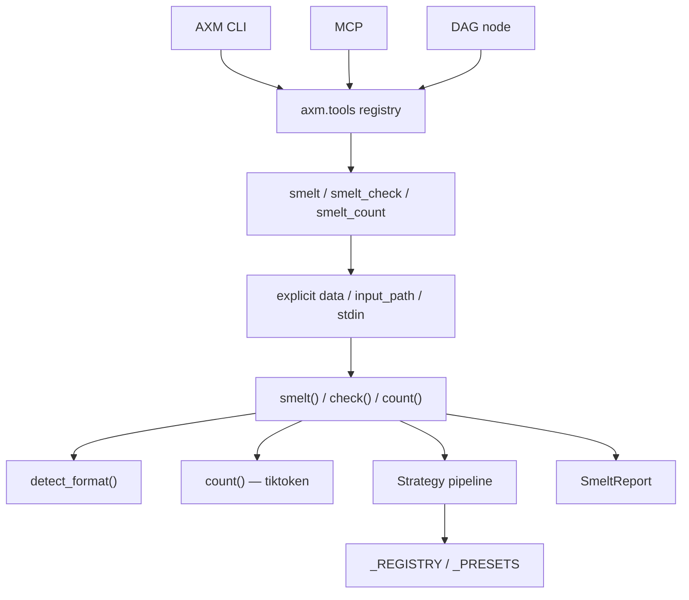
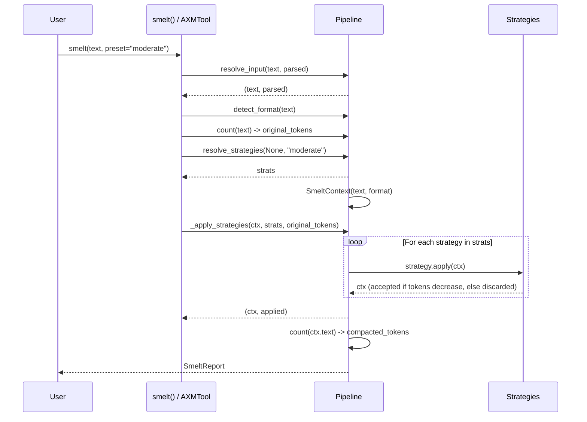

# Architecture

## Overview

`axm-smelt` follows a layered architecture with clear separation of concerns:

```mermaid
graph TB
    CLI["AXM CLI"] --> ToolRegistry["axm.tools registry"]
    MCP["MCP"] --> ToolRegistry
    DAG["DAG node"] --> ToolRegistry
    ToolRegistry --> Tools["smelt / smelt_check / smelt_count"]
    Tools --> InputSource["explicit data / input_path / stdin"]
    InputSource --> Pipeline["smelt() / check() / count()"]
    Pipeline --> Detector["detect_format()"]
    Pipeline --> Counter["count() — tiktoken"]
    Pipeline --> Strategies["Strategy pipeline"]
    Strategies --> StrategyRegistry["_REGISTRY / _PRESETS"]
    Pipeline --> Report["SmeltReport"]
```

## Layers

### 1. Public API (`__init__.py`)

Three exported functions:

- **`smelt(text?, strategies?, preset?, *, parsed?)`** — run the pipeline and return a `SmeltReport`. Accepts either `text` (str) or `parsed` (dict/list); at least one is required.
- **`check(text?, *, parsed?)`** — dry-run every registered strategy and return per-strategy savings estimates. Same input contract as `smelt`.
- **`count(text, model?)`** — count tokens via tiktoken (`o200k_base` by default)

### 2. AXMTools (`tools/`)

`SmeltTool`, `SmeltCheckTool`, and `SmeltCountTool` are registered once under the `axm.tools` entry point group. That registry supplies MCP, AXM CLI, and DAG-node access without a second interface layer. Their shared input resolver applies one deterministic precedence rule: explicit non-empty `data`, then the UTF-8 file named by `input_path`, then non-interactive stdin, then the historical empty default. When `data` is already a dict or list, the compaction and analysis tools pass it via `parsed=` to skip the serialize→deserialize round-trip.

The former Cyclopts façade (`cli.py`), standalone `axm-smelt` executable, and `python -m axm_smelt` module were removed. File input is handled by the shared `input_path` contract; output persistence remains the caller's responsibility. No compatibility alias remains.

### 3. Pipeline (`core/pipeline.py`)

`smelt()` composes three helpers (`resolve_input` and `resolve_strategies` are module-level public; `_apply_strategies` is private):

1. **`resolve_input(text, parsed)`** — normalizes inputs into `(text, parsed)`. If `parsed` is provided it is JSON-serialized; if neither argument is given, raises `ValueError`
2. **`resolve_strategies(strategies, preset)`** — returns strategy instances from explicit names, a preset name, or the `"safe"` default
3. **`_apply_strategies(ctx, strats, current_tokens)`** — applies strategies in order with a token-count guard: each `strategy.apply(ctx)` receives and returns a `SmeltContext`; the strategy is only accepted if it strictly reduces tokens (or reduces text length at equal tokens). Strategies that regress are silently discarded

Between helper calls, `smelt()` detects the format via `detect_format_parsed()` (JSON is probed inline to capture the already-parsed object; the remaining probes are `try_xml`, `try_yaml`, `try_markdown`), counts input tokens, and builds the initial `SmeltContext`. After `_apply_strategies` returns, it counts output tokens and computes `savings_pct`.

The **savings baseline** is the pipeline's working text in both input paths. For the `text=` path the baseline is the provided raw string, unchanged. For the `parsed=` path there is no user-supplied textual form, so `resolve_input` produces the compact serialization `json.dumps(parsed, separators=(",", ":"), ensure_ascii=False)` and that compact working text *is* the baseline — there is no pretty `indent=2` reference form. Measuring against this single honest baseline means a `parsed=` input with no applicable strategy yields `savings_pct` 0 rather than a fabricated gain against an indented dump the caller never saw. This matches the `smelt` docstring semantics at `pipeline.py:100-113`. `report.original` carries the same compact serialization (the pipeline's working text).

`check()` runs every registered strategy independently on the original `SmeltContext` and records per-strategy savings without chaining. Only strategies with positive savings (> 0%) are included in `strategy_estimates`; strategies that regress or break even are omitted.

### 4. Strategies (`strategies/`)

Each strategy is a class implementing `SmeltStrategy` (name, category, `apply(ctx) -> SmeltContext`). Strategies are registered in `_REGISTRY` and composed into presets via `_PRESETS`:

**Serialization key ordering** — the strategy and context serialization sites use a single canonical policy: `json.dumps(..., sort_keys=True, separators=(",", ":"), ensure_ascii=False)`. The structural strategies (`minify`, `drop_nulls`, `round_numbers`, `flatten`, `dedup_values_with_refs`) emit object keys in sorted order, matching `SmeltContext.text`, so a value round-tripped through a strategy has the same byte layout as the same value via `SmeltContext.text`. (`resolve_input` produces the pipeline's *working text* with compact separators but insertion order; the first `minify` in every preset re-canonicalizes it, so the reported output is stable.)

| Preset | Strategies |
|---|---|
| `safe` | `minify`, `collapse_whitespace` |
| `moderate` | `minify`, `drop_nulls`, `flatten`, `dedup_values_with_refs`, `tabular`, `strip_quotes`, `collapse_whitespace`, `compact_tables`, `strip_html_comments` |
| `aggressive` | `minify`, `drop_nulls`, `flatten`, `tabular`, `round_numbers`, `dedup_values_with_refs`, `strip_quotes`, `collapse_whitespace`, `compact_tables`, `strip_html_comments` |

| Strategy class | Name | Category |
|---|---|---|
| `MinifyStrategy` | `minify` | whitespace |
| `CollapseWhitespaceStrategy` | `collapse_whitespace` | whitespace |
| `CompactTablesStrategy` | `compact_tables` | whitespace |
| `DropNullsStrategy` | `drop_nulls` | structural |
| `FlattenStrategy` | `flatten` | structural |
| `TabularStrategy` | `tabular` | structural |
| `DedupValuesStrategy` | `dedup_values_with_refs` | structural |
| `StripQuotesStrategy` | `strip_quotes` | cosmetic |
| `StripHtmlCommentsStrategy` | `strip_html_comments` | cosmetic |
| `RoundNumbersStrategy` | `round_numbers` | cosmetic |

### 5. Format Detection (`core/detector.py`)

Heuristic detection returns a `Format` enum value (`JSON`, `YAML`, `XML`, `TOML`, `CSV`, `MARKDOWN`, `TEXT`). Strategies that are format-specific (e.g., `minify` for JSON) check the first character before attempting to parse.

### 6. Models (`core/models.py`)

`SmeltContext` — frozen dataclass carrying the detected format plus one source-of-truth representation (text or parsed); the other is derived deterministically and cached on first access. `SmeltContext.text` derives from `parsed` via the canonical sorted-key serialization (`sort_keys=True`, compact separators), the same policy every strategy applies. Strategies build a new `SmeltContext` instead of mutating the existing one, so the two representations cannot drift. `SmeltReport` — Pydantic model carrying the compaction metrics plus the `counter_backend` used. `Format` — string enum.

## Data Flow

```mermaid
sequenceDiagram
    participant User
    participant API as smelt() / AXMTool
    participant Pipeline
    participant Strategies

    User->>API: smelt(text, preset="moderate")
    API->>Pipeline: resolve_input(text, parsed)
    Pipeline-->>API: (text, parsed)
    API->>Pipeline: detect_format(text)
    API->>Pipeline: count(text) -> original_tokens
    API->>Pipeline: resolve_strategies(None, "moderate")
    Pipeline-->>API: strats
    Pipeline->>Pipeline: SmeltContext(text, format)
    API->>Pipeline: _apply_strategies(ctx, strats, original_tokens)
    loop For each strategy in strats
        Pipeline->>Strategies: strategy.apply(ctx)
        Strategies-->>Pipeline: ctx (accepted if tokens decrease, else discarded)
    end
    Pipeline-->>API: (ctx, applied)
    Pipeline->>Pipeline: count(ctx.text) -> compacted_tokens
    Pipeline-->>User: SmeltReport
```
