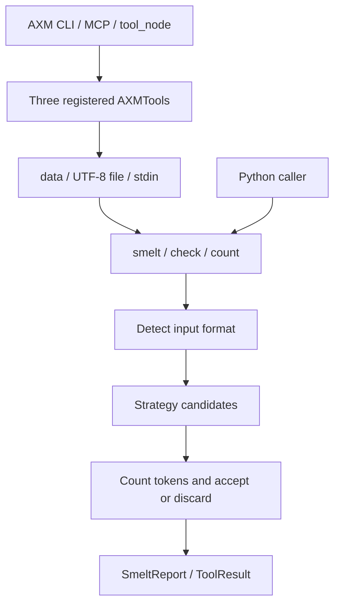

# Architecture

## From an input to a measured result

`axm-smelt` performs deterministic transformations and token counting.
It does not ask an LLM to summarize content. The useful question is whether
a chosen representation saves tokens **and remains suitable for its consumer**.

```mermaid
flowchart TD
    Registry["AXM CLI / MCP / tool_node"] --> Tools["Three registered AXMTools"]
    Tools --> Source["data / UTF-8 file / stdin"]
    Source --> API["smelt / check / count"]
    Python["Python caller"] --> API
    API --> Detect["Detect input format"]
    Detect --> Pipeline["Strategy candidates"]
    Pipeline --> Guard["Count tokens and accept or discard"]
    Guard --> Report["SmeltReport / ToolResult"]
```

## Layers

- The root `axm_smelt` module exports the [public functions and models](../reference/contracts.md#public-imports).
- `tools/` adapts input sources and catches exceptions into `ToolResult`.
  The same registrations supply generated CLI commands and MCP/DAG access.
- `core/pipeline.py` resolves input/strategy selection and constructs reports.
- `core/detector.py` selects the original format. `core/counter.py` resolves a
  tiktoken encoding and caches it by requested model name in the process.
- `strategies/` holds the internal strategy implementations and registry.
  A strategy takes and returns a `SmeltContext`.

Files are read only when an input path is selected. Tools do not persist
compacted data; callers decide whether to keep it.

## Acceptance is local and greedy

For each selected strategy, the pipeline counts the candidate and accepts it
only if it reduces tokens, or has equal tokens with fewer characters. The
next strategy sees the last **accepted** context. Rejected candidates are not
chained, even if they could enable a later reduction.

This guard prevents token regression for the pipeline's encoding. It does not
prove semantic equivalence, parseability, or globally optimal savings.
`aggressive` therefore does not guarantee a smaller output than `moderate`.
A shorter equal-token output is accepted with zero reported token savings.

## Representations and ordering

For raw text, the baseline is exactly the input string. For `parsed=`, it is
a compact Unicode JSON serialization with insertion-order keys. Savings are
measured against that working text, not an artificial pretty-printed version.

JSON-aware strategies reuse parsed objects where available. Text transforms
can invalidate that representation and require a later parse attempt.
Several JSON strategies serialize sorted keys, while the working baseline and
some other transformations preserve insertion order. The guard can reject a
sorted serialization: **the final result is not a canonical JSON encoding**.

`SmeltContext` is an internal frozen dataclass with cached representations.
Freezing fields does not make a caller-supplied dict/list deeply immutable;
code using that internal type must not mutate its parsed value. The public
pipeline's built-in strategies construct transformed values rather than editing
the caller's object.

## Analysis is a separate report

`check` tries each registry strategy independently against the original
context, then measures the default safe chain. It retains the original text
and token counts in its report while exposing the projected safe savings.
The tool wrapper returns only isolated estimates, input format, and count;
see [report versus tool data](../reference/contracts.md).

## Boundaries

There is no streaming path or resource budget. Text/JSON parsing and candidates
are held in memory. The strategy loop treats a strategy's `RecursionError`
as a no-op, but other exceptions and errors outside that loop can propagate.
The tool wrapper returns failures as structured errors.

The report's `format` always describes the **input**. A table or unquoted-key
output may still be labelled `json`; downstream consumers must validate the
actual output they use.
