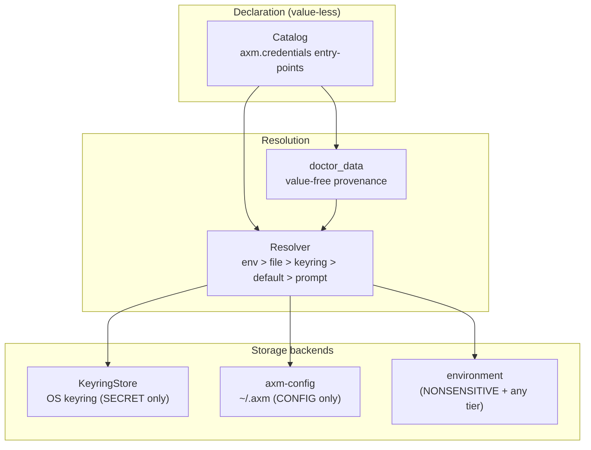

# Architecture

`axm-vault` answers one question — *where does a credential come from, and is it
present* — without ever holding, returning, or logging a secret value. Its
design is built around a single invariant (**never-leak**) and a clean split
between the two backends that actually store data: the **OS keyring** for
secrets and **axm-config** for non-sensitive config.

## The four moving parts

### 1. The catalog — schema, never values

A [`CredentialGroup`](../reference/models.md) bundles [`CredentialSpec`](../reference/models.md)
entries that describe *what* a package needs: a name, an env var, a `kind`, a
`Sensitivity`. **No field ever holds a secret** — the catalog is value-less by
construction. Packages contribute groups through the `axm.credentials`
entry-point group; [`load_catalog()`](../reference/catalog.md) aggregates them
(empty catalog is the nominal state for vault itself, and is cached).

At load time the catalog validates every `group.id` (as an axm-config
*namespace*) and every SECRET/CONFIG spec name (as an axm-config *key*) by
delegating to `axm_config.validate_segment` — the single canonical charset
rule. An identifier that could never round-trip through `axm_config.set_` is
rejected up front, instead of blowing up later mid-`run_setup`.

### 2. The resolver — a fixed layer precedence

The [`Resolver`](../reference/resolver.md) resolves a value by walking a fixed
precedence — `env > file > keyring > default > prompt`. Each layer is consulted
in turn; the first to yield a value wins, and the winning `layer` is reported
back alongside the value in `Resolved`. The layers are deliberately kept
disjoint:

- **env** is the only tier that reads the environment (`spec.env` + aliases); an
  empty-string env var counts as *absent*, not as an empty value.
- **file** reads the per-namespace TOML under `~/.axm` **only**, via
  `axm_config.store.NamespaceStore` — vault never resolves the `~/.axm` path
  itself (that stays axm-config's responsibility) and never mixes the
  environment into this layer.
- **keyring** is consulted **only** for specs classified `Sensitivity.SECRET`,
  and degrades gracefully to skipped (not crashed) when the OS keyring backend
  is unavailable on a headless host.

### 3. The two storage backends — a clean frontier

Writes route by sensitivity, and the two backends never overlap:

| Sensitivity | Written to | Read back from |
|---|---|---|
| `SECRET` | OS keyring (`KeyringStore`) | `keyring` layer |
| `CONFIG` | axm-config (`~/.axm`) | `file` layer |
| `NONSENSITIVE` | *nothing* (env-only) | `env` layer |

NONSENSITIVE credentials are never stored — persisting them would create a
second, stale source of truth. Rotation (`rotate_secret`) lives entirely on the
keyring side, retaining the previous secret for exactly one cycle under a
reserved `{name}.prev` slot so a caller can fall back during an in-flight roll.

### 4. The doctor — provenance without values

[`doctor_data`](../reference/doctor.md) answers *which layer would supply each
credential, and is it present at all* — **without ever reading the value**. It
probes each layer for presence only, reducing the result to a boolean the
instant a layer responds, so a plaintext secret never enters the report. When
the keyring is unavailable for a SECRET spec, the entry is annotated
`keyring="unavailable"` so the outage is surfaced rather than mis-reported as a
plain `missing`.

## The never-leak invariant

Every surface upholds one rule: **no value is ever serialized, returned, or
logged where it could leak.**

- The doctor and `Resolver.probe` reduce a value to a boolean before it can
  escape.
- `vault_doctor` returns value-free provenance; `vault_set` echoes only the
  storage *target*, never the value.
- `KeyringUnavailableError` and other error paths are asserted never to embed
  the secret in their message.
- `SecretStr` wrapping (via `as_secret`) keeps bound SECRET fields masked in any
  `repr`.

## Design decisions

| Decision | Rationale |
|---|---|
| Value-less catalog | A schema that cannot hold a secret cannot leak one. |
| Canonical charset via `axm_config.validate_segment` | One source of truth for namespace/key charsets — no hand-mirrored regex to drift out of sync. |
| Keyring/config frontier by `Sensitivity` | Secrets never touch `~/.axm`; config never touches the keyring. |
| Value-free doctor | Provenance is answerable without ever reading a value. |
| Pydantic v2, `frozen=True, extra="forbid"` | Immutable, strict models; unknown fields are a construction error. |
| `src/` layout | PEP 621 best practice, no import conflicts. |
