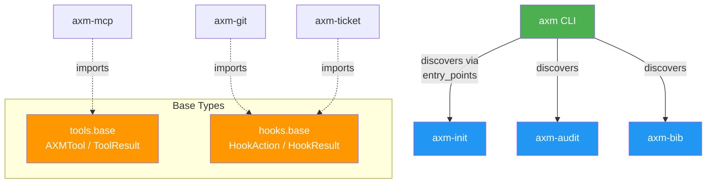

# Architecture

## Overview

`axm` is a **thin autodiscovery CLI wrapper** that delegates all functionality to installed AXM ecosystem packages. It contains zero business logic.



## Autodiscovery Pattern

Dispatch is **lazy**: `axm` resolves the requested command from `sys.argv` and
imports only that one entry point (no tool module is imported at startup). It
lists the catalog from entry-point *metadata* alone and dispatches on two groups
— explicit `axm.commands` (priority) and auto-generated `axm.tools` commands:

```python
# axm.cli.main (simplified)
cmd = _resolve_command(sys.argv[1:])          # first non-flag token
commands = entry_points_for("axm.commands")   # metadata only
tools = entry_points_for("axm.tools")         # metadata only
app = _build_single_app(cmd, commands, tools) # imports ONLY cmd's entry point
app(sys.argv[1:])
```

`create_app()` (eager, all entry points loaded) exists for tests and
introspection but is **not** the path `main` uses.

Each AXM package declares its commands in `pyproject.toml`:

```toml
[project.entry-points."axm.commands"]
init_scaffold = "axm_init.cli:scaffold"
init_check    = "axm_init.cli:check"
```

This is the same pattern used by `axm-mcp` for tool discovery (`axm.tools` group).

## Design Decisions

| Decision | Rationale |
|---|---|
| Entry-point autodiscovery | No hard dependencies on ecosystem packages |
| Optional deps (`axm[init]`) | Users install only what they need |
| `cyclopts` for CLI | Same framework as other AXM CLIs |
| `src/` layout | PEP 621 best practice, no import conflicts |
| Zero business logic | All functionality lives in dedicated packages |
| `{domain}_{action}` naming | One name for CLI and MCP — no mental translation |
| `AXMTool`/`ToolResult` in `axm` | Shared interface, no private dependency needed; `text` field carries pre-rendered output |
| `HookAction`/`HookResult` in `axm` | Hooks contract without pulling `axm-engine` deps |
| Core contracts re-exported from the `axm` root | The eleven contracts (`AXMTool`, `ToolResult`, `ToolMetadata`, `tool_metadata`, `HookAction`, `HookResult`, `WitnessResult`, `ValidationFeedback`, `WitnessRule`, `tool_node`, `ToolNodeError`) are re-exported from `axm/__init__.py` as a pure façade — types stay defined in their submodules. These root re-exports are the package's stable import surface; treat any change to them as breaking |
| `agent_hint` on `AXMTool` | LLM-optimized one-liner propagates to MCP tool descriptions — richer than docstrings, cheaper than system prompts |
| `tool_node` adapter in `axm` | Turns any `axm.tools` tool into a `fn(payload) -> dict` DAG python-node (fail-fast on `ToolResult.success is False`, raising `ToolNodeError`) — lets graphs reuse deterministic tools without a bespoke wrapper |
