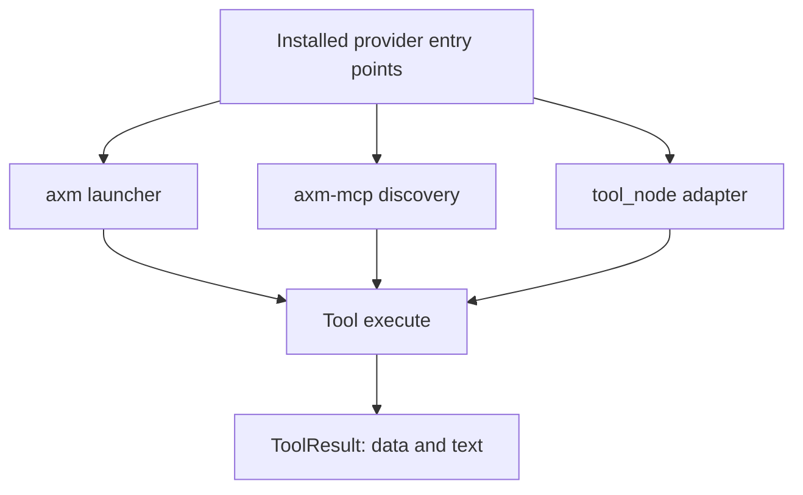

# Architecture

## Overview

`axm` combines a thin command launcher with shared Python contracts.
Domain operations belong to installed providers. MCP transport belongs to
`axm-mcp`; DAG execution belongs to `axm-dag` and authoring to `axm-loom`.
The core package depends only on Cyclopts.


```mermaid
flowchart TD
    Providers["Installed provider entry points"] --> CLI["axm launcher"]
    Providers --> MCP["axm-mcp discovery"]
    Providers --> Node["tool_node adapter"]
    CLI --> Operation["Tool execute"]
    MCP --> Operation
    Node --> Operation
    Operation --> Result["ToolResult: data and text"]
```

## Autodiscovery Pattern

The CLI discovers operations through one entry-point group:

| Group | Target | Behavior |
|---|---|---|
| `axm.tools` | A tool class, instance or supported callable | Generate a command from its execution signature |

For a request returning structured data, register an `AXMTool` under
`axm.tools`. This is the shared route for CLI, MCP discovery and
`tool_node`. Process lifecycles that do not return a tool result can expose
separate console scripts under `project.scripts`.

```toml
[project.entry-points."axm.tools"]
demo_count = "demo_tools.count:CountTool"
```

See the [complete tool guide](../howto/write-tool.md).

Dispatch is lazy: the installed `main()` selects the requested entry point
before loading its implementation. Root help and catalog listing use metadata
only. A class target is instantiated without arguments.
`create_app()` is an eager alternative for introspection and tests.

Only the tool registry is queried. Legacy command entries cannot override
tools or appear in the command catalog.

## Shared contracts

The root imports in the [SDK reference](../reference/python-api.md) are a
façade over the defining modules. Tools use `ToolResult`; witnesses use
`WitnessResult`. These types have
different fields and should not be treated as interchangeable envelopes.

`ToolResult.data` serves machine consumers and `text` serves readers.
The CLI, MCP consumers and node mappings decide which representation to use.
The core does not guarantee a textual rendering for every result.

Optional discovery metadata is read through `tool_metadata` and attributes,
rather than being required protocol members. A structural tool can therefore
remain an `AXMTool` without declaring MCP-specific metadata.

## Tool composition

`tool_node` is an adapter to a callable, not a scheduler. Its explicit output
mapping records which values the surrounding graph will receive. It normally
fails immediately on tool failure; observation workflows can explicitly opt
into returning failure data. See [mapping and failure rules](../howto/tool-node.md).

Real tools are cached per node after first resolution. Scoped substitutes use
context-local state and take precedence over that cache. The adapter does not
add a transaction, retry policy or synchronization around a provider instance.

## Design Decisions

| Decision | Purpose |
|---|---|
| Entry-point discovery | Providers can be installed independently |
| Optional dependency extras | A small launcher without all ecosystem dependencies |
| Shared root contracts | A common import surface for tools and consumers |
| Explicit node outputs | Make returned graph state deliberate |
| Separate structured data and text | Support automation and human inspection |
| Cyclopts signatures | Derive command arguments from the execution interface |
